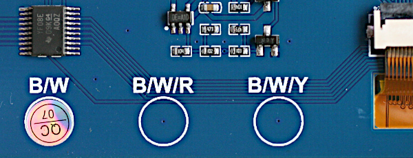
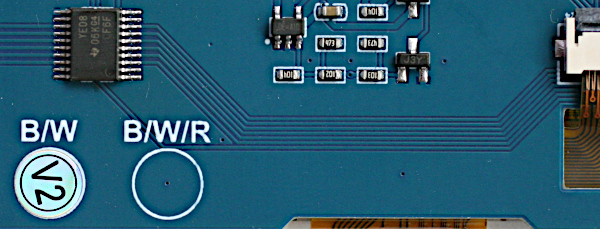

# Display drivers

These drivers support [nano-gui](./README.md), [micro-gui](https://github.com/peterhinch/micropython-micro-gui),
[micropython-touch](https://github.com/peterhinch/micropython-touch) and
[Writer and CWriter](https://github.com/peterhinch/micropython-font-to-py/blob/master/writer/WRITER.md).
They currently support four display technologies: OLED (color and monochrome),
color TFT, monochrome Sharp displays and EPD (ePaper/eInk).
All drivers provide a display class subclassed from the built-in
`framebuf.FrameBuffer` class. This provides three increasing levels of support:
 * Graphics via the `FrameBuffer` graphics primitives.
 * Text rendering in arbitrary fonts via `Writer` and `Cwriter` classes (see
 [font_to_py.py](https://github.com/peterhinch/micropython-font-to-py.git)).
 * Use with nano-gui, [micro-gui](https://github.com/peterhinch/micropython-micro-gui/)
 and [micropython-touch](https://github.com/peterhinch/micropython-touch).
 * Photo image display in conjunction with any of the above GUI's: see
 [IMAGE_DISPLAY.md](./IMAGE_DISPLAY.md) (on selected larger displays).

It should be noted that in the interests of conserving RAM these drivers offer
a bare minimum of functionality required to support the above. Most drivers
provide some support for bus sharing.

Users of the GUI and Writer classes only need to instantiate a display. Hence
only device constructors are documented. Other attributes are transparent to
the user. Required methods and bound variables are detailed in
[Writing device drivers](./DRIVERS.md#7-writing-device-drivers). Low level
access via the `Writer` and `CWriter` classes is documented
[here](https://github.com/peterhinch/micropython-font-to-py/blob/master/writer/WRITER.md).

###### [Main README](./README.md#1-introduction)

# Contents

 1. [Introduction](./DRIVERS.md#1-introduction)  
  1.1 [Color handling](./DRIVERS.md#11-color-handling) On 4, 8 and 16 bit drivers.  
  1.2 [Installation](./DRIVERS.md#12-installation)
 2. [OLED displays](./DRIVERS.md#2-oled-displays)  
  2.1 [Drivers for SSD1351](./DRIVERS.md#21-drivers-for-ssd1351) Color OLEDs  
  2.2 [Drivers for SSD1331](./DRIVERS.md#22-drivers-for-ssd1331) Small color OLEDs  
  2.3 [Drivers for SSD1327](./DRIVERS.md#23-drivers-for-ssd1327) Greyscale OLEDs  
 3. [Color TFT displays](./DRIVERS.md#3-color-tft-displays)  
  3.1 [Drivers for ST7735R](./DRIVERS.md#31-drivers-for-st7735r) Small TFTs  
  3.2 [Drivers for ST7789](./DRIVERS.md#32-drivers-for-st7789) Small high density TFTs  
  &nbsp;&nbsp;&nbsp;&nbsp;&nbsp;3.2.1 [TTGO T Display](./DRIVERS.md#321-ttgo-t-display) Low cost ESP32 with integrated display  
  &nbsp;&nbsp;&nbsp;&nbsp;&nbsp;3.2.2 [Waveshare Pico Res Touch](./DRIVERS.md#322-waveshare-pico-res-touch)  
  &nbsp;&nbsp;&nbsp;&nbsp;&nbsp;3.2.3 [Waveshare Pico LCD 2](./DRIVERS.md#323-waveshare-pico-lcd-2)  
  &nbsp;&nbsp;&nbsp;&nbsp;&nbsp;3.2.4 [Troubleshooting](./DRIVERS.md#324-troubleshooting)  
  3.3 [Drivers for ILI9341](./DRIVERS.md#33-drivers-for-ili9341) Large TFTs  
  3.4 [Driver for ILI94xx](./DRIVERS.md#34-driver-for-ili94xx) ILI9486 and HX8357D driver for large displays.  
  &nbsp;&nbsp;&nbsp;&nbsp;&nbsp;3.4.1 [Driver for ILI9488](./DRIVERS.md#341-driver-for-ili9488)  
  3.5 [Driver for gc9a01](./DRIVERS.md#35-driver-for-gc9a01) Round 240x240 displays.  
 4. [Drivers for sharp displays](./DRIVERS.md#4-drivers-for-sharp-displays) Large low power monochrome displays  
  4.1 [Display characteristics](./DRIVERS.md#41-display-characteristics)  
  &nbsp;&nbsp;&nbsp;&nbsp;&nbsp;4.1.1 [The VCOM bit](./DRIVERS.md#411-the-vcom-bit)  
  &nbsp;&nbsp;&nbsp;&nbsp;&nbsp;4.1.2 [Refresh rate](./DRIVERS.md#412-refresh-rate)  
  4.2 [Test scripts](./DRIVERS.md#42-test-scripts)  
  4.3 [Device driver constructor](./DRIVERS.md#43-device-driver-constructor)  
  &nbsp;&nbsp;&nbsp;&nbsp;&nbsp;4.3.1 [Device driver methods](./DRIVERS.md#431-device-driver-methods)  
  &nbsp;&nbsp;&nbsp;&nbsp;&nbsp;4.3.2 [The vcom arg](./DRIVERS.md#432-the-vcom-arg)  
  4.4 [Application design](./DRIVERS.md#44-application-design)  
  &nbsp;&nbsp;&nbsp;&nbsp;&nbsp;4.4.1 [Micropower applications](./DRIVERS.md#441-micropower-applications)  
  4.5 [Resources](./DRIVERS.md#45-resources)  
 5. [ePaper displays](./DRIVERS.md#5-epaper-displays)  
  5.1 [Adafruit monochrome eInk Displays](./DRIVERS.md#51-adafruit-monochrome-eink-displays)  
  &nbsp;&nbsp;&nbsp;&nbsp;&nbsp;5.1.1 [EPD constructor args](./DRIVERS.md#511-epd-constructor-args)  
  &nbsp;&nbsp;&nbsp;&nbsp;&nbsp;5.1.2 [Public methods](./DRIVERS.md#512-public-methods)  
  &nbsp;&nbsp;&nbsp;&nbsp;&nbsp;5.1.3 [Events](./DRIVERS.md#513-events)  
  &nbsp;&nbsp;&nbsp;&nbsp;&nbsp;5.1.4 [Public bound variables](./DRIVERS.md#514-public-bound-variables)  
  &nbsp;&nbsp;&nbsp;&nbsp;&nbsp;5.1.5 [FeatherWing Wiring](./DRIVERS.md#515-featherwing-wiring)  
  &nbsp;&nbsp;&nbsp;&nbsp;&nbsp;5.1.6 [Micropower use](./DRIVERS.md#516-micropower-use)  
  5.2 [Waveshare eInk Display HAT](./DRIVERS.md#52-waveshare-eink-display-hat) Pi HAT repurposed for MP hosts.  
  &nbsp;&nbsp;&nbsp;&nbsp;&nbsp;5.2.1 [EPD constructor args](./DRIVERS.md#521-epd-constructor-args)  
  &nbsp;&nbsp;&nbsp;&nbsp;&nbsp;5.2.2 [Public methods](./DRIVERS.md#522-public-methods)  
  &nbsp;&nbsp;&nbsp;&nbsp;&nbsp;5.2.3 [Events](./DRIVERS.md#523-events)  
  &nbsp;&nbsp;&nbsp;&nbsp;&nbsp;5.2.4 [public bound variables](./DRIVERS.md#524-public-bound-variables)  
  5.3 [Waveshare 400x300 Pi Pico display](./DRIVERS.md#53-waveshare-400x300-pi-pico-display) Excellent display can also be used with other hosts.  
  &nbsp;&nbsp;&nbsp;&nbsp;&nbsp;5.3.1 [Constructor args](./DRIVERS.md#531-constructor-args)  
  &nbsp;&nbsp;&nbsp;&nbsp;&nbsp;5.3.2 [Public methods](./DRIVERS.md#532-public-methods)  
  &nbsp;&nbsp;&nbsp;&nbsp;&nbsp;5.3.3 [Events](./DRIVERS.md#533-events)  
  &nbsp;&nbsp;&nbsp;&nbsp;&nbsp;5.3.4 [Public bound variables](./DRIVERS.md#534-public-bound-variables)  
  &nbsp;&nbsp;&nbsp;&nbsp;&nbsp;5.3.5 [The Greyscale Driver](./DRIVERS.md#535-the-greyscale-driver)  
  &nbsp;&nbsp;&nbsp;&nbsp;&nbsp;5.3.6 [Current consumption](./DRIVERS.md#536-current-consumption)  
  5.4 [WeAct Studio SSD1680 eInk Displays](./DRIVERS.md#54-weact-studio-ssd1680-eink-displays)  
  5.5 [Waveshare Pico 2.13 eInk Display](./DRIVERS.md#55-waveshare-pico-2_13-eink-display) Also Pico 2.9" model.  
  &nbsp;&nbsp;&nbsp;&nbsp;&nbsp;5.5.2 [Public methods](./DRIVERS.md#552-public-methods)  
  &nbsp;&nbsp;&nbsp;&nbsp;&nbsp;5.5.3 [Events](./DRIVERS.md#553-events)  
  &nbsp;&nbsp;&nbsp;&nbsp;&nbsp;5.5.4 [Public bound variables](./DRIVERS.md#554-public-bound-variables)  
 6. [EPD Asynchronous support](./DRIVERS.md#6-epd-asynchronous-support)  
 7. [Writing device drivers](./DRIVERS.md#7-writing-device-drivers)  
 8. [Links](./DRIVERS.md#8-links)  

The [Micropower use](./DRIVERS.md#515-micropower-use) section is applicable to
EPD's in general but makes specific reference to the 2.9" micropower demo.

###### [Main README](./README.md#1-introduction)

# 1. Introduction

A nano-gui application specifies a driver by means of `color_setup.py` located
in the root directory of the target. In micro-gui `hardware_setup.py` does a
similar job, also specifying pins for the user controls.

A typical `color_setup.py` looks like this:
```python
import machine
import gc
from drivers.ssd1351.ssd1351 import SSD1351 as SSD  # Choose device driver
pdc = machine.Pin('Y1', machine.Pin.OUT_PP, value=0)
pcs = machine.Pin('Y2', machine.Pin.OUT_PP, value=1)
prst = machine.Pin('Y3', machine.Pin.OUT_PP, value=1)
spi = machine.SPI(2, baudrate=10_000_000)  # baudrate depends on display chip
gc.collect()
# Precaution before instantiating framebuf. The next line creates the buffer.
ssd = SSD(spi, pcs, pdc, prst, 96)  # Create a display instance
```
The directory `setup_examples` contains examples for various displays. These
are named by graphics chip ID followed by host, thus `ssd1306_pyb.py` is for an
SSD1306 based display connected to a Pyboard. Files may be adapted and copied
to `color_setup.py` on the target's root. The section in this doc for the
specific display chip should be consulted for SSD constructor arguments and SPI
baudrate. The more exotic displays (Sharp and ePaper) have additional features
and requirements detailed below.

## 1.1 Color handling

Most color displays support colors specified as 16-bit quantities. Storing two
bytes for every pixel results in large frame buffers. Most of the drivers
reduce this to 1 byte (the default) or 4 bits per pixel, with the data being
expanded at runtime when a line is displayed. This trades a large saving in RAM
for a small increase in refresh time. Minimising this increase while keeping
the driver cross-platform involves the use of the `viper` decorator.

Eight bit drivers store colors in `rrrgggbb`. This results in a loss of
precision in specifying a color. Four bit drivers store a color as the index
into a 16 bit lookup table. There is no loss of precision but only 16 distinct
colors can be supported.

The choice of 16, 8 or 4 bit drivers is largely transparent: all demo scripts
run in a visually identical manner under all drivers. This will apply to any
application which uses the predefined colors. Differences become apparent when
specifying custom colors. For detail see the main README
[User defined colors](./README.md#311-user-defined-colors).

For use in any of the supported GUIs, where the choice exists a 4-bit driver
should normally be preferred to conserve RAM: all demo scripts will work with
such a driver and results will be visually identical compared to the bigger
drivers. Where images are to be displayed a 4-bit driver can show a monochrome
image but color images require 8 or 16 bits. See
[IMAGE_DISPLAY.md](./IMAGE_DISPLAY.md).

## 1.2 Installation

Please ensure that device firmware is up to date. On networked hardware a
display driver may be installed as follows (example is for ST7789):
```python
>>> mip.install("github:peterhinch/micropython-nano-gui/drivers/st7789")
```
The last part of the addresss (`st7789`) is the name of the directory holding
drivers for the display in use. In some cases the directory holds more than one
driver: these will all be installed. Unused drivers may be deleted.

On any hardware [mpremote](http://docs.micropython.org/en/latest/reference/mpremote.html#mpremote)
may be used on the PC as follows:
```bash
$ mpremote mip install "github:peterhinch/micropython-nano-gui/drivers/st7789"
```

###### [Contents](./DRIVERS.md#contents)

# 2. OLED displays

## 2.1 Drivers for SSD1351

This is an OLED driver. The supported displays produce excellent images with
extreme contrast and bright colors. Power consumption is low.

See [Adafruit 1.5" 128*128 OLED display](https://www.adafruit.com/product/1431)
and [Adafruit 1.27" 128*96 display](https://www.adafruit.com/product/1673).

There are four versions.
 * `ssd1351.py` This is optimised for STM (e.g. Pyboard) platforms.
 * `ssd1351_generic.py` Cross-platform version. Tested on ESP32 and ESP8266.
 * `ssd1351_16bit.py` Cross-platform. Uses 16 bit RGB565 color.
 * `ssd1351_4bit.py` Cross-platform. Uses 4 bit color.

All these drivers work with the provided demo scripts.  
To conserve RAM the first two use 8 bit (rrrgggbb) color. This works well with
the GUI if saturated colors are used to render text and controls.

The `ssd1351_generic.py` and 4 bit versions use the `micropython.viper`
decorator. If your platform does not support this, comment it out and remove
the type annotations. You may be able to use the `micropython.native`
decorator.

If the platform supports the viper emitter performance should still be good: on
a Pyboard V1 the generic driver perorms a refresh of a 128*128 color display in
47ms. The STM version is faster but not by a large margin: a refresh takes
41ms. 32ms of these figures is consumed by the data transfer over the SPI
interface. The 4-bit version with Viper takes 44ms.

If the viper and native decorators are unsupported a screen redraw takes 272ms
(on Pyboard 1.0) which is visibly slow.

The `ssd1351_16bit` version on a 128x128 display requires 32KiB for the frame
buffer; this means it is only usable on platforms with plenty of RAM. Testing
was done on a Pyboard D SF2W. With the GUI this version offers no benefit, but
it delivers major advantages in applications such as rendering images.

For further information see the GUI README
[User defined colors](./README.md#311-user-defined-colors).

This driver was tested on Adafruit 1.5 and 1.27 inch displays.

The `color_setup.py` file should initialise the SPI bus with a baudrate of
20_000_000. Args `polarity`, `phase`, `bits`, `firstbit` are defaults. Hard or
soft SPI may be used but hard may be faster.

#### SSD1351 Constructor args:
 * `spi` An SPI bus instance.
 * `pincs` An initialised output pin. Initial value should be 1.
 * `pindc` An initialised output pin. Initial value should be 0.
 * `pinrs` An initialised output pin. Initial value should be 1.
 * `height=128` Display dimensions in pixels. Height must be 96 or 128.
 * `width=128`
 * `init_spi=False` This optional arg enables flexible options in configuring
 the SPI bus. The default assumes exclusive access to the bus with
 `color_setup.py` initialising it. Those settings will be left in place. If a
 callback function is passed, it will be called prior to each SPI bus write:
 this is for shared  bus applications. The callback will receive a single arg
 being the SPI bus instance. In normal use it will be a one-liner or lambda
 initialising the bus. A minimal example is this function:
```python
def spi_init(spi):
    spi.init(baudrate=20_000_000)  # Data sheet: should support 20MHz
```
Despite the datasheet I failed to get this baudrate to work even on a PCB.

#### A "gotcha" in the datasheet

For anyone seeking to understand or modify the code, the datasheet para 8.3.2
is confusing. They use the colors red, green and blue to represent colors C, B
and A. With the setup used in these drivers, C is blue and A is red. The 16 bit
color streams sent to the display are:  
`s[x]`     1st byte sent `b7 b6 b5 b4 b3 g7 g6 g5`  
`s[x + 1]` 2nd byte sent `g4 g3 g2 r7 r6 r5 r4 r3`

###### [Contents](./DRIVERS.md#contents)

## 2.2 Drivers for SSD1331

This is an OLED driver for small displays. The supported display produces
excellent images with extreme contrast and bright colors. Power consumption is
low.

See [Adafruit 0.96" OLED display](https://www.adafruit.com/product/684). Most
of the demos assume a larger screen and will fail. The `color96.py` demo is
written for this display.

There are two versions. Both are cross-platform.
 * `ssd1331.py` Uses 8 bit rrrgggbb color.
 * `ssd1331_16bit.py` Uses 16 bit RGB565 color.

The `ssd1331_16bit` version requires 12KiB of RAM for the frame buffer, while
the standard version needs only 6KiB. For the GUI the standard version works
well because text and controls are normally drawn with a limited range of
colors, most of which are saturated.

The 16 bit version provides greatly improved results when rendering images.

The `color_setup.py` file should initialise the SPI bus with a baudrate of
6_666_000. Args `polarity`, `phase`, `bits`, `firstbit` are defaults. Hard or
soft SPI may be used but hard may be faster.

#### SSD1331 Constructor args:
 * `spi` An SPI bus instance.
 * `pincs` An initialised output pin. Initial value should be 1.
 * `pindc` An initialised output pin. Initial value should be 0.
 * `pinrs` An initialised output pin. Initial value should be 1.
 * `height=64` Display dimensions in pixels.
 * `width=96`
 * `init_spi=False` This optional arg enables flexible options in configuring
 the SPI bus. The default assumes exclusive access to the bus with
 `color_setup.py` initialising it. Those settings will be left in place. If a
 callback function is passed, it will be called prior to each SPI bus write:
 this is for shared  bus applications. The callback will receive a single arg
 being the SPI bus instance. In normal use it will be a one-liner or lambda
 initialising the bus. A minimal example is this function:
```python
def spi_init(spi):
    spi.init(baudrate=6_666_000)  # Data sheet: max is 150ns
```

###### [Contents](./DRIVERS.md#contents)

## 2.3 Drivers for SSD1327

This driver was contributed by Mike Causer (@mcauser) and Philip Adamson
(@Treadbrook). The displays are 4-bit greyscale. The driver converts 24-bit RGB
colors to 4-bit greyscale based on the maximum brightness of the R, G, and B
values. The driver should support any display using SSD1327 on I2C. Specific
support is for:

 1. [Seed OLED 96x96](https://www.seeedstudio.com/Grove-OLED-Display-1-12.html?queryID=080778ddd8f54df96ca0e016af616327&objectID=1763&indexName=bazaar_retailer_products)
 2. [Waveshare 128x128](https://www.waveshare.com/product/ai/displays/oled/1.5inch-oled-module.htm?___SID=U)

The driver provides the following classes:
 1. `SSD1327_I2C` Generic driver for SSD1327 using I2C interface.
 2. `SEEED_OLED_96X96` Subclass for the Seeed display.
 3. `WS_OLED_128X128` Subclass for Waveshare display.

`SSD1327_I2C` constructor args:
 1. `width` In pixels.
 2. `height` In pixels.
 3. `i2c` Initialised I2C interface.
 4. `addr=0x3C` I2C address.

The subclasses populate the width and height arguments appropriately for the
supported displays.

`SEEED_OLED_96X96` constructor arg:
 1. `i2c` Initialised I2C interface.

`WS_OLED_128X128` constructor args:
 1.  `i2c` Initialised I2C interface.
 2. `addr=0x3C` I2C address.

###### [Contents](./DRIVERS.md#contents)

# 3. Color TFT displays

## 3.1 Drivers for ST7735R

This chip is for small TFT displays. Four drivers are provided. All are
cross-platform but assume `micropython.viper` capability. They use 8-bit or
4-bit color to minimise the RAM used by the frame buffer.

Drivers for [Adafruit 1.8" display](https://www.adafruit.com/product/358).
 * `st7735r.py` 8-bit color.
 * `st7735r_4bit.py` 4-bit color for further RAM reduction.

For [Adafruit 1.44" display](https://www.adafruit.com/product/2088).
 * `st7735r144.py` 8-bit color.
 * `st7735r144_4bit` 4 bit color.

Users of other ST7735R based displays should beware: there are many variants
with differing setup requirements.
[This driver](https://github.com/boochow/MicroPython-ST7735/blob/master/ST7735.py)
has four different initialisation routines for various display versions. The
supported Adafruit displays differ in their initialisation settings, hence the
need for different drivers for the two display types. If your Chinese display
doesn't work with my drivers you are on your own: I can't support hardware I
don't possess.

The `color_setup.py` file should initialise the SPI bus with a baudrate of
12_000_000. Args `polarity`, `phase`, `bits`, `firstbit` are defaults. Hard or
soft SPI may be used but hard may be faster.

#### ST7735R Constructor args 1.8" display:
 * `spi` An initialised SPI bus instance. The device can support clock rates of
 upto 15MHz.
 * `cs` An initialised output pin. Initial value should be 1.
 * `dc` An initialised output pin. Initial value should be 0.
 * `rst` An initialised output pin. Initial value should be 1.
 * `height=128` Display dimensions in pixels. For portrait mode exchange
 `height` and `width` values.
 * `width=160`
 * `usd=False` Upside down: set `True` to invert display.
 * `init_spi=False` This optional arg enables flexible options in configuring
 the SPI bus. See below.

#### ST7735R144 Constructor args 1.44" display:
 * `spi` An initialised SPI bus instance. The device can support clock rates of
 upto 15MHz.
 * `cs` An initialised output pin. Initial value should be 1.
 * `dc` An initialised output pin. Initial value should be 0.
 * `rst` An initialised output pin. Initial value should be 1.
 * `height=128` Display dimensions in pixels.
 * `width=128`
 * `rotation=0` Pass 0, 90, 180 or 270 to rotate the display.
 * `init_spi=False` This optional arg enables flexible options in configuring
 the SPI bus. See below.

#### The init_spi constructor arg

The `False` default assumes exclusive access to the bus. It is initialised by
`color_setup.py` and those settings are left in place. If a callback function
is passed, it will be called prior to each SPI bus write. This is for shared
bus applications. The callback will receive a single arg being the SPI bus
instance. In normal use it will be a one-liner or lambda  initialising the bus.
A minimal example is this function which caters for the case where another
program may have changed the baudrate:
```python
def spi_init(spi):
    spi.init(baudrate=12_000_000)  # Data sheet: max is 12MHz
```

###### [Contents](./DRIVERS.md#contents)

## 3.2 Drivers for ST7789

The chip supports sizes up to 240x320 pixels. To keep the buffer size down, the
normal driver uses 4-bit color with dynamic conversion to 16 bit RGB565 at
runtime. This uses a lookup table (LUT) enabling user defined colors. The
resultant buffer size for a 240x240 display is 28800 bytes. See
[Color handling](./DRIVERS.md#11-color-handling) for the implications of 4-bit
color.

An 8-bit driver is also provided. This may be used for rendering color images;
when used with the GUIs, demos are visually identical to the 4-bit driver.

[Tested display: Adafruit 1.3 inch](https://www.adafruit.com/product/4313). The
Adafruit [1.54 inch](https://www.adafruit.com/product/3787) has identical
resolution and uses the same CircuitPython driver so can be expected to work.

The driver also supports the
[TTGO T-Display](http://www.lilygo.cn/claprod_view.aspx?TypeId=62&Id=1274).
This is an inexpensive ESP32 with a 135x240 color TFT display. See
`setup_examples/st7789_ttgo.py`.

Also, in landscape mode only, the
[Waveshare Pico LCD 1.14 inch](https://www.waveshare.com/pico-lcd-1.14.htm).
This has a hardware quirk, copy `setup_examples/st7789_pico_lcd_114.py` to
your setup file.

The `color_setup.py` file should initialise the SPI bus with a baudrate of
30_000_000. Args `polarity`, `phase`, `bits`, `firstbit` are defaults. Hard or
soft SPI may be used but hard may be faster. 30MHz is a conservative value: see
below. An example file for the Pi Pico is in `setup_examples/st7789_pico.py`.

#### ST7789 Constructor args:
 * `spi` An initialised SPI bus instance. The chip supports clock rates of upto
 62.5MHz (datasheet table 6). I have tested 60MHz. High speeds are sensitive to
 electrical issues such as lead lengths, PCB layout and grounding.
 * `cs` An initialised output pin. Initial value should be 1.
 * `dc` An initialised output pin. Initial value should be 0.
 * `rst=None` An initialised output pin with initial value 1. The default is for
 vendors who do not provide an `rst` connection.
 * `height=240` Display dimensions in pixels. For portrait mode exchange
 `height` and `width` values: this ensures that `nano-gui` gets the correct
 aspect ratio.
 * `width=240`
 * `disp_mode=LANDSCAPE` This arg enables portrait mode and other
 configurations. See below for options exported by the driver.
 * `init_spi=False` For shared SPI bus applications. See note below.
 * `display=GENERIC` Defines the hardware variant. See below for options
 exported by the driver.

 #### Method (4-bit driver only)

 * `greyscale(gs=None)` Setting `gs=True` enables the screen to be used to show
a full screen monochrome image. By default the frame buffer contents are
interpreted as color values. In greyscale mode the contents are treated as
greyscale  values. This mode persists until the method is called with
`gs=False`. The method returns the current greyscale state. It is possible to
superimpose widgets on an image, but the mapping of colors onto the greyscale
may yield unexpected shades of grey. `WHITE` and `BLACK` work well. In
[micro-gui](https://github.com/peterhinch/micropython-micro-gui) and
[micropython-touch](https://github.com/peterhinch/micropython-touch) the
`after_open` method should be used to render the image to the framebuf and to
overlay any widgets.

#### Constants exported by the driver

The `color_setup.py` file should invoke the driver as follows:
```python
from drivers.st7789.st7789_4bit import *
SSD = ST7789
```
The following constants are available:  
Orientation (values for `disp_mode`):  
`LANDSCAPE` Normal display, text is parallel to long axis.  
`PORTRAIT` Text is parallel to short axis.  
`USD` Upside down rendering.  
`REFLECT` Mirror image rendering.  

Display types. These are values for `display` constructor arg:
* `GENERIC` Adafruit displays, Waveshare Pico Res Touch 2.8., 3.2" Cheap Yellow
Display and others.
* `TDISPLAY` TTGO t-display, Waveshare Pico LCD 1.14 inch.
* `PI_PICO_LCD_2` Waveshare Pico LCD 2.
* `DFR0995` DFRobot DFR0995 1.47".
* `WAVESHARE_13` Waveshare Pico LCD 1.3" 240x240
* `ADAFRUIT_1_9` Adafruit 5394 1.9" LCD 320x170

These were contributed by users. See the
[driver code](https://github.com/peterhinch/micropython-nano-gui/blob/master/drivers/st7789/st7789_4bit.py)
comments for more details and acknowledgements of contributors.

### init_spi

This optional arg enables flexible options in configuring the SPI bus. The
default assumes exclusive access to the bus. In this normal case,
`color_setup.py` initialises it and the settings will be left in place. If the
bus is shared with devices which require different settings, a callback
function should be passed. It will be called prior to each SPI bus write. The
callback will receive a single arg being the SPI bus instance. It will
typically be a one-liner or lambda initialising the bus. A minimal example is
this function:
```python
def spi_init(spi):
    spi.init(baudrate=30_000_000)
```
#### Display mode

This is provided mainly to support asymmetrical displays. It also enables the
Adafruit display image to be rotated. Any of the orientation constants listed
above may be applied, and multiple options may be combined using the bitwise-or
`|` operator.  

When choosing `LANDSCAPE` or `PORTRAIT` mode it is essential that `height` and
`width` constructor args match the mode.

The following example `color_setup.py` is for Pi Pico and produces an upside
down portrait display.
```python
from drivers.st7789.st7789_4bit import *
SSD = ST7789

pdc = Pin(13, Pin.OUT, value=0)  # Arbitrary pins
pcs = Pin(14, Pin.OUT, value=1)
prst = Pin(15, Pin.OUT, value=1)

gc.collect()  # Precaution before instantiating framebuf
spi = SPI(1, 30_000_000, sck=Pin(10), mosi=Pin(11), miso=Pin(8))
ssd = SSD(spi, dc=pdc, cs=pcs, rst=prst, disp_mode=PORTRAIT | USD)
```

#### Use with asyncio

Running the SPI bus at 60MHz a refresh blocks for 83ms (tested on a Pi Pico at
standard clock frequency). If the blocking period is acceptable, no special
precautions are required. This period may be unacceptable for some `asyncio`
applications. Some may use lower SPI baudrates either for electrical reasons or
where the host cannot support high speeds, and some platforms may run Python
code at a different speed.

The driver provides an asynchronous `do_refresh(split=4)` method. If this is
run the display will be refreshed, but will periodically yield to the scheduler
enabling other tasks to run. This is documented [here](./ASYNC.md).

The amount of data for SPI transfer for a 240x240 display is  
240x240x16 = 921.6K bits  
At a 60MHz baudrate this equates to  
240x240x16/6e7=15.36ms  
This suggests that about 80% of the latency results from the Python code. An
option may be to overclock.

### 3.2.1 TTGO T Display

Thanks to [Ihor Nehrutsa](https://github.com/IhorNehrutsa) who wrote much of
the setup file for this device.

This is an ESP32 based device with an integrated 1.14" 135x240 pixel display
based on ST7789.

It is supported by `setup_examples/st7789_ttgo.py`. Copy to
`/pyboard/color_setup.py` on the device. It produces a landscape mode display
with the top left hand corner adjacent to pin 36.

Commented-out code offers portrait mode.

URL's. More in `st7789_ttgo.py`  
[TTGO Product page](http://www.lilygo.cn/claprod_view.aspx?TypeId=62&Id=1274)  
[Ihor Nehrutsa's PR](https://github.com/peterhinch/micropython-nano-gui/pull/8)  
[Another MicroPython driver](https://github.com/jikegong/TTGO-Esp32-ST7789-Display-MicroPython/blob/2ed1816c41f25c8993038c35ef40b2efeb225dcc/st7789.py)  
[Factory test (C)](https://github.com/Xinyuan-LilyGO/TTGO-T-Display/blob/master/TFT_eSPI/examples/FactoryTest/FactoryTest.ino)  

### 3.2.2 Waveshare Pico Res Touch

This is a "plug and play" 2.8" color TFT for nano-gui and the Pi Pico. Users of
micro-gui will need to find a way to connect pushbuttons, either using stacking
headers on the Pico or soldering wires to its pads. The `color_setup.py` file
is as follows. Note the commented-out options and the Lewis Caroll nature of
the landscape/portrait constructor args. See `setup_examples/ws_pico_res_touch.py`.
```python
import gc
from machine import Pin, SPI
from drivers.st7789.st7789_4bit import *
SSD = ST7789

pdc = Pin(8, Pin.OUT, value=0)
pcs = Pin(9, Pin.OUT, value=1)
prst = Pin(15, Pin.OUT, value=1)
pbl = Pin(13, Pin.OUT, value=1)

gc.collect()  # Precaution before instantiating framebuf
spi = SPI(1, 33_000_000, sck=Pin(10), mosi=Pin(11), miso=Pin(12))

# Define the display
# For portrait mode:
# ssd = SSD(spi, height=320, width=240, dc=pdc, cs=pcs, rst=prst)
# For landscape mode:
ssd = SSD(spi, height=240, width=320, disp_mode=PORTRAIT, dc=pdc, cs=pcs, rst=prst)

# Optional use of SD card.
from sdcard import SDCard
import os
sd = SDCard(spi, Pin(22, Pin.OUT), 33_000_000)
vfs = os.VfsFat(sd)
os.mount(vfs, "/fc")
```
The ST7789 is specified for baudrates upto 62.5MHz, however the maximum the
Pico can produce is 31.25MHz. The display uses a nonstandard pin for MISO. This
was proven to work by testing the SD card. This requires the official SD card
driver which may be found in the MicroPython source tree in
`drivers/sdcard/sdcard.py`. I am not an expert on SD cards. Mine worked fine at
31.25MHz but this may or may not be universally true.

### 3.2.3 Waveshare Pico LCD 2

Support for this display resulted from a collaboration with Mike Wilson
(@MikeTheGent).

This is a "plug and play" 2" color TFT for `nano-gui` and the Pi Pico. Users of
`micro-gui` will need to find a way to connect pushbuttons, using stacking
headers on the Pico or soldering wires to its pads. The `color_setup.py` file
is as follows.
```python
from machine import Pin, SPI
import gc

from drivers.st7789.st7789_4bit import *
SSD = ST7789

gc.collect()  # Precaution before instantiating framebuf
# Conservative low baudrate. Can go to 62.5MHz.
spi = SPI(1, 30_000_000, sck=Pin(10), mosi=Pin(11), miso=None)
pcs = Pin(9, Pin.OUT, value=1)
prst = Pin(12, Pin.OUT, value=1)
pbl = Pin(13, Pin.OUT, value=1)
pdc = Pin(8, Pin.OUT, value=0)

ssd = SSD(spi, height=240, width=320, dc=pdc, cs=pcs, rst=prst, disp_mode=LANDSCAPE, display=PI_PICO_LCD_2)
```

### 3.2.4 Troubleshooting

If your display shows garbage, check the following (I have seen both):
 * SPI baudrate too high for your physical layout.
 * `height` and `width` not matching the choice of `LANDSCAPE` or `PORTRAIT`
 display mode.

###### [Contents](./DRIVERS.md#contents)

## 3.3 Drivers for ILI9341

Adafruit make several displays using this chip, for example
[this 3.2 inch unit](https://www.adafruit.com/product/1743). This display is
large by microcontroller standards. See below for discussion of which hosts can
be expected to work.

The `color_setup.py` file should initialise the SPI bus with a baudrate of
10_000_000. Args `polarity`, `phase`, `bits`, `firstbit` are defaults. Hard or
soft SPI may be used but hard may be faster. See note on overclocking below.

#### ILI9341 Constructor args:
 * `spi` An initialised SPI bus instance. The device can support clock rates of
 upto 10MHz.
 * `cs` An initialised output pin. Initial value should be 1.
 * `dc` An initialised output pin. Initial value should be 0.
 * `rst` An initialised output pin. Initial value should be 1.
 * `height=240` Display dimensions in pixels. For portrait mode exchange
 `height` and `width` values.
 * `width=320`
 * `usd=False` Upside down: set `True` to invert display.
 * `init_spi=False` Allow bus sharing. See note below.
 * `mod=None` Set to a number from 0 to 7 to correct garbled display on some
 Chinese units.
 * `bgr=False` If `True` use BGR color rendition in place of RGB.

 #### Method (4-bit driver only)

 * `greyscale(gs=None)` Setting `gs=True` enables the screen to be used to show
 a full screen monochrome image. By default the frame buffer contents are
 interpreted as color values. In greyscale mode the contents are treated as
 greyscale  values. This mode persists until the method is called with
 `gs=False`. The method returns the current greyscale state. It is possible to
 superimpose widgets on an image, but the mapping of colors onto the greyscale
 may yield unexpected shades of grey. `WHITE` and `BLACK` work well. In
 [micro-gui](https://github.com/peterhinch/micropython-micro-gui) and
 [micropython-touch](https://github.com/peterhinch/micropython-touch) the
 `after_open` method should be used to render the image to the framebuf and to
 overlay any widgets.

The 4-bit driver uses four bits per pixel to conserve RAM. Even with this
adaptation the buffer size is 37.5KiB which is too large for some platforms. On
a Pyboard 1.1 the `scale.py` demo ran with 34.5K free with no modules frozen,
and with 47K free with `gui` and contents frozen. An ESP32 with SPIRAM has been
tested. On an ESP32 without SPIRAM, `nano-gui` runs but
[micro-gui](https://github.com/peterhinch/micropython-micro-gui) requires
frozen bytecode. The RP2 Pico runs both GUI's.

See [Color handling](./DRIVERS.md#11-color-handling) for details of the
implications of 4-bit color. The 8-bit driver enables color image display on
platforms with sufficient RAM: see [IMAGE_DISPLAY.md](./IMAGE_DISPLAY.md).

The drivers use the `micropython.viper` decorator. If your platform does not
support this, the Viper code will need to be rewritten with a substantial hit
to performance.

#### Use with asyncio

A full refresh blocks for ~200ms. If this is acceptable, no special precautions
are required. However this period may be unacceptable for some `asyncio`
applications. The driver provides an asynchronous `do_refresh(split=4)` method.
If this is run the display will be refreshed, but will periodically yield to
the scheduler enabling other tasks to run. This is documented
[here](./ASYNC.md). [micro-gui](https://github.com/peterhinch/micropython-micro-gui)
uses this automatically.

Another option to reduce blocking is overclocking the SPI bus.

#### Overclocking SPI

The ILI9341 datasheet section 19.3.4 specifies a minimum clock cycle time of
100ns for write cycles. It seems that every man and his dog overclocks this,
even the normally conservative Adafruit
[use 24MHz](https://learn.adafruit.com/adafruit-2-8-and-3-2-color-tft-touchscreen-breakout-v2/python-usage)
and [rdagger](https://github.com/rdagger/micropython-ili9341/blob/master/demo_fonts.py)
uses 40MHz. I have successfully run my display at 40MHz. My engineering
training makes me baulk at exceeding datasheet limits but the choice is yours.
I raised [this isse](https://github.com/adafruit/Adafruit_CircuitPython_ILI9341/issues/24).
The response may be of interest.

### The init_spi constructor arg

This optional arg enables flexible options in configuring the SPI bus. The
default assumes exclusive access to the bus. In this normal case,
`color_setup.py` initialises it and the settings will be left in place. If the
bus is shared with devices which require different settings, a callback function
should be passed. It will be called prior to each SPI bus write. The callback
will receive a single arg being the SPI bus instance. It will typically be a
one-liner or lambda initialising the bus. A minimal example is this function:
```python
def spi_init(spi):
   spi.init(baudrate=10_000_000)
```

#### Troubleshooting

Some Chinese modules produce garbled displays. Please try the
[ILI9486 driver](./DRIVERS.md#34-driver-for-ili94xx) with the `mirror`
constructor arg set `True`. Patch and testing provided by
[Abel Deuring](https://github.com/peterhinch/micropython-micro-gui/issues/25#issuecomment-1475329104).

###### [Contents](./DRIVERS.md#contents)

## 3.4 Driver for ILI94xx

This was developed for the ILI9486 but its application is more wide ranging.
In addition to ILI9486, ILI9341 and HX8357D have been tested. ILI9488 is a
special case: see [below](./DRIVERS.md#341-driver-for-ili9488).

The ILI9486 supports displays of up to 480x320 pixels which is large by
microcontroller standards. Even with 4-bit color the frame buffer requires
76,800 bytes. On a Pico `nanogui` works fine, but
[micro-gui](https://github.com/peterhinch/micropython-micro-gui) fails to
compile unless frozen bytecode is used, in which case it runs with about 75K of
free RAM. An ESP32 with SPIRAM should work.

##### Generic display wiring

Testing was done with a Pico and an
[Adafruit 3.5inch display]( https://www.adafruit.com/product/2050), using the
following setup files:
[nanogui setup](https://github.com/peterhinch/micropython-nano-gui/blob/master/setup_examples/ili9486_pico.py)
and [microgui setup](https://github.com/peterhinch/micropython-micro-gui/blob/main/setup_examples/ili9486_pico.py).
These use the following pinout:

| Pico pin | GPIO | Display | Signal  |
|:---------|:-----|:--------|:--------|
| 40       | n/a  |         | Vbus 5V |
| 36       | n/a  |         | 3.3V    |
| 3,8,36.. | n/a  | Gnd     | Gnd     |
| 9        | 6    | SCLK    |         |
| 10       | 7    | MOSI    |         |
| 11       | 8    | DC      |         |
| 12       | 9    | RST     |         |
| 14       | 10   | CS      |         |

Please check the power requirements of the display board, which may require a
5V or a 3.3V supply. The Adafruit board can accept either.

##### Waveshare PI HAT wiring

Setup files are as per the generic display. The table shows the Raspberry Pi
connector looking at the underside of the board with the bulk of the board to
the right. It was tested with a Pi Pico.

Connections may be adapted for other MicroPython targets. The board may be
powered from 5V or 3.3V: there is a regulator on board.

| Pico |      |  L |  R |      | Pico |
|:-----|:-----|:--:|:--:|:-----|:-----|
| Vin  | VIN  |  2 |  1 | 3V3  |      |
|      |      |  4 |  3 |      |      |
|      |      |  6 |  5 |      |      |
|      |      |  8 |  7 |      |      |
|      |      | 10 |  9 | GND  | Gnd  |
|      |      | 12 | 11 |      |      |
|      |      | 14 | 13 |      |      |
|      |      | 16 | 15 |      |      |
|  8   | DC   | 18 | 17 |      |      |
|      |      | 20 | 19 | MOSI |  7   |
|  9   | RST  | 22 | 21 |      |      |
| 10   | CS   | 24 | 23 | SCLK |  6   |
|      |      | 25 | 26 |      |      |

#### ILI9486 Constructor args:
 * `spi` An initialised SPI bus instance. The device can support clock rates of
 upto 15MHz according to the datasheet. In practice it can be overclocked to
 30MHz.
 * `cs` An initialised output pin. Initial value should be 1.
 * `dc` An initialised output pin. Initial value should be 0.
 * `rst` An initialised output pin. Initial value should be 1.
 * `height=320` Display dimensions in pixels. For portrait mode exchange
 `height` and `width` values.
 * `width=480`
 * `usd=False` Upside down: set `True` to invert display.
 * `mirror=False` If `True` reflects display. Has been found necessary for some
 Chinese ILI9341 modules.
 * `init_spi=False` This optional arg enables flexible options in configuring
 the SPI bus. The default assumes exclusive access to the bus. In this normal
 case, `color_setup.py` initialises it and the settings will be left in place.
 If the bus is shared with devices which require different settings, a callback
 function should be passed. It will be called prior to each SPI bus write. The
 callback will receive a single arg being the SPI bus instance. It will
 typically be a one-liner or lambda initialising the bus. A minimal example is
 this function:
```python
def spi_init(spi):
    spi.init(baudrate=10_000_000)
```
#### ILI9486 class variable
 * `COLOR_INVERT = 0`  

@beetlegig [reported](https://github.com/micropython/micropython/discussions/10511#discussioncomment-4833729)
inverted colors on an ILI9488 display. If black appears as white, and other
colors are incorrect, adapt the `color_setup.py` or `hardware_setup.py` to set
this to `0xFFFF`:
```python
from drivers.ili94xx.ili9486 import ILI9486 as SSD
SSD.COLOR_INVERT = 0xFFFF  # Fix color inversion
```
The ILI9486 class uses 4-bit color to conserve RAM. See
[Color handling](./DRIVERS.md#11-color-handling) for the implications of 4-bit
color. On the Pico with the display driver loaded there was 85KiB free RAM
running `nano-gui`. To run `micro-gui` it was necessary to run the GUI as
frozen bytecode, when it ran with 75K of free RAM.

The driver uses the `micropython.viper` decorator. If your platform does not
support this, the Viper code will need to be rewritten with a substantial hit
to performance.

#### Use with asyncio

A full refresh blocks for ~220ms. If this is acceptable, no special precautions
are required. However this period may be unacceptable for some `asyncio`
applications. The driver provides an asynchronous `do_refresh(split=4)` method.
If this is run the display will be refreshed, but will periodically yield to
the scheduler enabling other tasks to run. This is documented
[here](./ASYNC.md).

##### Design note

The driver aims to work with any ILI9486, however
[this display](https://www.waveshare.com/product/3.5inch-RPi-LCD-A.htm), a
480x320 color LCD designed for the Raspberry Pi, has special hardware. Rather
than driving the ILI9486 via SPI, it uses SPI to fill a shift register, copying
the data to the chip using a parallel interface. The driver is designed to work
with both types of hardware; to achieve this it uses driver default values
where possible. These defaults are common to a range of controllers.

The driver is quite minimal. Drivers released by display manufacturers set up
the controller to achieve precise color rendering. With a 4-bit palette these
consume bytes with zero visual benefit.

### 3.4.1 Driver for ILI9488

This chip only supports RGB565 color when driven with a parallel interface. On
SPI 18-bit RGB666 must be used, necessitating the transmission of three bytes
for every pixel; a 50% performance penalty. With a maximum SPI baudrate of 20MHz
this makes for slow refreshes. Some manufacturers (e.g. Waveshare) include an
onboard serial to parallel converter. This allows SPI baudrates of up to 60MHz
(Waveshare figure) with a further speed boost provided by the availability of
RGB565. This may be accessed simply by using the ILI9486 driver.

If unsure whether a given board has a converter, specify the ILI9486 driver and
run the hardware test script. If the result is a blank screen, the ILI9488
driver is required.

The ILI9486 and ILI9488 drivers have identical API's.

Thanks are due to Carl Pottle (cpottle9) for identifying this issue and
submitting the device driver
[background information](https://github.com/peterhinch/micropython-nano-gui/discussions/96).

## 3.5 Driver for gc9a01

This chip is used on 240x240 pixel circular displays. While all pixels are
accessible, only those in a 240 pixel diameter circle are visible. The
`color_setup.py` file should initialise the SPI bus. Args polarity, phase, bits,
firstbit are defaults. Hard or soft SPI may be used but hard may be faster.
Clock rates up to 100MHz are supported according to the chip datasheet section
7.3.4, but high speeds are sensitive to  electrical issues such as lead lengths,
PCB layout and grounding. I have run 33MHz without issue.

Two versions are provided:
* `gc9a01.py` 4-bit driver, frame buffer requires 28,800 bytes of RAM.
* `gc9a01_8_bit.py` 8-bit driver, requires 57,600 bytes.

For use with the three GUI options the 4-bit version is normally preferred. The
8-bit version allows more colors to be displayed on any given screen. Both have
identical constructor args and method.

#### GC9A01 Constructor args:

 * `spi` An initialised SPI bus instance.
 * `cs` An initialised output pin. Initial value should be 1.
 * `dc` An initialised output pin. Initial value should be 0.
 * `rst` An initialised output pin. Initial value should be 1.
 * `height=240` Display dimensions in pixels.
 * `width=240`
 * `lscape=False` If `True`, display is rotated 90° (Landscape mode).
 * `usd=False` Upside down: if `True` display is inverted.
 * `mirror=False` If `True` a mirror-image is displayed
 * `init_spi=False` For shared SPI bus applications. See note below.

 #### Method (4-bit driver only)

 * `greyscale(gs=None)` Setting `gs=True` enables the screen to be used to show
a full screen monochrome image. By default the frame buffer contents are
interpreted as color values. In greyscale mode the contents are treated as
greyscale  values. This mode persists until the method is called with
`gs=False`. The method returns the current greyscale state. It is possible to
superimpose widgets on an image, but the mapping of colors onto the greyscale
may yield unexpected shades of grey. `WHITE` and `BLACK` work well. In
[micro-gui](https://github.com/peterhinch/micropython-micro-gui) and
[micropython-touch](https://github.com/peterhinch/micropython-touch) the
`after_open` method should be used to render the image to the framebuf and to
overlay any widgets.

#### Shared SPI bus

This optional arg enables flexible options in configuring the SPI bus. The
default assumes exclusive access to the bus. In this normal case,
`color_setup.py` initialises it and the settings are left in place. If the bus
is shared with devices which require different settings, a callback function
should be passed. It will be called prior to each SPI bus write. The callback
will receive a single arg being the SPI bus instance. It will typically be a
one-liner or lambda initialising the bus to be suitable for the GC9A01. A
minimal example is this function:

```py
def spi_init(spi):
    spi.init(baudrate=33_000_000)
```
#### Use with asyncio

A full refresh blocks for ~70ms, measured on RP2 with 30MHz hard SPI and
standard clock. This is reduced to 61ms at 250MHz clock. If this is acceptable,
no special precautions are required. However this period may be unacceptable for
some asyncio applications. The driver provides an asynchronous
`do_refresh(split=4)` method. If this is run the display will be refreshed, but
will periodically yield to the scheduler enabling other tasks to run. This is
documented [here](./ASYNC.md).
[micro-gui](https://github.com/peterhinch/micropython-micro-gui) and
[micropython-touch](https://github.com/peterhinch/micropython-touch) use this
automatically.

#### Driver design note

The display setup is based on [this driver](https://github.com/russhughes/gc9a01_mpy/)
by Russ Hughes. It uses a number of undocumented registers. Under test the
initialisation of most of these registers could be commented out without obvious
effects, however two of them were necessary to avoid display corruption. All the
calls were left in place with appropriate code comments. The source of the code
in question was unclear. Russ Hughes indicated that it probably originated with
a display manufacturer.

###### [Contents](./DRIVERS.md#contents)

# 4. Drivers for sharp displays

These displays have characteristics which mean that they are best suited to
micropower applications. Inevitably this means that deployment is more involved
than the other supported units. This doc provides some background information
on their use.

These monochrome SPI displays exist in three variants from Adafruit.
 1. [2.7 inch 400x240 pixels](https://www.adafruit.com/product/4694)
 2. [1.3 inch 144x168](https://www.adafruit.com/product/3502)
 3. [1.3 inch 96x96](https://www.adafruit.com/product/1393) - Discontinued.

I have tested on the first of these. However the
[Adfruit driver](https://github.com/adafruit/Adafruit_CircuitPython_SharpMemoryDisplay)
supports all of these and I would expect this one also to do so.

## 4.1. Display characteristics

These displays have extremely low current consumption: I measured ~90μA on the
2.7" board when in use. Refresh is fast, visually excellent and can run at up
to 20Hz. This contrasts with ePaper (eInk) displays where refresh is slow
(seconds) and visually intrusive; an alternative fast mode overcomes this, but
at the expense of ghosting.

On the other hand the power consumption of ePaper can be zero (you can switch
them off and the display is retained). If you power down a Sharp display the
image is retained, but only for a few seconds. In a Pyboard context 90μA is low
in comparison to stop mode and battery powered applications should be easily
realised.

The 2.7" display has excellent resolution and can display fine lines and small
fonts. In other respects the display quality is not as good as ePaper. For good
contrast best results are achieved if the viewing angle and the direction of
the light source are positioned to achieve reflection.

### 4.1.1 The VCOM bit

The significance of this is somewhat glossed-over in the Adafruit docs, and a
study of the datasheet is confusing in the absence of prior knowledge of LCD
technology.

The signals applied to an LCD display should have no DC component. This is
because DC can cause gradual electrolysis and deterioration of of the liquid
crystal material. Display driver hardware typically has an oscillator driving
exclusive-or gates such that antiphase signals are applied for ON pixels, and
in-phase for OFF pixels. The oscillator typically drives a D-type flip-flop to
ensure an accurate 1:1 mark space ratio and hence zero DC component.

These displays offer two ways of achieving this, in the device driver or using
an external 1:1 mark space logic signal. The bit controlling this is known as
`VCOM` and the external pins supporting it are `EXTMODE` and `EXTCOMIN`.
`EXTMODE` determines whether a hardware input is used (`Vcc`) or software
control is required (`Gnd`). It is pulled low.

The driver supports software control, in that `VCOM` is complemented each time
the display is refreshed. The Adafruit driver also does this.

Sofware control implies that, in long running applications, the display should
regularly be refreshed. The datasheet incicates that the maximum rate is 20Hz,
but a 1Hz rate is sufficient.

If hardware control is to be used, `EXTMODE` should be linked to `Vcc` and a
1:1 logic signal applied to `EXTCOMIN`. A frequency range of 0.5-10Hz is
specified, and the datasheet also specifies "`EXTCOMIN` frequency should be
made lower than frame frequency".

In my opinion the easiest way to deal with this is usually to use software
control, ensuring that the driver's `show` method is called at regular
intervals of at least 1Hz.

### 4.1.2 Refresh rate

The datasheet specifies a minimum refresh rate of 1Hz.

## 4.2. Test scripts

 1. `sharptest.py` Basic functionality test.
 2. `clocktest.py` Digital and analog clock display.
 3. `clock_batt.py` As above but designed for low power operation. Pyboard
 specific.

Tests assume that `nanogui` is installed as per the instructions. `sharptest`
should not be run for long periods as it does not regularly refresh the
display. It tests `writer.py` and some `framebuffer` graphics primitives.
`clocktest` demostrates use with `nanogui`.

The `clock_batt.py` demo needs `upower.py` from
[micropython-micropower](https://github.com/peterhinch/micropython-micropower).

Testing was done on a Pyboard D SF6W: frozen bytecode was not required. I
suspect a Pyboard 1.x would require it to prevent memory errors. Fonts in
particular benefit from freezing as their RAM usage is radically reduced.

## 4.3. Device driver constructor

Positional args:
 1. `spi` An SPI bus instance. The constructor initialises this to the baudrate
 and bit order required by the hardware.
 2. `pincs` A `Pin` instance. The caller should initialise this as an output
 with value 0 (unusually the hardware CS line is active high).
 3. `height=240` Dimensions in pixels. Defaults are for 2.7" display.
 4. `width=400`
 5. `vcom=False` Accept the default unless using `pyb.standby`. See
 [4.3.2](./DRIVERS.md#432-the-vcom-arg).

### 4.3.1 Device driver methods

 1. `show` No args. Transfers the framebuffer contents to the device, updating
 the display.
 2. `update` Toggles the `VCOM` bit without transferring the framebuffer. This
 is a power saving method for cases where the application calls `show` at a
 rate of < 1Hz. In such cases `update` should be called at a 1Hz rate.

### 4.3.2 The vcom arg

It purpose is to support micropower applications which use `pyb.standby`.
Wakeup from standby is similar to a reboot in that program execution starts
from scratch. In the case where the board wakes up, writes to the display, and
returns to standby, the `VCOM` bit would never change. In this case the
application should store a `bool` in peristent storage, toggling it on each
restart, and pass that to the constructor.

Persistent storage exists in the RTC registers and backup RAM. See
[micopython-micropower](https://github.com/peterhinch/micropython-micropower)
for details of how to acces these resources.

## 4.4. Application design

In all cases the frame buffer is located on the target hardware. In the case of
the 2.7 inch display this is 400*240//8 = 12000 bytes in size. This should be
instantiated as soon as possible in the application to ensure that sufficient
contiguous RAM is available.

### 4.4.1 Micropower applications

These comments largely assume a Pyboard host. The application should import
`upower` from
[micropython-micropower](https://github.com/peterhinch/micropython-micropower).
This turns the USB interface off if not in use to conserve power. It also
provides an `lpdelay` function to implement a delay using `pyb.stop()` to
conserve power.

In tests the `clock_batt` demo consumed 700μA between updates. A full refresh
every 30s consumed about 48mA for 128ms. These figures correspond to a mean
current consumption of 904μA implying about 46 days operation per AH of
battery capacity. LiPo cells of 2AH capacity are widely available offering a
theoretical runtime of 92 days between charges.

Lower currents might be achieved using standby but I have major doubts. This is
because it is necessary to toggle the VCOM bit at a minimum of 1Hz. Waking from
standby uses significan amounts of power as the modules are compiled. Even if
frozen bytecode is used, there is still significant power usage importing
modules and instantiating classes; this usage is not incurred in the loop in
the demo.

## 4.5. Resources

[Schematic for 2.7" unit](https://learn.adafruit.com/assets/94077)

[Datasheet 2.7"](https://cdn-learn.adafruit.com/assets/assets/000/094/215/original/LS027B7DH01_Rev_Jun_2010.pdf?1597872422)

[Datasheet 1.3"](http://www.adafruit.com/datasheets/LS013B4DN04-3V_FPC-204284.pdf)

###### [Contents](./DRIVERS.md#contents)

# 5. ePaper displays

Known as ePaper or eInk, electrophoretic (EPD) displays are usually monochrome.
Some support a few levels of grey or a very small range of colors. They have
long refresh times (many seconds). The principal benefit that they consume zero
current except while being refreshed: it is possible to switch off power
completely with the device retaining the image indefinitely. Present day EPD
units perform the slow refresh autonomously - the process makes no demands on
the CPU enabling user code to continue to run.

The standard refresh method blocks (monopolises the CPU) until refresh is
complete, adding an additional 2s delay. This enables the demo scripts to run
unchanged, with the 2s delay allowing the results to be seen before the next
refresh begins. This is fine for simple applications. The drivers also support
concurrency with `asyncio`. Such applications can perform other tasks while a
refresh is in progress. See
[EPD Asynchronous support](./DRIVERS.md#6-epd-asynchronous-support).

Finally the [Waveshare 400x300 Pi Pico display](./DRIVERS.md#53-waveshare-400x300-pi-pico-display)
supports partial updates. This is a major improvement in usability. This unit
is easily used with hosts other than Pico/Pico W and is highly recommended.

## 5.1 Adafruit monochrome eInk Displays

The driver supports two Adafruit 2.9 inch 296*128 pixel units. A flexible
[display](https://www.adafruit.com/product/4262) interfaced via their
[interface breakout](https://www.adafruit.com/product/4224).

An alternative is the
[Adafruit 2.9" eInk FeatherWing](https://www.adafruit.com/product/4777) with
[wiring details](./DRIVERS.md#514-featherwing-wiring) listed below.

In my testing there are differences between these alternatives. The FeatherWing
shows a black border around the display. The reason for this is
[unclear](https://github.com/adafruit/Adafruit_CircuitPython_IL0373/issues/11#issuecomment-763704622).
In development I encountered instances where the image on the flexible display
gradually degraded after the system was powered down. The white background
becomes speckled over a period of a few minutes. I'm unsure of the reason for
this. The `epd29_lowpower` demo did not exhibit this.

The interface breakout for the flexible display has an `ENA` pin which enables
the display to be powered down. This facilitates micropower applications: the
host shuts down the display before itself going into deep sleep.

The driver is cross platform and supports landscape or portrait mode. To keep
the buffer size down (to 4736 bytes) there is no greyscale support. It should
be noted that the Adafruit site cautions against refreshing the flexible
displays more frequently than every 180s. This warning does not appear on the
FeatherWing pages. No reason for the warning is given and it is
[unclear](https://forums.adafruit.com/viewtopic.php?f=19&t=174091) if this is
an absolute limit or an average rate.

##### Wiring

The [interface schematic is here](https://learn.adafruit.com/assets/86038). The
drawing title is confusing but I believe this is the correct schematic.

The following assumes a Pyboard host. Pyboard pin numbers are based on hardware
SPI 2 and an arbitrary choice of GPIO. All may be changed and soft SPI may be
used.

| Pyb |  Breakout |
|:----|:----------|
| Vin | Vin (1)   |
| Gnd | Gnd (3)   |
| Y8  | MOSI (6)  |
| Y6  | SCK (4)   |
| Y4  | BUSY (11) | (Low = Busy)
| Y3  | RST (10)  |
| Y2  | CS (7)    |
| Y1  | DC (8)    |

In normal use the `ENA` pin (12) may be left unconnected. For micropower use,
see below.

### 5.1.1 EPD constructor args
 * `spi` An initialised SPI bus instance. The device can support clock rates of
 upto 10MHz.
 * `cs` An initialised output pin. Initial value should be 1.
 * `dc` An initialised output pin. Initial value should be 0.
 * `rst` An initialised output pin. Initial value should be 1.
 * `busy` An initialised input pin.
 * `landscape=True` By default the long axis is horizontal.

The `asyn` arg has been removed: the driver now detects asynchronous use.

### 5.1.2 Public methods

All methods are synchronous.

 * `init` No args. Issues a hardware reset and initialises the hardware. This
 is called by the constructor. It needs to explicitly be called to exit from a
 deep sleep.
 * `sleep` No args. Puts the display into deep sleep. If called while a refresh
 is in progress it will block until the refresh is complete. `sleep` should be
 called before a power down to avoid leaving the display in an abnormal state.
 * `ready` No args. After issuing a `refresh` the device will become busy for
 a period: `ready` status should be checked before issuing `refresh`.
 * `wait_until_ready` No args. Pause until the device is ready.

### 5.1.3 Events

These provide synchronisation in asynchronous applications. They are only
needed in more advanced asynchronous applications and their use is discussed in
[EPD Asynchronous support](./DRIVERS.md#6-epd-asynchronous-support).
 * `updated` Set when framebuf has been copied to device. It is now safe to
 modify widgets without risk of display corruption.
 * `complete` Set when display update is complete. It is now safe to call
 `ssd.refresh()`.

### 5.1.4 Public bound variables

 * `height` Integer. Height in pixels. Treat as read-only.
 * `width` Integer. Width in pixels. Treat as read-only.
 * `demo_mode=False` Boolean. If set `True` after instantiating, `refresh()`
 will block until display update is complete, and then for a further two
 seconds to enable viewing. This enables generic nanogui demos to be run on an
 EPD.

Note that in synchronous applications with `demo_mode=False`, `refresh` returns
while the display is updating. Applications should issue `wait_until_ready`
before issuing another refresh.

### 5.1.5 FeatherWing wiring

The [pinout is listed here](https://learn.adafruit.com/adafruit-eink-display-breakouts/pinouts-2).
The `busy` line is brought out to a labelled pad on the PCB. It can be linked
to an unused pin on the interface connectors.

These are the connections required to run the test scripts on a Pyboard. Viwed
on the underside of the board with the SD card at the top. Each connector has
pairs of pins which are linked together.

| Pin   | Pyb  | Pin   | Pyb  | Notes                             |
|:------|:-----|:----- |:-----|:----------------------------------|
| RST   | Y3   |       |      | Should be open drain (see below). |
| 3V    | 3.3V |       |      |                                   |
|  .    |      |       |      |                                   |
| Gnd   | Gnd  |       |      |                                   |
|  .    |      | .     |      |                                   |
|  .    |      | .     |      |                                   |
|  .    |      | .     |      |                                   |
|  .    |      | .     |      |                                   |
|  .    |      | .     |      |                                   |
|  .    |      | .     |      |                                   |
| SCK   | Y6   | DC    | Y1   |                                   |
| MOSI  | Y8   | ECS   | Y2   |                                   |
|  .    |      | .     |      |                                   |
|  .    |      | .     |      |                                   |
|  .    |      | .     |      |                                   |
| BUSY  | Y4   | .     |      | Linked with wire to BUSY pad.     |

The FeatherWing has a reset button which shorts the RST line to Gnd. To avoid
risk of damage to the microcontroller pin if the button is pressed, the pin
should be configured as open drain.

### 5.1.6 Micropower use

Developers of micropower applications will need to familiarise themselves with
the power saving features of their board. Information may be found in
[micropython-micropower](https://github.com/peterhinch/micropython-micropower).
Some information is generic, but the code is Pyboard specific. Pyboard users
should copy `upower.py` to the filesystem root. Further power savings may be
achieved by precompiling or freezing code as this avoids the energy used by the
compiler (on each wakeup). Users of other platforms will need to know how to
enter and exit from deep sleep.

I developed this using the breakout board linked to Wbus DIP28 adaptor and a
Pyboard D, powered from a LiPo cell. A Pyboard 1.1 could be used identically.
The test script `epd29_lowpower.py` requires `upower.py` as described above.
This simplifies access to the Pyboard RTC's alarms which can wake the board
from deep sleep. Wakeup from certain pins is also possible.

To power down the breakout the `ENA` pin must be pulled to 0v. Some
microcontrollers can ensure that a GPIO pin is able to sink current when the
chip goes into deep sleep. In other cases the pin becomes high impedance. The
following ensures that a high impedance pin will cause `ENA` to be pulled low.
The N channel MOSFET must have a low threshold voltage.


An alternative, slightly less efficient approach, is to pull down `ENA` with
a 2.2KΩ resistor and link it to a GPIO pin. The breakout has a 100KΩ resistor
to Vin. The 2.2KΩ resistor causes the breakout and display to assume the power
off state if the GPIO pin is high impedance.

The test script `epd29_lowpower.py` assumes pin `Y5` linked to the breakout
enable. I used the 2.2KΩ resistor pull down. The code comments clarify the mode
of operation. The demo wakes every 30s. Real applications would do it much less
frequently with attendant power savings.

Users of other EPD's may want to develop other means of powering down the EPD.
A p-channel MOSFET could be considered as described
[here](https://github.com/peterhinch/micropython-micropower/blob/master/HARDWARE.md#hardware-issues).

##### Measurements

In use I measured 58μA between wakeups. The Pyboard accounts for about 6μA.
33μA will be used by the 100KΩ pullup on the breakout's power enable line. I
haven't attempted to figure out where the other 19μA is going.

I measured power consumption for a hypothetical application which wakes once
per hour, refreshes the screen, and goes back to sleep. In summary it uses
0.74AH per year. This suggests it could run for ~3 years on a set of alkaline
AA cells (capacity 2.5AH).

Of the total, the 58μA sleep current accounts for 0.5AH, and the wakeup current
0.24AH. Of the wakeup current, 28% is used for physical display refresh and a
further 39% during SPI transfer to the display. The remaining 33% is used by
boot (3%), initialisation of the device (2.8%), and initialisation of nano-gui
(27%). This is based on study of the current waveform in conjunction with
guessing what is going on in each phase of operation.

The measurements used frozen bytecode on a Pyboard D SF6W. No SD card was
fitted. Code was `epd29_lowpower.py` with the red LED code removed.

The fact that nearly 70% of the energy is used in standby suggests
improvements. If the EPD subsystem were turned off by a p-channel MOSFET,
current consumption could be reduced to the 6μA figure of the Pyboard, an order
of magnitude improvement.

###### [Contents](./DRIVERS.md#contents)

## 5.2 Waveshare eInk Display HAT

This 2.7" 176*274 display is designed for the Raspberry Pi and is detailed
[here](https://www.waveshare.com/wiki/2.7inch_e-Paper_HAT).

I bought two of these units from different sources. Both have hardware issues
discussed [here](https://forum.micropython.org/viewtopic.php?f=2&t=9564). I
have failed to achieve consistent behaviour. Units behave perfectly one day and
fail the next. I published this driver on the assumption that I was twice sold
dubious Chinese clones and that genuine ones would be reliable.

The driver is cross-platform.

##### Wiring

This shows the Raspberry Pi connector looking at the underside of the board
with the bulk of the board to the right. Only the top portion of the 40-way
connector is shown, with connections to a Pyboard to match `waveshare_setup.py`.

Connections may be adapted for other MicroPython targets. The board may be
powered from 5V or 3.3V: there is a regulator on board.

| Pyb |      |  L |  R |      | Pyb |
|:----|:-----|:--:|:--:|:-----|:----|
| Vin | VIN  |  2 |  1 |      |     |
|     |      |  4 |  3 |      |     |
|     |      |  6 |  5 |      |     |
|     |      |  8 |  7 |      |     |
|     |      | 10 |  9 | GND  | Gnd |
|     |      | 12 | 11 | RST  | Y3  |
|     |      | 14 | 13 |      |     |
|     |      | 16 | 15 |      |     |
| Y4  | BUSY | 18 | 17 |      |     |
|     |      | 20 | 19 | MOSI | Y8  |
| Y1  | DC   | 22 | 21 |      |     |
| Y2  | CS   | 24 | 23 | SCLK | Y6  |

Pins 26-40 unused and omitted.

### 5.2.1 EPD constructor args
 * `spi` An initialised SPI bus instance. The device can support clock rates of
 upto 2MHz.
 * `cs` An initialised output pin. Initial value should be 1.
 * `dc` An initialised output pin. Initial value should be 0.
 * `rst` An initialised output pin. Initial value should be 1.
 * `busy` An initialised input pin.
 * `landscape=False` By default the long axis is vertical.

The `asyn` arg has been removed: the driver now detects asynchronous use.

### 5.2.2 EPD public methods

All methods are synchronous.

* `init` No args. Issues a hardware reset and initialises the hardware. This
 is called by the constructor. It needs to explicitly be called to exit from a
 deep sleep.
 * `sleep` No args. Puts the display into deep sleep. If called while a refresh
 is in progress it will block until the refresh is complete. `sleep` should be
 called before a power down to avoid leaving the display in an abnormal state.
 * `ready` No args. After issuing a `refresh` the device will become busy for
 a period: `ready` status should be checked before issuing `refresh`.
 * `wait_until_ready` No args. Pause until the device is ready.

### 5.2.3 Events

These provide synchronisation in asynchronous applications. They are only
needed in more advanced asynchronous applications and their use is discussed in
[EPD Asynchronous support](./DRIVERS.md#6-epd-asynchronous-support).
 * `updated` Set when framebuf has been copied to device. It is now safe to
 modify widgets without risk of display corruption.
 * `complete` Set when display update is complete. It is now safe to call
 `ssd.refresh()`.

### 5.2.4 Public bound variables

 * `height` Integer. Height in pixels. Treat as read-only.
 * `width` Integer. Width in pixels. Treat as read-only.
 * `demo_mode=False` Boolean. If set `True` after instantiating, `refresh()`
 will block until display update is complete, and then for a further two
 seconds to enable viewing. This enables generic nanogui demos to be run on an
 EPD.

Note that in synchronous applications with `demo_mode=False`, `refresh` returns
while the display is updating. Applications should issue `wait_until_ready`
before issuing another refresh.

## 5.3 Waveshare 400x300 Pi Pico display

This display has excellent support for partial updates which are fast and
visually unobtrusive. They have the drawback of "ghosting" where remnants of the
previous image are visible. At any time a full update may be performed which
removes all trace of ghosting. This model of display has low levels of ghosting
and thus is supported by micro-gui. The model supports hosts other than the Pico
via a supplied cable. Ghosting shows no sign of increasing with time: in a test
one of these displays ran the micro-gui demo for over 1,000 hours. This performs
partial updates only. The level of ghosting showed no sign of increasing with
time.

Two versions of this display exist. They require different drivers. The type of
a board may be distinguished as below, with the V2 board being the second
image:  
  
V1 board.  

  
V2 board.

There are two drivers for the V1 display:
 1. `pico_epaper_42.py` 1-bit black/white driver supports partial updates.
 2. `pico_epaper_42_gs.py` 2-bit greyscale driver. No partial updates.

 The V2 display has the following drivers, contributed by Michael Surdouski.
 1. `pico_epaper_42_v2.py` 1-bit black/white driver supports partial updates.
 2. `pico_epaper_42_v2_gs.py` 2-bit greyscale driver. No partial updates.

All drivers have identical args and methods.

The 4.2" displays support a Pi Pico or Pico W plugged into the rear of the
unit. Alternatively it can be connected to any other host using the supplied
cable. With a Pico variant plugged in the `color_setup` file is very simple:
```python
import machine
import gc
from drivers.epaper.pico_epaper_42_v2 import EPD as SSD  # V2 driver

gc.collect()  # Precaution before instantiating framebuf.
ssd = SSD()  # Create a display instance based on a Pico in socket.
```
##### Frozen bytecode

In testing the V2 driver failed when implemented as frozen bytecode. It worked
when pre-compiled to a `.mpy` file. The reason for this is unclear.

### 5.3.1 Constructor args

For other hosts the pins need to be specified in `color_setup.py` via the
following constructor args:

 * `spi=None` An SPI bus instance defined with default args.
 * `cs=None` A `Pin` instance defined as `Pin.OUT`.
 * `dc=None` A `Pin` instance defined as `Pin.OUT`.
 * `rst=None` A `Pin` instance defined as `Pin.OUT`.
 * `busy=None` A `Pin` instance defined as `Pin.IN, Pin.PULL_UP`.

### 5.3.2 Public methods

All methods are synchronous. Common API (nanogui and microgui):

 * `set_partial()` Enable partial updates (does nothing on greyscale driver).
 * `set_full()` Restore normal update operation (null on greyscale driver).

 On the 1-bit driver, after issuing `set_partial()`, subsequent updates will be
 partial. Normal updates are restored by issuing `set_full()`. These methods
 should not be issued while an update is in progress. In the case of synchronous
 applications, issue `.wait_until_ready`. Asynchronous nanogui applications
 should check `.ready` and wait on the `complete` Event. Microgui applications
 should honour the `Screen.rfsh_lock` lock - see
 [docs](https://github.com/peterhinch/micropython-micro-gui/blob/main/README.md#10-epaper-displays).

Synchronous methods for nanogui API:

 * `sleep` No args. Applications should call this before power down to ensure
 the display is put into the correct state.
 * `ready` No args. After issuing a `refresh` the device will become busy for
 a period: `ready` status should be checked before issuing `refresh`.
 * `wait_until_ready` No args. Pause until the device is ready. This should be
 run before issuing `refresh` or `sleep`.
 * `init` No args. Issues a hardware reset and initialises the hardware. This
 is called by the constructor. It may be used to recover from a `sleep` state
 but this is not recommended for V2 displays (see note on current consumption).

 Asynchronous method for use in nanogui code:

 * `do_refresh(split=0)` The unused arg is for compatibility with the micro-gui
core and is ignored. In asynchronous nano gui code, issuing
 ```python
 while not ssd.ready():
    await asyncio.sleep_ms(0)
await ssd.do_refresh()
 ```
 causes the contents of the `ssd` frame buffer to be transferred to the display.
 The duration of `do_refresh` blocking is limited to 20ms. It is essential to
 ensure that the display is ready before initiating a refresh; the `do_refresh`
 method returns before the physical refresh is complete. The
 method should not be issued in micro-gui applications.

### 5.3.3 Events

These provide synchronisation in asynchronous applications. They are only
needed in more advanced asynchronous applications and their use is discussed in
[EPD Asynchronous support](./DRIVERS.md#6-epd-asynchronous-support). They are
necessary in micro-gui applications to synchronise changes between partial and
full refrresh modes. See
[this demo](https://github.com/peterhinch/micropython-micro-gui/blob/main/gui/demos/epaper.py).
 * `updated` Set when framebuf has been copied to device. It is now safe to
 modify widgets without risk of display corruption.
 * `complete` Set when display update is complete. It is now safe to call
 `ssd.refresh()`.

### 5.3.4 Public bound variables

 * `height` Integer. Height in pixels. Treat as read-only.
 * `width` Integer. Width in pixels. Treat as read-only.
 * `demo_mode=False` Boolean. If set `True` after instantiating, `refresh()`
 will block until display update is complete, and then for a further two
 seconds to enable viewing. This enables generic nanogui demos to be run on an
 EPD.

 The following are primarily for use in micro-gui applications:

 * `maxblock=25` Defines the maximum period (in ms) that the asynchronous
 refresh can block before yielding to the scheduler.
 * `blank_on_exit=True` On application shutdown by default the display is
 cleared. Setting this `False` overrides this, leaving the display contents in
 place (this is an instruction to micro-gui).

Note that in synchronous applications with `demo_mode=False`, `refresh` returns
while the display is updating. Applications should issue `wait_until_ready`
before issuing another refresh.

### 5.3.5 The greyscale driver

This is unsuitable for `micro-gui` because of its lack of partial updates.

The greyscale driver will render code written for color screens, but the
mapping of colors onto the limited number of grey values is unlikely to be
ideal. It's best to choose colors specifically for this display. The following
illustrates its use:
```python
from color_setup import ssd  # Create a display instance
from gui.core.nanogui import refresh
refresh(ssd, True)  # Initialise and clear display.
ssd.wait_until_ready()
ssd.fill(0)
ssd.line(0, 0, ssd.width - 1, ssd.height - 1, 3)  # Black diagonal corner-to-corner
ssd.rect(0, 0, 15, 15, 2)  # Dark grey square at top left
ssd.rect(ssd.width -15, ssd.height -15, 15, 15, 1)  # Light grey square at bottom right
ssd.fill_rect(0, 50, 15, 15, 1)  # Light grey
ssd.fill_rect(0, 70, 15, 15, 2)  # Dark grey
ssd.fill_rect(0, 90, 15, 15, 3)  # Black
refresh(ssd)
```
Color values of 0 (white) to 3 (black) can explicitly be specified.

### 5.3.6 Current consumption

This was measured on a V2 display. The Waveshare driver has a `sleep` method
which claims to put the device into a deep sleep mode. Their docs indicate a
sleep current of 0.01μA. This was not borne out by measurement:
* ~5mA while doing a full update.
* ~1.2mA while running the micro-gui epaper.py demo. This performs continuous
partial updates.
* 92μA while inactive.
* 92μA after running `.sleep`.
Conclusion: there is no reason to call `.sleep` other than in preparation for a
shutdown, consequently the method is not provided. I believe the discrepancy is
caused by the supply current of the level translator.

 ###### [Contents](./DRIVERS.md#contents)

## 5.4 WeAct Studio SSD1680 eInk Displays

The driver supports the WeAct Studio SSD1680 2.9 inch 296*128 pixel
[display](https://github.com/WeActStudio/WeActStudio.EpaperModule) that uses the
[SSD1680 driver](https://github.com/WeActStudio/WeActStudio.EpaperModule/blob/master/Doc/SSD1680.pdf).

This display lacks many features when compared to the ones from Waveshare,
two important examples are fast refresh and partial refresh. However it is about
half the price of the Waveshare 2.9in alternative.

The driver is cross platform and supports landscape or portrait mode. To keep
the buffer size down (to 4736 bytes) there is no greyscale support. It should
be noted that WeAct Studio product page suggests to not update the display more
frequently than every 180s.

## 5.5 Waveshare Pico 2_13 eInk Display

Also Pico 2.9" display, which also supports other hosts via a supplied cable.

The Pico or Pico 2 plugs into the rear of this display. Display is 1-bit
monochrome. Partial updates are supported. Note that while the physical display
size is 250x122 pixels the driver is limited to 250x120. The driver supports V4
hardware; according to Waveshare documentation V3 hardware should also work. A
typical
`color_setup.py` comprises:
```py
import gc
# 2.13" display
from drivers.epaper.pico_epaper_213_v4 import EPD as SSD
# 2.9" display
#from drivers.epaper.pico_epaper_29 import EPD as SSD

# Precaution before instantiating framebuf
gc.collect()
# Create a display instance using default pin numbers.
ssd = SSD(landscape=True)  # Or False for portrait display.
# ssd.demo_mode=True
```
The `demo_mode` option allows demos written for generic displays to run by
imposing a two second delay after each display refresh: this allows updates to
be seen. Applications should not use this mode, controlling refresh frequency
according to the application requirements.

The following demos work with this display (not using `demo_mode`):  
`epd29_async.py` Runs continuously showing changing values.  
`epd21_sync` A synchronous demo, displays an image and quits.

### 5.5.1 Constructor Args

The `None` defaults map onto the pinout of the Pico adaptor. The args are
provided to enable use with non-Pico hosts.

* `spi=None` An SPI bus instance defined with default args.
* `cs=None` A `Pin` instance defined as `Pin.OUT`.
* `dc=None` A `Pin` instance defined as `Pin.OUT`.
* `rst=None` A `Pin` instance defined as `Pin.OUT`.
* `busy=None` A `Pin` instance defined as `Pin.IN, Pin.PULL_UP`.
* `landscape=True` Set `False` for portrait mode.

### 5.5.2 Public Methods

* `sleep` No args. Applications should call this before power down to ensure
the display is put into the correct state. It powers the display down.
* `ready` No args. After issuing a `refresh` the device will become busy for
a period: `ready` status should be checked before issuing `refresh`.
* `wait_until_ready` No args. Pause until the device is ready. This should be
run before issuing `refresh` or `sleep`.
* `init` No args. Issues a hardware reset and initialises the hardware. This
may be used to recover from a `sleep` state.
* `set_partial()` Enable partial updates.
* `set_full()` Restore normal update operation.

After issuing `set_partial()`, subsequent updates will be partial. Normal
updates are restored by issuing `set_full()`. These methods should not be issued
while an update is in progress. In the case of synchronous applications, issue
`.wait_until_ready`. Asynchronous applications should wait on the `complete`
event.

### 5.5.3 Events

These provide synchronisation in asynchronous applications. They are only
needed in more advanced asynchronous applications and their use is discussed in
[EPD Asynchronous support](./DRIVERS.md#6-epd-asynchronous-support).
 * `updated` Set when framebuf has been copied to device. It is now safe to
 modify widgets without risk of display corruption.
 * `complete` Set when display update is complete. It is now safe to call
 `ssd.refresh()`.

 ### 5.3.4 Public bound variables

  * `height` Integer. Height in pixels. Treat as read-only.
  * `width` Integer. Width in pixels. Treat as read-only.
  * `demo_mode=False` Boolean. If set `True` after instantiating, `refresh()`
  will block until display update is complete, and then for a further two
  seconds to enable viewing. This enables generic nanogui demos to be run on an
  EPD.
  * `verbose=False` Set `True` to enable print statements.

### 5.3.5 Partial Updates

#### 2.13" display

While these work well, the way they are achieved (based on Waveshare's C driver)
is radical. Each partial update briefly (2ms) asserts the hardware reset. No
other means of achieving a usable partial update was found. According to the
schematic the `rst` signal interrupts the power supply to the display.

For this reason use with micro-gui is not recommended; micro-gui performs
continuous background refreshes.

#### 2.9" display

Partial updates work with some visible ghosting. The driver does not interrupt
the power supply.

# 6. EPD Asynchronous support

The following applies to nano-gui. Under micro-gui the update mechanism is
a background task. Use with micro-gui is covered
[here](https://github.com/peterhinch/micropython-micro-gui/blob/main/README.md#10-epaper-displays).

When synchronous code issues
```python
refresh(ssd)  # Several seconds on an EPD
```
the GUI updates the frame buffer contents and calls the device driver's `show`
method. This causes the contents to be copied to the display hardware and a
redraw to be inititated. This typically takes several seconds unless partial
updates are enabled. The method (and hence `refresh`) blocks until the physical
refresh is complete. If `demo_mode` is set, device drivers block for an
additional 2 seconds to enable demos written for normal displays to work (the
2 second pause allows the result of each refresh to be seen).

This long blocking period is not ideal in asynchronous code. If `refresh` is
called from a task, `refresh` calls the `show` method as before, but `show`
creates a task `._as_show` and returns immediately. The task yields to the
scheduler as necessary to ensure that blocking is limited to around 30ms. If
screen updates take place at a low rate the only precaution necessary is to
ensure that sufficient time elapses between calls to `ssd.refresh()` for the
update to complete. For example the following code fragment illustrates an
application which performs a full EPD refresh once per minute:

```python
async def run():
    while True:
        # get data
        # Update screen widgets
        ssd.refresh()  # Launches background refresh
        await asyncio.sleep(60)
```
Other running tasks experience latency measured in tens of ms.

Finer control is available using the two public bound `Event` instances. This
fragment assumes an application with a single task performing refreshes. The
application has two `Event` instances, one requesting refresh and the other
requesting widget updates:
```python
async def refresh_task():
    while True:
        await refresh_request.wait()  # Another task has requested refresh
        refresh_request.clear()
        ssd.refresh()  # Launch background refresh
        await ssd.updated.wait()  # Wait until framebuf copied to device
        data_request.set()  # Ask other tasks to update widgets
        await ssd.complete.wait()
        # Now safe to respond to refresh_request and issue ssd.refresh()
```
The `updated` and `complete` events are cleared when `ssd.refresh` is called
and are set as the background refresh proceeds.

Some displays support partial updates. This is currently restricted to the
[Pico Epaper 4.2"](https://www.waveshare.com/pico-epaper-4.2.htm). Partial
updates are much faster and are visually non-intrusive at a cost of "ghosting"
where black pixels fail to be fully cleared. All ghosting is removed when a
full refresh is issued. Where a driver supports partial updates the following
synchronous methods are provided:
 * `set_partial()` Enable partial updates.
 * `set_full()` Restore normal update operation.
These must not be issued while an update is in progress.

See the demo `eclock_async.py` for an example of managing partial updates: once
per hour (on the half-hour) a full update is performed.

###### [Contents](./DRIVERS.md#contents)

# 7. Writing device drivers

Device drivers in this repository support `nanogui`. If the display hardware is
suitable they can also support `microgui` and `micropython-touch`. This with the
addition of a single asynchronous method. Drivers are cross platform and
support a range of display technologies. For a responsive user experience on
`microgui` or `micropython-touch` a display must offer fast refresh. This means
that ePaper units are only suitable for `nanogui` unless they offer an effective
partial update facility.

A driver comprises a class which must be subclassed from `framebuf.FrameBuffer`.
It is instantiated in the GUI's setup file and the GUI interacts with the
instance. A minimal monochrome driver might provide only a `.show` method which
refreshes the display. Such a driver would support `framebuf` graphics
primitives and text via `Writer` but would not be `nanogui` compatible. For this
a little boilerplate code is required to enable the driver to process color
values. Levels of support are listed below, each level providing additional
interfaces:
1. One bit monochrome driver for `Writer`.
2. Color, greyscale or color-compatible monochrome driver for `nanogui`.
3. A driver that also supports `microgui` and `micropython-touch`.
4. ePaper displays have special requirements owing to their long update times.

Authors of device drivers are encouraged to raise an issue or PR so that the
library can be extended.

## 7.1 Common requirements - all drivers

#### Constructor

This is called in the setup file. Its precise call pattern may vary between
drivers subject to the general guidelines below.

Mandatory args:  
* Interface details. These should consist of initialised instances such as `Pin`
and `SPI` or `I2C` instances.
* Height and width in pixels.

Optional args:  
* Means of specifying orientation e.g. landscape/portrait, upside-down, reflect.
* Means of bus-sharing.
* Hardware-specific options.

#### Bound variables

* `height` Size in pixels in the orientation specified to the constructor.
* `width` The GUI and applications treat these as read-only.

#### Synchronous Method

* `show` Refreshes the display from the `FrameBuffer` contents.

## 7.2 nanogui compatible drivers

GUI applications use 24 bit color (RGB888) regardless of display hardware. The
driver must convert this to the format used by the frame buffer. This format may
correspond with one acceptable to the hardware. In some cases the driver
designer may choose a different format, with frame buffer contents being mapped
onto a hardware compatible format at the time of transfer. Typically this is
done to minimise buffer size.

Conversion from RGB888 to the format in the `FrameBuffer` is done by a static
`rgb` method. In the case of a monochrome display, typically any color with high
brightness is mapped to white with (e.g.):
```python
    @staticmethod
    def rgb(r, g, b):
        return int(((r | g | b) & 0x80) > 0)
```
A typical color display with 8-bit `rrrgggbb` hardware will use:
```python
    @staticmethod
    def rgb(r, g, b):
        return (r & 0xe0) | ((g >> 3) & 0x1c) | (b >> 6)
```
A greyscale display typically maps RGB values onto a 4-bit greyscale color
space:
```python
    @staticmethod
    def rgb(r, g, b):
        return (r + g + b) // 48  # Mean brightness scaled to fit 4 bits
```
Some additional boilerplate code is required for GUI compatibility. Its purpose
is to render in a chosen color 1-bit monochrome objects such as glyphs.
```python
from drivers.boolpalette import BoolPalette
# In the constructor:
        mode = framebuf.GS8  # Whatever mode the driver uses
        self.palette = BoolPalette(mode)
        super().__init__(buf, self.width, self.height, mode)
```
## 7.2.1 Show

The synchronous `show` method takes no arguments; when called, the contents of
the buffer underlying the `FrameBuffer` are output to the hardware. The method
should be optimised for speed. In the case of ePaper displays enhancements for
asynchronous support should be considered (see below).

In cases where the `framebuf` mode corresponds to the hardware mode, `.show`
copies data from `framebuf` to the hardware. Otherwise `.show` converts the
format prior to output; where this occurs the driver is described as a mapped
driver. The usual purpose of mapping is to reduce `framebuf` RAM use.

## 7.2.2 Mapped drivers

Typical usage is where hardware expects 16-bit or bigger data, but this would
result in an excessively large frame buffer. If an 8-bit frame buffer is
acceptable the driver stores RGB332, expanding it to RGB565 in `.show`. RAM
saving can be taken further by using a 4-bit `framebuf` and expanding it to
RGB565 or RGB666 via a lookup table (LUT): in this case the `framebuf` stores an
index to the LUT (see 4 to N bit mapping below).

### 7.2.2.1 8 to 16 bit mapping

An example of hardware that does not support 8 bit color is the SSD1351. See
[this driver](https://github.com/peterhinch/micropython-nano-gui/blob/master/drivers/ssd1351/ssd1351_generic.py).
This uses `framebuf.GS8` to store 8 bit color in `rrrgggbb` format. The `.show`
method converts these to 16-bit values at run time. The `FrameBuffer` uses
`framebuf.GS8` to store colors in RGB332 format. The `rgb` static method
converts 24 bit `r, g, b` colors to RGB332. The `.show` method converts from
RGB332 to RGB565 and outputs the data.

### 7.2.2.2 4 to N bit mapping

The minimum RAM use arises if the `FrameBuffer` stores 4-bit values which are
indices into a color lookup table (LUT). The LUT holds a set of up to 16 colors
stored as 16-bit values (typically in the display's native format). Such a driver
configures the `FrameBuffer` in `GS4_HMSB` mode. The class must include the class
variable `lut`:

```python
class MY_DRIVER(framebuf.FrameBuffer):
    lut = bytearray(32)  # Holds 16x16-bit color values
```
This is a lookup table (LUT) mapping a 4-bit index onto an 16-bit color value.
The "on the fly" converter in `.show` unpacks the values in the frame buffer and
uses them as indices into the `lut` bytearray. See the various 4-bit drivers such
as
[ILI9341](https://github.com/peterhinch/micropython-nano-gui/blob/master/drivers/ili93xx/ili9341.py).

In this case the `rgb` static method converts 24 bit `r, g, b` colors to RGB565
used to populate the LUT (the way in which this occurs is transparent to the
driver). Most displays can handle RGB565. In cases where they cannot, `.show`
converts the RGB565 in the LUT to that required by the hardware
[e.g. ILI9488](https://github.com/peterhinch/micropython-nano-gui/blob/master/drivers/ili94xx/ili9488.py)
which requires RGB666.

There is an endian-ness issue here. The convention I use is that the LS byte
from `.rgb()` is transmitted first by `.show`. So long as `.rgb()` and the "on
the fly" converter match, this choice is arbitrary.

## 7.3 Debugging

If the above guidelines are followed the `Writer` (monochrome) or `CWriter`
(color) classes, `nanogui` and `micro-gui`modules should then work
automatically.

The following script is useful for testing color display drivers after
configuring `color_setup.py`. It draws squares at the extreme corners of the
display and a corner to corner diagonal. The nature of this image makes
faultfinding much simpler than viewing a garbled GUI screen.
```python
from color_setup import ssd  # Create a display instance
from gui.core.colors import RED, BLUE, GREEN
from gui.core.nanogui import refresh
refresh(ssd, True)  # Initialise and clear display.
if hasattr(ssd, "wait_until_ready"):  # Slow display - ePaper
    ssd.wait_until_ready()
ssd.fill(0)
ssd.line(0, 0, ssd.width - 1, ssd.height - 1, GREEN)  # Green diagonal corner-to-corner
ssd.rect(0, 0, 15, 15, RED, True)  # Filled red square at top left
ssd.rect(ssd.width -15, ssd.height -15, 15, 15, BLUE)  # Blue square at bottom right
ssd.show()
```
If this produces correct output (at all supported orientations) the GUI's can be
expected to work.

## 7.4 Supporting micro-gui and micropython-touch

This amounts to providing a single additional asynchronous method, `do_refresh`.
Unlike `nano-gui` these GUI's perform refresh automatically as an `asyncio`
task. This requires the driver to have a method conforming to this pattern:
```py
async def do_refresh(self, split: int=some_default, elock: Lock=None)
```
The aim of `split` is to reduce blocking and ensure a responsive system. If
refresh is fast (say < 50ms) a driver might ignore this arg, with `do_refresh`
transferring the entire framebuffer to the hardware.

The GUI passes a value in `split` which is an integer divisor of the display
height in lines. The `do_refresh` method calculates the number of lines in a
segment. For each segment it outputs those lines and yields to the scheduler. A
default value should be provided, allowing asynchronous nanogui code to issue
`await ssd.do_refresh()`.

The `do_refresh` method requires the class to have a bound `Lock` (`self._lock`)
to prevent creation of concurrent instances by nanogui application code.

This is the pattern for `do_refresh` where `split` is used:
```py
async def do_refresh(self, split=4, elock=None):
    async with self._lock:  # Ensure only one concurrent instance of this task
        lines, mod = divmod(self.height, split)  # Lines per segment
        if mod:  # nanogui user has called this with an invalid arg
            raise ValueError("Invalid do_refresh arg.")
        # Hardware-dependent setup code omitted
        line = 0
        for _ in range(split):  # For each segment
            # *** Copy a segment's lines to the hardware ***
            line += lines
            await asyncio.sleep_ms(0)
```

### 7.4.2 Enhanced asyncio support

This is an optional driver enhancement for non-ePaper displays which enables
high performance asyncio applications to have fine control of locking. A
user-accessible Lock is provided to enable refresh to be paused: this is
`Screen.rfsh_lock`. By default the screen refresh task will hold this `Lock` for
the entire duration of a refresh. Alternatively the `Lock` can be held for the
duration of the update of one segment, enabling faster scheduling of demanding
tasks.

To implement this, the driver needs a bound variable `.lock_mode`. The
constructor has:
```py
    self.lock_mode = False
```
and a method provides user access to this
```py
def short_lock(self, v=None):
    if v is not None:
        self.lock_mode = v  # If set, user lock is passed to .do_refresh
    return self.lock_mode
```
When the GUI performs a refresh, it checks that `ssd.lock_mode` exists: if so,
and it is `True`, `Screen.rfsh_lock` is passed to `do_refresh` via `elock`
which then locks each segment. In all other cases the entire refresh is locked
in a way which is transparent to the driver.

Note that in drivers lacking this enhanced support, `elock` will never be
passed.

The following is the pattern for an enhanced `do_refresh` method, including bus
sharing:
```py
async def do_refresh(self, split=4, elock=None):
    if elock is None:
        elock = asyncio.Lock()  # Dummy lock. Lazy way of dealing with `None`.
    async with self._lock:  # Ensure only one concurrent instance of this task
        lines, mod = divmod(self.height, split)  # Lines per segment
        if mod:  # nanogui user has called this with an invalid arg
            raise ValueError("Invalid do_refresh arg.")
        # Hardware-dependent setup code omitted
        line = 0
        for _ in range(split):  # For each segment
            async with elock:  # Honour a micro or touch gui user lock
                # Optional code for bus sharing
                if self._spi_init:  # A callback was passed
                    self._spi_init(self._spi)  # Bus may be shared
                # Copy a segment's lines to the hardware
                line += lines
            await asyncio.sleep_ms(0)
```
### 7.4.3 Bus sharing

Support for sharing the SPI bus is optional. However it can be necessary. A case
in point was a touch display whose hardware shares the SPI bus between touch
controller and display controller. These had radically different clock speed
requirements.

The constructor accepts an optional `spi_init` arg which is a function which
accepts a bus as input and re-initialises it for display controller use. See
[the ili9341 driver](https://github.com/peterhinch/micropython-nano-gui/blob/master/drivers/ili93xx/ili9341.py)
for the full text of this code.

## 7.5 ePaper drivers

These are characterised by long times (seconds) to perform a full refresh. This
necessitates some synchronisation. The following levels of support may be
implemented:
1. Minimal: provides mandatory `.ready()` and `.wait_until_ready()` methods.
2. Asyncio friendly: `.show()` launches a task if asyncio is running. Refresh
then continues in the background. Two bound `Event` objects `.updated` and
`.complete` enable the application to synchronise with refresh.
3. Micro-gui support: provides the asynchronous `do_refresh` as described above.

Micro-gui support is contingent on the display having a fast and effective
partial update mode. Touch support would require this plus (obviously) a touch
overlay. At the time of writing only one display has a good enough partial mode
to be supported by `micro-gui`: this is the
[Waveshare Pico ePaper 4.2](https://www.waveshare.com/pico-epaper-4.2.htm) unit
which also supports hosts other than the Pico.

### 7.5.1 Minimal support

The `.show` method terminates when data has been copied to the device. At this
point physical refresh is in progress: the user can determine when refresh is
complete with `.ready` or `.wait_until_ready` methods. On a device with a "busy"
pin implementation is as follows.

The constructor takes a `busy` arg being a `Pin` instance initialised as input.
```py
    self._busy_pin = busy
    self._busy = False
```
The two mandatory methods are
```py
def wait_until_ready(self):  # Block until device can accept data
    while not self.ready():
        time.sleep_ms(100)

def ready(self):
    return not (self._busy or self._busy_pin())  # 1 == busy
```
The `.show()` method handles `._busy`:
```py
def show(self):
    if self._busy:
        raise RuntimeError("Cannot refresh: display is busy.")
    self._busy = True
    # Copy data to hardware
    self._busy = False
    return
```
At the end of `.show()` the display remains busy while physical refresh occurs.

### 7.5.2 Asyncio support

The aim here is to simplify application design and to obviate the need for using
the blocking `wait_until_ready()` method. To do this a driver should detect the
fact that asyncio is running:
```py
def asyncio_running():
    try:
        _ = asyncio.current_task()
    except:
        return False
    return True
```
The constructor should create a bound variable:  
* `demo_mode = False`
This may be set in the setup file to enable standard asynchronous demos to run
on ePaper. The result is visually poor, with regular full updates.  

There should be two bound `Event` instances:
* `.updated` The driver sets this when the data has been copied to the device.
* `.complete` This is set when the physical refresh of the display has completed
and the hardware is ready.

The purpose of `.updated` is to allow the application to modify the contents of
the frame buffer while a physical redraw is in progress; a task waits on
`.updated` before updating the frame buffer. Without this interlock display
corruption might occur.

The `.show` method should check `asyncio_running`. If `False` it operates in
normal blocking mode, otherwise it launches a task to perform background refresh.
The `self._busy` flag described above ensures that only one instance of the task
can occur, with an exception being thrown if `.show()` is called when `._busy`
is set. The application may use `.complete` to avoid this occurrence.

The background refresh task should yield periodically to limit the duration of
blocking (`await asyncio.sleep_ms(0)`). As a rule of thumb in applications which
process human interactions blocking should be limited to 50-100ms. The following
illustrates an outline of a `show` routine for ePaper:
```py
def show(self):
    if self._busy:
        raise RuntimeError("Cannot refresh: display is busy.")
    self._busy = True  # Immediate busy flag.
    self._show()
    # Immediate return unless in demo mode
    if self.demo_mode:
        self.wait_until_ready()  # Rather hacky way to run standard demos on ePpaper
        time.sleep_ms(2000)  # Demo mode: give time for user to see result

def _show(self):
    if asyncio_running():
        self.updated.clear()
        self.complete.clear()
        asyncio.create_task(self._as_show())
        return

    # asyncio not running, send the framebuffer contents to the hardware.
    # Send is complete.
    self._busy = False  # Immediate return
    # .ready does not return True until hardware refresh is complete

async def _as_show(self):
    # If blocking is too long, send data in segments
    while framebuf_not_fully_copied:
        # Copy some of the data
        await asyncio.sleep_ms(0)  # Yield and continue.

    self.updated.set()  # Indicate that hardware contains the full buffer
    # Wait until actual image update is complete
    while self._busy_pin():
        await asyncio.sleep_ms(0)  # Let other tasks run
    self._busy = False
    self.complete.set()
```

### 7.5.3 Micro-gui and touch support

This is predicated on the display having a usable partial mode with minimal
ghosting. The following methods are required:
* `async def do_refresh(self, split, elock)` See [para 7.6](./DRIVERS.md#76-supporting-micro-gui-and-micropython-touch).
* `def set_full(self)` Subsequent refreshes will be full.
* `def set_partial(self)` Subsequent refreshes will be partial.

The driver must provide for entering and leaving partial mode in this way:
applications using partial mode should do a full refresh occasionally to
eliminate any ghosting. Setting the mode in the constructor is invalid.

The `do_refresh` method should clear the `.complete` Event at the start and set
it immediately prior to exit (when the hardware has signalled completion).

###### [Contents](./DRIVERS.md#contents)

# 8. Links

#### [Device driver document.](./DRIVERS.md)

#### [nano-gui](./README.md)

#### [micro-gui](https://github.com/peterhinch/micropython-micro-gui)

#### [Writer and CWriter](https://github.com/peterhinch/micropython-font-to-py/blob/master/writer/WRITER.md)

###### [Contents](./DRIVERS.md#contents)
