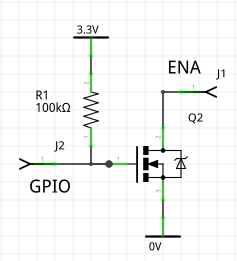

# Display drivers

These drivers support [nano-gui](./README.md), [micro-gui](https://github.com/peterhinch/micropython-micro-gui),
and [Writer and CWriter](https://github.com/peterhinch/micropython-font-to-py/blob/master/writer/WRITER.md).
They currently support four display technologies: OLED (color and monochrome),
color TFT, monochrome Sharp displays and EPD (ePaper/eInk).
All drivers provide a display class subclassed from the built-in
`framebuf.FrameBuffer` class. This provides three increasing levels of support:
 * Graphics via the `FrameBuffer` graphics primitives.
 * Text rendering in arbitrary fonts via `Writer` and `Cwriter` classes (see
 [font_to_py.py](https://github.com/peterhinch/micropython-font-to-py.git)).
 * Use with nano-gui and [micro-gui](https://github.com/peterhinch/micropython-micro-gui/).

It should be noted that in the interests of conserving RAM these drivers offer
a bare minimum of functionality required to support the above. Most drivers
provide some support for bus sharing.

Users of the GUI and Writer classes only need to instantiate a display. Hence
only device constructors are documented. Other attributes are transparent to
the user. Required methods and bound variables are detailed in
[Writing device drivers](./DRIVERS.md#7-writing-device-drivers). Low level
access via the `Writer` and `CWriter` classes is documented
[here](https://github.com/peterhinch/micropython-font-to-py/blob/master/writer/WRITER.md).

###### [Main README](./README.md#1-introduction)

# Contents

 1. [Introduction](./DRIVERS.md#1-introduction)  
  1.1 [Color handling](./DRIVERS.md#11-color-handling)  
 2. [OLED displays](./DRIVERS.md#2-oled-displays)  
  2.1 [Drivers for SSD1351](./DRIVERS.md#21-drivers-for-ssd1351) Color OLEDs  
  2.2 [Drivers for SSD1331](./DRIVERS.md#22-drivers-for-ssd1331) Small color OLEDs  
  2.3 [Drivers for SSD1327](./DRIVERS.md#23-drivers-for-ssd1327) Greyscale OLEDs  
 3. [Color TFT displays](./DRIVERS.md#3-color-tft-displays)  
  3.1 [Drivers for ST7735R](./DRIVERS.md#31-drivers-for-st7735r) Small TFTs  
  3.2 [Drivers for ILI9341](./DRIVERS.md#32-drivers-for-ili9341) Large TFTs  
  3.3 [Drivers for ST7789](./DRIVERS.md#33-drivers-for-st7789) Small high density TFTs  
  &nbsp;&nbsp;&nbsp;&nbsp;&nbsp;3.3.1 [TTGO T Display](./DRIVERS.md#331-ttgo-t-display) Low cost ESP32 with integrated display  
  &nbsp;&nbsp;&nbsp;&nbsp;&nbsp;3.3.2 [Waveshare Pico Res Touch](./DRIVERS.md#332-waveshare-pico-res-touch)  
  &nbsp;&nbsp;&nbsp;&nbsp;&nbsp;3.3.3 [Waveshare Pico LCD 2](./DRIVERS.md#333-waveshare-pico-lcd-2)  
  &nbsp;&nbsp;&nbsp;&nbsp;&nbsp;3.3.4 [Troubleshooting](./DRIVERS.md#334-troubleshooting)  
  3.4 [3.4 Driver for ILI9486](./DRIVERS.md#34-driver-for-ili9486) Very large display needs plenty of RAM  
 4. [Drivers for sharp displays](./DRIVERS.md#4-drivers-for-sharp-displays) Large low power monochrome displays  
  4.1 [Display characteristics](./DRIVERS.md#41-display-characteristics)  
  &nbsp;&nbsp;&nbsp;&nbsp;&nbsp;4.1.1 [The VCOM bit](./DRIVERS.md#411-the-vcom-bit)  
  &nbsp;&nbsp;&nbsp;&nbsp;&nbsp;4.1.2 [Refresh rate](./DRIVERS.md#412-refresh-rate)  
  4.2 [Test scripts](./DRIVERS.md#42-test-scripts)  
  4.3 [Device driver constructor](./DRIVERS.md#43-device-driver-constructor)  
  &nbsp;&nbsp;&nbsp;&nbsp;&nbsp;4.3.1 [Device driver methods](./DRIVERS.md#431-device-driver-methods)  
  &nbsp;&nbsp;&nbsp;&nbsp;&nbsp;4.3.2 [The vcom arg](./DRIVERS.md#432-the-vcom-arg)  
  4.4 [Application design](./DRIVERS.md#44-application-design)  
  &nbsp;&nbsp;&nbsp;&nbsp;&nbsp;4.4.1 [Micropower applications](./DRIVERS.md#441-micropower-applications)  
  4.5 [Resources](./DRIVERS.md#45-resources)  
 5. [ePaper displays](./DRIVERS.md#5-epaper-displays)  
  5.1 [Adafruit monochrome eInk Displays](./DRIVERS.md#51-adafruit-monochrome-eink-displays)  
  &nbsp;&nbsp;&nbsp;&nbsp;&nbsp;5.1.1 [EPD constructor args](./DRIVERS.md#511-epd-constructor-args)  
  &nbsp;&nbsp;&nbsp;&nbsp;&nbsp;5.1.2 [EPD public methods](./DRIVERS.md#512-epd-public-methods)  
  &nbsp;&nbsp;&nbsp;&nbsp;&nbsp;5.1.3 [EPD public bound variables](./DRIVERS.md#513-epd-public-bound-variables)  
  &nbsp;&nbsp;&nbsp;&nbsp;&nbsp;5.1.4 [FeatherWing Wiring](./DRIVERS.md#514-featherwing-wiring)  
  &nbsp;&nbsp;&nbsp;&nbsp;&nbsp;5.1.5 [Micropower use](./DRIVERS.md#515-micropower-use)  
  5.2 [Waveshare eInk Display HAT](./DRIVERS.md#52-waveshare-eink-display-hat)  
  &nbsp;&nbsp;&nbsp;&nbsp;&nbsp;5.2.1 [EPD constructor args](./DRIVERS.md#521-epd-constructor-args)  
  &nbsp;&nbsp;&nbsp;&nbsp;&nbsp;5.2.2 [EPD public methods](./DRIVERS.md#522-epd-public-methods)  
  &nbsp;&nbsp;&nbsp;&nbsp;&nbsp;5.2.3 [EPD public bound variables](./DRIVERS.md#523-epd-public-bound-variables)  
 6. [EPD Asynchronous support](./DRIVERS.md#6-epd-asynchronous-support)  
 7. [Writing device drivers](./DRIVERS.md#7-writing-device-drivers)  
 8. [Links](./DRIVERS.md#8-links)  

The [Micropower use](./DRIVERS.md#515-micropower-use) section is applicable to
EPD's in general but makes specific reference to the 2.9" micropower demo.

###### [Main README](./README.md#1-introduction)

# 1. Introduction

A nano-gui application specifies a driver by means of `color_setup.py` located
in the root directory of the target. In micro-gui `hardware_setup.py` does a
similar job, also specifying pins for the user controls.

A typical `color_setup.py` looks like this:
```python
import machine
import gc
from drivers.ssd1351.ssd1351 import SSD1351 as SSD  # Choose device driver
pdc = machine.Pin('Y1', machine.Pin.OUT_PP, value=0)
pcs = machine.Pin('Y2', machine.Pin.OUT_PP, value=1)
prst = machine.Pin('Y3', machine.Pin.OUT_PP, value=1)
spi = machine.SPI(2, baudrate=10_000_000)  # baudrate depends on display chip
gc.collect()
# Precaution before instantiating framebuf. The next line creates the buffer.
ssd = SSD(spi, pcs, pdc, prst, 96)  # Create a display instance
```
The directory `setup_examples` contains examples for various displays. These
are named by graphics chip ID followed by host, thus `ssd1306_pyb.py` is for an
SSD1306 based display connected to a Pyboard. Files may be adapted and copied
to `color_setup.py` on the target's root. The section in this doc for the
specific display chip should be consulted for SSD constructor arguments and SPI
baudrate. The more exotic displays (Sharp and ePaper) have additional features
and requirements detailed below.

## 1.1 Color handling

Most color displays support colors specified as 16-bit quantities. Storing two
bytes for every pixel results in large frame buffers. Most of the drivers
reduce this to 1 byte (the default) or 4 bits per pixel, with the data being
expanded at runtime when a line is displayed. This trades a large saving in RAM
for a small increase in refresh time. Minimising this increase while keeping
the driver cross-platform involves the use of the `viper` decorator.

Eight bit drivers store colors in `rrrgggbb`. This results in a loss of
precision in specifying a color. Four bit drivers store a color as the index
into a 16 bit lookup table. There is no loss of precision but only 16 distinct
colors can be supported.

The choice of 16, 8 or 4 bit drivers is largely transparent: all demo scripts
run in a visually identical manner under all drivers. This will apply to any
application which uses the predefined colors. Differences become apparent when
specifying custom colors. For detail see the main README
[User defined colors](./README.md#311-user-defined-colors).

###### [Contents](./DRIVERS.md#contents)

# 2. OLED displays

## 2.1 Drivers for SSD1351

This is an OLED driver. The supported displays produce excellent images with
extreme contrast and bright colors. Power consumption is low.

See [Adafruit 1.5" 128*128 OLED display](https://www.adafruit.com/product/1431)
and [Adafruit 1.27" 128*96 display](https://www.adafruit.com/product/1673).

There are four versions.
 * `ssd1351.py` This is optimised for STM (e.g. Pyboard) platforms.
 * `ssd1351_generic.py` Cross-platform version. Tested on ESP32 and ESP8266.
 * `ssd1351_16bit.py` Cross-platform. Uses 16 bit RGB565 color.
 * `ssd1351_4bit.py` Cross-platform. Uses 4 bit color.

All these drivers work with the provided demo scripts.  
To conserve RAM the first two use 8 bit (rrrgggbb) color. This works well with
the GUI if saturated colors are used to render text and controls.

The `ssd1351_generic.py` and 4 bit versions use the `micropython.viper`
decorator. If your platform does not support this, comment it out and remove
the type annotations. You may be able to use the `micropython.native`
decorator.

If the platform supports the viper emitter performance should still be good: on
a Pyboard V1 the generic driver perorms a refresh of a 128*128 color display in
47ms. The STM version is faster but not by a large margin: a refresh takes
41ms. 32ms of these figures is consumed by the data transfer over the SPI
interface. The 4-bit version with Viper takes 44ms.

If the viper and native decorators are unsupported a screen redraw takes 272ms
(on Pyboard 1.0) which is visibly slow.

The `ssd1351_16bit` version on a 128x128 display requires 32KiB for the frame
buffer; this means it is only usable on platforms with plenty of RAM. Testing
was done on a Pyboard D SF2W. With the GUI this version offers no benefit, but
it delivers major advantages in applications such as rendering images.

For further information see the GUI README
[User defined colors](./README.md#311-user-defined-colors).

This driver was tested on Adafruit 1.5 and 1.27 inch displays.

The `color_setup.py` file should initialise the SPI bus with a baudrate of
20_000_000. Args `polarity`, `phase`, `bits`, `firstbit` are defaults. Hard or
soft SPI may be used but hard may be faster.

#### SSD1351 Constructor args:
 * `spi` An SPI bus instance.
 * `pincs` An initialised output pin. Initial value should be 1.
 * `pindc` An initialised output pin. Initial value should be 0.
 * `pinrs` An initialised output pin. Initial value should be 1.
 * `height=128` Display dimensions in pixels. Height must be 96 or 128.
 * `width=128`
 * `init_spi=False` This optional arg enables flexible options in configuring
 the SPI bus. The default assumes exclusive access to the bus with
 `color_setup.py` initialising it. Those settings will be left in place. If a
 callback function is passed, it will be called prior to each SPI bus write:
 this is for shared  bus applications. The callback will receive a single arg
 being the SPI bus instance. In normal use it will be a one-liner or lambda
 initialising the bus. A minimal example is this function:
```python
def spi_init(spi):
    spi.init(baudrate=20_000_000)  # Data sheet: should support 20MHz
```
Despite the datasheet I failed to get this baudrate to work even on a PCB.

#### A "gotcha" in the datasheet

For anyone seeking to understand or modify the code, the datasheet para 8.3.2
is confusing. They use the colors red, green and blue to represent colors C, B
and A. With the setup used in these drivers, C is blue and A is red. The 16 bit
color streams sent to the display are:  
`s[x]`     1st byte sent `b7 b6 b5 b4 b3 g7 g6 g5`  
`s[x + 1]` 2nd byte sent `g4 g3 g2 r7 r6 r5 r4 r3`

###### [Contents](./DRIVERS.md#contents)

## 2.2 Drivers for SSD1331

This is an OLED driver for small displays. The supported display produces
excellent images with extreme contrast and bright colors. Power consumption is
low.

See [Adafruit 0.96" OLED display](https://www.adafruit.com/product/684). Most
of the demos assume a larger screen and will fail. The `color96.py` demo is
written for this display.

There are two versions. Both are cross-platform.
 * `ssd1331.py` Uses 8 bit rrrgggbb color.
 * `ssd1331_16bit.py` Uses 16 bit RGB565 color.

The `ssd1331_16bit` version requires 12KiB of RAM for the frame buffer, while
the standard version needs only 6KiB. For the GUI the standard version works
well because text and controls are normally drawn with a limited range of
colors, most of which are saturated.

The 16 bit version provides greatly improved results when rendering images.

The `color_setup.py` file should initialise the SPI bus with a baudrate of
6_666_000. Args `polarity`, `phase`, `bits`, `firstbit` are defaults. Hard or
soft SPI may be used but hard may be faster.

#### SSD1331 Constructor args:
 * `spi` An SPI bus instance.
 * `pincs` An initialised output pin. Initial value should be 1.
 * `pindc` An initialised output pin. Initial value should be 0.
 * `pinrs` An initialised output pin. Initial value should be 1.
 * `height=64` Display dimensions in pixels.
 * `width=96`
 * `init_spi=False` This optional arg enables flexible options in configuring
 the SPI bus. The default assumes exclusive access to the bus with
 `color_setup.py` initialising it. Those settings will be left in place. If a
 callback function is passed, it will be called prior to each SPI bus write:
 this is for shared  bus applications. The callback will receive a single arg
 being the SPI bus instance. In normal use it will be a one-liner or lambda
 initialising the bus. A minimal example is this function:
```python
def spi_init(spi):
    spi.init(baudrate=6_666_000)  # Data sheet: max is 150ns
```

###### [Contents](./DRIVERS.md#contents)

## 2.3 Drivers for SSD1327

This driver was contributed by Mike Causer (@mcauser) and Philip Adamson
(@Treadbrook). The displays are 4-bit greyscale. The driver converts 24-bit RGB
colors to 4-bit greyscale based on the maximum brightness of the R, G, and B
values. The driver should support any display using SSD1327 on I2C. Specific
support is for:

 1. [Seed OLED 96x96](https://www.seeedstudio.com/Grove-OLED-Display-1-12.html?queryID=080778ddd8f54df96ca0e016af616327&objectID=1763&indexName=bazaar_retailer_products)
 2. [Waveshare 128x128](https://www.waveshare.com/product/ai/displays/oled/1.5inch-oled-module.htm?___SID=U)

The driver provides the following classes:
 1. `SSD1327_I2C` Generic driver for SSD1327 using I2C interface.
 2. `SEEED_OLED_96X96` Subclass for the Seeed display.
 3. `WS_OLED_128X128` Subclass for Waveshare display.

`SSD1327_I2C` constructor args:
 1. `width` In pixels.
 2. `height` In pixels.
 3. `i2c` Initialised I2C interface.
 4. `addr=0x3C` I2C address.

The subclasses populate the width and height arguments appropriately for the
supported displays.

`SEEED_OLED_96X96` constructor arg:
 1. `i2c` Initialised I2C interface.

`WS_OLED_128X128` constructor args:
 1.  `i2c` Initialised I2C interface.
 2. `addr=0x3C` I2C address.

###### [Contents](./DRIVERS.md#contents)

# 3. Color TFT displays

## 3.1 Drivers for ST7735R

This chip is for small TFT displays. Four drivers are provided. All are
cross-platform but assume `micropython.viper` capability. They use 8-bit or
4-bit color to minimise the RAM used by the frame buffer.

Drivers for [Adafruit 1.8" display](https://www.adafruit.com/product/358).
 * `st7735r.py` 8-bit color. 
 * `st7735r_4bit.py` 4-bit color for further RAM reduction.

For [Adafruit 1.44" display](https://www.adafruit.com/product/2088).
 * `st7735r144.py` 8-bit color. 
 * `st7735r144_4bit` 4 bit color.

Users of other ST7735R based displays should beware: there are many variants
with differing setup requirements.
[This driver](https://github.com/boochow/MicroPython-ST7735/blob/master/ST7735.py)
has four different initialisation routines for various display versions. The
supported Adafruit displays differ in their initialisation settings, hence the
need for different drivers for the two display types. If your Chinese display
doesn't work with my drivers you are on your own: I can't support hardware I
don't possess.

The `color_setup.py` file should initialise the SPI bus with a baudrate of
12_000_000. Args `polarity`, `phase`, `bits`, `firstbit` are defaults. Hard or
soft SPI may be used but hard may be faster.

#### ST7735R Constructor args 1.8" display:
 * `spi` An initialised SPI bus instance. The device can support clock rates of
 upto 15MHz.
 * `cs` An initialised output pin. Initial value should be 1.
 * `dc` An initialised output pin. Initial value should be 0.
 * `rst` An initialised output pin. Initial value should be 1.
 * `height=128` Display dimensions in pixels. For portrait mode exchange
 `height` and `width` values.
 * `width=160`
 * `usd=False` Upside down: set `True` to invert display.
 * `init_spi=False` This optional arg enables flexible options in configuring
 the SPI bus. See below.

#### ST7735R144 Constructor args 1.44" display:
 * `spi` An initialised SPI bus instance. The device can support clock rates of
 upto 15MHz.
 * `cs` An initialised output pin. Initial value should be 1.
 * `dc` An initialised output pin. Initial value should be 0.
 * `rst` An initialised output pin. Initial value should be 1.
 * `height=128` Display dimensions in pixels.
 * `width=128`
 * `rotation=0` Pass 0, 90, 180 or 270 to rotate the display.
 * `init_spi=False` This optional arg enables flexible options in configuring
 the SPI bus. See below.

#### The init_spi constructor arg 
 
The `False` default assumes exclusive access to the bus. It is initialised by
`color_setup.py` and those settings are left in place. If a callback function
is passed, it will be called prior to each SPI bus write. This is for shared
bus applications. The callback will receive a single arg being the SPI bus
instance. In normal use it will be a one-liner or lambda  initialising the bus.
A minimal example is this function which caters for the case where another
program may have changed the baudrate:
```python
def spi_init(spi):
    spi.init(baudrate=12_000_000)  # Data sheet: max is 12MHz
```

###### [Contents](./DRIVERS.md#contents)

## 3.2 Drivers for ILI9341

Adafruit make several displays using this chip, for example
[this 3.2 inch unit](https://www.adafruit.com/product/1743).

The `color_setup.py` file should initialise the SPI bus with a baudrate of
10_000_000. Args `polarity`, `phase`, `bits`, `firstbit` are defaults. Hard or
soft SPI may be used but hard may be faster. See note on overclocking below.

#### ILI9341 Constructor args:
 * `spi` An initialised SPI bus instance. The device can support clock rates of
 upto 10MHz.
 * `cs` An initialised output pin. Initial value should be 1.
 * `dc` An initialised output pin. Initial value should be 0.
 * `rst` An initialised output pin. Initial value should be 1.
 * `height=240` Display dimensions in pixels. For portrait mode exchange
 `height` and `width` values.
 * `width=320`
 * `usd=False` Upside down: set `True` to invert display.
 * `init_spi=False` This optional arg enables flexible options in configuring
 the SPI bus. The default assumes exclusive access to the bus. In this normal
 case, `color_setup.py` initialises it and the settings will be left in place.
 If the bus is shared with devices which require different settings, a callback
 function should be passed. It will be called prior to each SPI bus write. The
 callback will receive a single arg being the SPI bus instance. It will
 typically be a one-liner or lambda initialising the bus. A minimal example is
 this function:
```python
def spi_init(spi):
    spi.init(baudrate=10_000_000)
```

The ILI9341 class uses 4-bit color to conserve RAM. Even with this adaptation
the buffer size is 37.5KiB. See [Color handling](./DRIVERS.md#11-color-handling)
for details of the implications of 4-bit color. On a Pyboard 1.1 the `scale.py`
demo ran with 34.5K free with no modules frozen, and with 47K free with `gui`
and contents frozen.

The driver uses the `micropython.viper` decorator. If your platform does not
support this, the Viper code will need to be rewritten with a substantial hit
to performance.

#### Use with uasyncio

A full refresh blocks for ~200ms. If this is acceptable, no special precautions
are required. However this period may be unacceptable for some `uasyncio`
applications. The driver provides an asynchronous `do_refresh(split=4)` method.
If this is run the display will be refreshed, but will periodically yield to
the scheduler enabling other tasks to run. This is documented
[here](./ASYNC.md).

Another option to reduce blocking is overclocking the SPI bus.

#### Overclocking SPI

The ILI9341 datasheet section 19.3.4 specifies a minimum clock cycle time of
100ns for write cycles. It seems that every man and his dog overclocks this,
even the normally conservative Adafruit
[use 24MHz](https://learn.adafruit.com/adafruit-2-8-and-3-2-color-tft-touchscreen-breakout-v2/python-usage)
and [rdagger](https://github.com/rdagger/micropython-ili9341/blob/master/demo_fonts.py)
uses 40MHz. I have successfully run my display at 40MHz. My engineering
training makes me baulk at exceeding datasheet limits but the choice is yours.
I raised [this isse](https://github.com/adafruit/Adafruit_CircuitPython_ILI9341/issues/24).
The response may be of interest.

###### [Contents](./DRIVERS.md#contents)

## 3.3 Drivers for ST7789

These displays tend to be physically small with a high pixel density. The chip
supports up to 240x320 displays. The Adafruit units tested are 240x240. To keep
the buffer size down, the driver uses 4-bit color with dynamic conversion to 16
bit RGB565 at runtime. This uses a lookup table (LUT) enabling user defined
colors. The resultant buffer size for the Adafruit displays is 28800 bytes. See
[Color handling](./DRIVERS.md#11-color-handling) for the implications of 4-bit
color.

[Tested display: Adafruit 1.3 inch](https://www.adafruit.com/product/4313). The
Adafruit [1.54 inch](https://www.adafruit.com/product/3787) has identical
resolution and uses the same CircuitPython driver so can be expected to work.

The driver also supports the
[TTGO T-Display](http://www.lilygo.cn/claprod_view.aspx?TypeId=62&Id=1274).
This is an inexpensive ESP32 with a 135x240 color TFT display. See
`setup_examples/st7789_ttgo.py`.

Also, in landscape mode only, the
[Waveshare Pico LCD 1.14 inch](https://www.waveshare.com/pico-lcd-1.14.htm).
This has a hardware quirk, copy `setup_examples/st7789_pico_lcd_114.py` to
your setup file.

The `color_setup.py` file should initialise the SPI bus with a baudrate of
30_000_000. Args `polarity`, `phase`, `bits`, `firstbit` are defaults. Hard or
soft SPI may be used but hard may be faster. 30MHz is a conservative value: see
below. An example file for the Pi Pico is in `setup_examples/st7789_pico.py`.

#### ST7789 Constructor args:
 * `spi` An initialised SPI bus instance. The chip supports clock rates of upto
 62.5MHz (datasheet table 6). I have tested 60MHz. High speeds are sensitive to
 electrical issues such as lead lengths, PCB layout and grounding.
 * `cs` An initialised output pin. Initial value should be 1.
 * `dc` An initialised output pin. Initial value should be 0.
 * `rst` An initialised output pin. Initial value should be 1.
 * `height=240` Display dimensions in pixels. For portrait mode exchange
 `height` and `width` values: this ensures that `nano-gui` gets the correct
 aspect ratio.
 * `width=240`
 * `disp_mode=LANDSCAPE` This arg enables portrait mode and other
 configurations. See below.
 * `init_spi=False` For shared SPI bus applications. See note below.
 * `display=GENERIC` The `display` arg is an opaque type defining the display
 hardware. Current options (exported by the driver) are `GENERIC` for Adafruit
 displays and `TDISPLAY` for the TTGO board.

#### Constants exported by the driver

The `color_setup.py` file should invoke the driver as follows:
```python
from drivers.st7789.st7789_4bit import *
SSD = ST7789
```
The following constants are available:  
Orientation (values for `disp_mode`):  
`LANDSCAPE` Normal display, text is parallel to long axis.  
`PORTRAIT` Text is parallel to short axis.  
`USD` Upside down rendering.  
`REFLECT` Mirror image rendering.  

Display types (values for `display`):  
`GENERIC` For Adafruit displays.  
`TDISPLAY` For the TTGO T-Display and Waveshare Pico LCD.  

### init_spi

This optional arg enables flexible options in configuring the SPI bus. The
default assumes exclusive access to the bus. In this normal case,
`color_setup.py` initialises it and the settings will be left in place. If the
bus is shared with devices which require different settings, a callback
function should be passed. It will be called prior to each SPI bus write. The
callback will receive a single arg being the SPI bus instance. It will
typically be a one-liner or lambda initialising the bus. A minimal example is
this function:
```python
def spi_init(spi):
    spi.init(baudrate=30_000_000)
```
#### Display mode

This is provided mainly to support asymmetrical displays. It also enables the
Adafruit display image to be rotated. Any of the orientation constants listed
above may be applied, and multiple options may be combined using the bitwise-or
`|` operator.  

When choosing `LANDSCAPE` or `PORTRAIT` mode it is essential that `height` and
`width` constructor args match the mode.

The following example `color_setup.py` is for Pi Pico and produces an upside
down portrait display.
```python
from drivers.st7789.st7789_4bit import *
SSD = ST7789

pdc = Pin(13, Pin.OUT, value=0)  # Arbitrary pins
pcs = Pin(14, Pin.OUT, value=1)
prst = Pin(15, Pin.OUT, value=1)

gc.collect()  # Precaution before instantiating framebuf
spi = SPI(1, 30_000_000, sck=Pin(10), mosi=Pin(11), miso=Pin(8))
ssd = SSD(spi, dc=pdc, cs=pcs, rst=prst, disp_mode=PORTRAIT | USD)
```

#### Use with uasyncio

Running the SPI bus at 60MHz a refresh blocks for 83ms (tested on a Pi Pico at
standard clock frequency). If the blocking period is acceptable, no special
precautions are required. This period may be unacceptable for some `uasyncio`
applications. Some may use lower SPI baudrates either for electrical reasons or
where the host cannot support high speeds, and some platforms may run Python
code at a different speed.

The driver provides an asynchronous `do_refresh(split=4)` method. If this is
run the display will be refreshed, but will periodically yield to the scheduler
enabling other tasks to run. This is documented [here](./ASYNC.md).

The amount of data for SPI transfer for a 240x240 display is  
240x240x16 = 921.6K bits  
At a 60MHz baudrate this equates to  
240x240x16/6e7=15.36ms  
This suggests that about 80% of the latency results from the Python code. An
option may be to overclock.

### 3.3.1 TTGO T Display

Thanks to [Ihor Nehrutsa](https://github.com/IhorNehrutsa) who wrote much of
the setup file for this device.

This is an ESP32 based device with an integrated 1.14" 135x240 pixel display
based on ST7789.

It is supported by `setup_examples/st7789_ttgo.py`. Copy to
`/pyboard/color_setup.py` on the device. It produces a landscape mode display
with the top left hand corner adjacent to pin 36.

Commented-out code offers portrait mode.

URL's. More in `st7789_ttgo.py`  
[TTGO Product page](http://www.lilygo.cn/claprod_view.aspx?TypeId=62&Id=1274)  
[Ihor Nehrutsa's PR](https://github.com/peterhinch/micropython-nano-gui/pull/8)  
[Another MicroPython driver](https://github.com/jikegong/TTGO-Esp32-ST7789-Display-MicroPython/blob/2ed1816c41f25c8993038c35ef40b2efeb225dcc/st7789.py)  
[Factory test (C)](https://github.com/Xinyuan-LilyGO/TTGO-T-Display/blob/master/TFT_eSPI/examples/FactoryTest/FactoryTest.ino)  

### 3.3.2 Waveshare Pico Res Touch

This is a "plug and play" 2.8" color TFT for nano-gui and the Pi Pico. Users of
micro-gui will need to find a way to connect pushbuttons, either using stacking
headers on the Pico or soldering wires to its pads. The `color_setup.py` file
is as follows. Note the commented-out options and the Lewis Caroll nature of
the landscape/portrait constructor args. See `setup_examples/ws_pico_res_touch.py`.
```python
import gc
from machine import Pin, SPI
from drivers.st7789.st7789_4bit import *
SSD = ST7789

pdc = Pin(8, Pin.OUT, value=0)
pcs = Pin(9, Pin.OUT, value=1)
prst = Pin(15, Pin.OUT, value=1)
pbl = Pin(13, Pin.OUT, value=1)

gc.collect()  # Precaution before instantiating framebuf
spi = SPI(1, 33_000_000, sck=Pin(10), mosi=Pin(11), miso=Pin(12))

# Define the display
# For portrait mode:
# ssd = SSD(spi, height=320, width=240, dc=pdc, cs=pcs, rst=prst)
# For landscape mode:
ssd = SSD(spi, height=240, width=320, disp_mode=PORTRAIT, dc=pdc, cs=pcs, rst=prst)

# Optional use of SD card.
from sdcard import SDCard
import os
sd = SDCard(spi, Pin(22, Pin.OUT), 33_000_000)
vfs = os.VfsFat(sd)
os.mount(vfs, "/fc")
```
The ST7789 is specified for baudrates upto 62.5MHz, however the maximum the
Pico can produce is 31.25MHz. The display uses a nonstandard pin for MISO. This
was proven to work by testing the SD card. This requires the official SD card
driver which may be found in the MicroPython source tree in
`drivers/sdcard/sdcard.py`. I am not an expert on SD cards. Mine worked fine at
31.25MHz but this may or may not be universally true.

### 3.3.3 Waveshare Pico LCD 2

Support for this display resulted from a collaboration with Mike Wilson
(@MikeTheGent).

This is a "plug and play" 2" color TFT for `nano-gui` and the Pi Pico. Users of
`micro-gui` will need to find a way to connect pushbuttons, using stacking
headers on the Pico or soldering wires to its pads. The `color_setup.py` file
is as follows.
```python
from machine import Pin, SPI
import gc

from drivers.st7789.st7789_4bit import *
SSD = ST7789

gc.collect()  # Precaution before instantiating framebuf
# Conservative low baudrate. Can go to 62.5MHz.
spi = SPI(1, 30_000_000, sck=Pin(10), mosi=Pin(11), miso=None)
pcs = Pin(9, Pin.OUT, value=1)
prst = Pin(12, Pin.OUT, value=1)
pbl = Pin(13, Pin.OUT, value=1)
pdc = Pin(8, Pin.OUT, value=0)

ssd = SSD(spi, height=240, width=320, dc=pdc, cs=pcs, rst=prst, disp_mode=LANDSCAPE, display=PI_PICO_LCD_2)
```

### 3.3.4 Troubleshooting

If your display shows garbage, check the following (I have seen both):
 * SPI baudrate too high for your physical layout.
 * `height` and `width` not matching the choice of `LANDSCAPE` or `PORTRAIT`
 display mode.

## 3.4 Driver for ILI9486

This was tested with
[this display](https://www.waveshare.com/product/3.5inch-RPi-LCD-A.htm), a
480x320 color LCD designed for the Raspberry Pi. Note that even with 4-bit
color the display buffer is 76,800 bytes. On a Pico `nanogui` works fine, but
`micro-gui` fails to compile unless frozen bytecode is used, in which case it
runs with about 75K free RAM.

See [nanogui setup](https://github.com/peterhinch/micropython-nano-gui/blob/master/setup_examples/ili9486_pico.py)
and [microgui setup](https://github.com/peterhinch/micropython-micro-gui/blob/main/setup_examples/ili9486_pico.py)
for examples of initialisation files.

##### Wiring

This shows the Raspberry Pi connector looking at the underside of the board
with the bulk of the board to the right. This was tested with a Pi Pico.

Connections may be adapted for other MicroPython targets. The board may be
powered from 5V or 3.3V: there is a regulator on board.

| Pico |      |  L |  R |      | Pico |
|:-----|:-----|:--:|:--:|:-----|:-----|
| Vin  | VIN  |  2 |  1 | 3V3  |      |
|      |      |  4 |  3 |      |      |
|      |      |  6 |  5 |      |      |
|      |      |  8 |  7 |      |      |
|      |      | 10 |  9 | GND  | Gnd  |
|      |      | 12 | 11 |      |      |
|      |      | 14 | 13 |      |      |
|      |      | 16 | 15 |      |      |
|  8   | DC   | 18 | 17 |      |      |
|      |      | 20 | 19 | MOSI |  7   |
|  9   | RST  | 22 | 21 |      |      |
| 10   | CS   | 24 | 23 | SCLK |  6   |
|      |      | 25 | 26 |      |      |

#### ILI9486 Constructor args:
 * `spi` An initialised SPI bus instance. The device can support clock rates of
 upto 15MHz according to the datasheet. In practice it can be overclocked to
 30MHz.
 * `cs` An initialised output pin. Initial value should be 1.
 * `dc` An initialised output pin. Initial value should be 0.
 * `rst` An initialised output pin. Initial value should be 1.
 * `height=320` Display dimensions in pixels. For portrait mode exchange
 `height` and `width` values.
 * `width=480`
 * `usd=False` Upside down: set `True` to invert display.
 * `init_spi=False` This optional arg enables flexible options in configuring
 the SPI bus. The default assumes exclusive access to the bus. In this normal
 case, `color_setup.py` initialises it and the settings will be left in place.
 If the bus is shared with devices which require different settings, a callback
 function should be passed. It will be called prior to each SPI bus write. The
 callback will receive a single arg being the SPI bus instance. It will
 typically be a one-liner or lambda initialising the bus. A minimal example is
 this function:
```python
def spi_init(spi):
    spi.init(baudrate=10_000_000)
```

The ILI9486 class uses 4-bit color to conserve RAM. Even with this adaptation
the buffer size is 76.85KiB. See [Color handling](./DRIVERS.md#11-color-handling)
for details of the implications of 4-bit color. On the Pico with the display
driver loaded there was 85KiB free RAM running `nano-gui` but `micro-gui` ran
out of RAM..

The driver uses the `micropython.viper` decorator. If your platform does not
support this, the Viper code will need to be rewritten with a substantial hit
to performance.

#### Use with uasyncio

A full refresh blocks for ~220ms. If this is acceptable, no special precautions
are required. However this period may be unacceptable for some `uasyncio`
applications. The driver provides an asynchronous `do_refresh(split=4)` method.
If this is run the display will be refreshed, but will periodically yield to
the scheduler enabling other tasks to run. This is documented
[here](./ASYNC.md).

###### [Contents](./DRIVERS.md#contents)

# 4. Drivers for sharp displays

These displays have characteristics which mean that they are best suited to
micropower applications. Inevitably this means that deployment is more involved
than the other supported units. This doc provides some background information
on their use.

These monochrome SPI displays exist in three variants from Adafruit.
 1. [2.7 inch 400x240 pixels](https://www.adafruit.com/product/4694)
 2. [1.3 inch 144x168](https://www.adafruit.com/product/3502)
 3. [1.3 inch 96x96](https://www.adafruit.com/product/1393) - Discontinued.

I have tested on the first of these. However the
[Adfruit driver](https://github.com/adafruit/Adafruit_CircuitPython_SharpMemoryDisplay)
supports all of these and I would expect this one also to do so.

## 4.1. Display characteristics

These displays have extremely low current consumption: I measured ~90μA on the
2.7" board when in use. Refresh is fast, visually excellent and can run at up
to 20Hz. This contrasts with ePaper (eInk) displays where refresh is slow
(seconds) and visually intrusive; an alternative fast mode overcomes this, but
at the expense of ghosting.

On the other hand the power consumption of ePaper can be zero (you can switch
them off and the display is retained). If you power down a Sharp display the
image is retained, but only for a few seconds. In a Pyboard context 90μA is low
in comparison to stop mode and battery powered applications should be easily
realised.

The 2.7" display has excellent resolution and can display fine lines and small
fonts. In other respects the display quality is not as good as ePaper. For good
contrast best results are achieved if the viewing angle and the direction of
the light source are positioned to achieve reflection.

### 4.1.1 The VCOM bit

The significance of this is somewhat glossed-over in the Adafruit docs, and a
study of the datasheet is confusing in the absence of prior knowledge of LCD
technology.

The signals applied to an LCD display should have no DC component. This is
because DC can cause gradual electrolysis and deterioration of of the liquid
crystal material. Display driver hardware typically has an oscillator driving
exclusive-or gates such that antiphase signals are applied for ON pixels, and
in-phase for OFF pixels. The oscillator typically drives a D-type flip-flop to
ensure an accurate 1:1 mark space ratio and hence zero DC component.

These displays offer two ways of achieving this, in the device driver or using
an external 1:1 mark space logic signal. The bit controlling this is known as
`VCOM` and the external pins supporting it are `EXTMODE` and `EXTCOMIN`.
`EXTMODE` determines whether a hardware input is used (`Vcc`) or software
control is required (`Gnd`). It is pulled low.

The driver supports software control, in that `VCOM` is complemented each time
the display is refreshed. The Adafruit driver also does this.

Sofware control implies that, in long running applications, the display should
regularly be refreshed. The datasheet incicates that the maximum rate is 20Hz,
but a 1Hz rate is sufficient.

If hardware control is to be used, `EXTMODE` should be linked to `Vcc` and a
1:1 logic signal applied to `EXTCOMIN`. A frequency range of 0.5-10Hz is
specified, and the datasheet also specifies "`EXTCOMIN` frequency should be
made lower than frame frequency".

In my opinion the easiest way to deal with this is usually to use software
control, ensuring that the driver's `show` method is called at regular
intervals of at least 1Hz.

### 4.1.2 Refresh rate

The datasheet specifies a minimum refresh rate of 1Hz.

## 4.2. Test scripts

 1. `sharptest.py` Basic functionality test.
 2. `clocktest.py` Digital and analog clock display.
 3. `clock_batt.py` As above but designed for low power operation. Pyboard
 specific.

Tests assume that `nanogui` is installed as per the instructions. `sharptest`
should not be run for long periods as it does not regularly refresh the
display. It tests `writer.py` and some `framebuffer` graphics primitives.
`clocktest` demostrates use with `nanogui`.

The `clock_batt.py` demo needs `upower.py` from
[micropython-micropower](https://github.com/peterhinch/micropython-micropower).

Testing was done on a Pyboard D SF6W: frozen bytecode was not required. I
suspect a Pyboard 1.x would require it to prevent memory errors. Fonts in
particular benefit from freezing as their RAM usage is radically reduced.

## 4.3. Device driver constructor

Positional args:
 1. `spi` An SPI bus instance. The constructor initialises this to the baudrate
 and bit order required by the hardware.
 2. `pincs` A `Pin` instance. The caller should initialise this as an output
 with value 0 (unusually the hardware CS line is active high).
 3. `height=240` Dimensions in pixels. Defaults are for 2.7" display.
 4. `width=400`
 5. `vcom=False` Accept the default unless using `pyb.standby`. See
 [4.3.2](./DRIVERS.md#432-the-vcom-arg).

### 4.3.1 Device driver methods

 1. `show` No args. Transfers the framebuffer contents to the device, updating
 the display.
 2. `update` Toggles the `VCOM` bit without transferring the framebuffer. This
 is a power saving method for cases where the application calls `show` at a
 rate of < 1Hz. In such cases `update` should be called at a 1Hz rate.

### 4.3.2 The vcom arg

It purpose is to support micropower applications which use `pyb.standby`.
Wakeup from standby is similar to a reboot in that program execution starts
from scratch. In the case where the board wakes up, writes to the display, and
returns to standby, the `VCOM` bit would never change. In this case the
application should store a `bool` in peristent storage, toggling it on each
restart, and pass that to the constructor.

Persistent storage exists in the RTC registers and backup RAM. See
[micopython-micropower](https://github.com/peterhinch/micropython-micropower)
for details of how to acces these resources.

## 4.4. Application design

In all cases the frame buffer is located on the target hardware. In the case of
the 2.7 inch display this is 400*240//8 = 12000 bytes in size. This should be
instantiated as soon as possible in the application to ensure that sufficient
contiguous RAM is available.

### 4.4.1 Micropower applications

These comments largely assume a Pyboard host. The application should import
`upower` from 
[micropython-micropower](https://github.com/peterhinch/micropython-micropower).
This turns the USB interface off if not in use to conserve power. It also
provides an `lpdelay` function to implement a delay using `pyb.stop()` to
conserve power.

In tests the `clock_batt` demo consumed 700μA between updates. A full refresh
every 30s consumed about 48mA for 128ms. These figures correspond to a mean
current consumption of 904μA implying about 46 days operation per AH of
battery capacity. LiPo cells of 2AH capacity are widely available offering a
theoretical runtime of 92 days between charges.

Lower currents might be achieved using standby but I have major doubts. This is
because it is necessary to toggle the VCOM bit at a minimum of 1Hz. Waking from
standby uses significan amounts of power as the modules are compiled. Even if
frozen bytecode is used, there is still significant power usage importing
modules and instantiating classes; this usage is not incurred in the loop in
the demo.

## 4.5. Resources

[Schematic for 2.7" unit](https://learn.adafruit.com/assets/94077)

[Datasheet 2.7"](https://cdn-learn.adafruit.com/assets/assets/000/094/215/original/LS027B7DH01_Rev_Jun_2010.pdf?1597872422)

[Datasheet 1.3"](http://www.adafruit.com/datasheets/LS013B4DN04-3V_FPC-204284.pdf)

###### [Contents](./DRIVERS.md#contents)

# 5. ePaper displays

Known as ePaper or eInk, electrophoretic (EPD) displays are usually monochrome.
Some support a few levels of grey or a very small range of colors. They have
long refresh times (many seconds). The principal benefit that they consume zero
current except while being refreshed: it is possible to switch off power
completely with the device retaining the image indefinitely. Present day EPD
units perform the slow refresh autonomously - the process makes no demands on
the CPU enabling user code to continue to run.

The drivers are compatible with `uasyncio`. One approach is to use synchronous
methods only and the standard demos (some of which use `uasyncio`) may be run.
However copying the framebuffer to the device blocks for some time - 250ms or
more - which may be problematic for applications which need to respond to
external events. A specific asynchronous mode provides support for reducing
blocking time. See [EPD Asynchronous support](./DRIVERS.md#6-epd-asynchronous-support).

## 5.1 Adafruit monochrome eInk Displays

The driver supports two Adafruit 2.9 inch 296*128 pixel units. A flexible
[display](https://www.adafruit.com/product/4262) interfaced via their
[interface breakout](https://www.adafruit.com/product/4224).

An alternative is the
[Adafruit 2.9" eInk FeatherWing](https://www.adafruit.com/product/4777) with
[wiring details](./DRIVERS.md#514-featherwing-wiring) listed below.

In my testing there are differences between these alternatives. The FeatherWing
shows a black border around the display. The reason for this is 
[unclear](https://github.com/adafruit/Adafruit_CircuitPython_IL0373/issues/11#issuecomment-763704622).
In development I encountered instances where the image on the flexible display
gradually degraded after the system was powered down. The white background
becomes speckled over a period of a few minutes. I'm unsure of the reason for
this. The `epd29_lowpower` demo did not exhibit this.

The interface breakout for the flexible display has an `ENA` pin which enables
the display to be powered down. This facilitates micropower applications: the
host shuts down the display before itself going into deep sleep.

The driver is cross platform and supports landscape or portrait mode. To keep
the buffer size down (to 4736 bytes) there is no greyscale support. It should
be noted that the Adafruit site cautions against refreshing the flexible
displays more frequently than every 180s. This warning does not appear on the
FeatherWing pages. No reason for the warning is given and it is
[unclear](https://forums.adafruit.com/viewtopic.php?f=19&t=174091) if this is
an absolute limit or an average rate.

##### Wiring

The [interface schematic is here](https://learn.adafruit.com/assets/86038). The
drawing title is confusing but I believe this is the correct schematic.

The following assumes a Pyboard host. Pyboard pin numbers are based on hardware
SPI 2 and an arbitrary choice of GPIO. All may be changed and soft SPI may be
used.

| Pyb |  Breakout |
|:----|:----------|
| Vin | Vin (1)   |
| Gnd | Gnd (3)   |
| Y8  | MOSI (6)  |
| Y6  | SCK (4)   |
| Y4  | BUSY (11) | (Low = Busy)
| Y3  | RST (10)  |
| Y2  | CS (7)    |
| Y1  | DC (8)    |

In normal use the `ENA` pin (12) may be left unconnected. For micropower use,
see below.

### 5.1.1 EPD constructor args
 * `spi` An initialised SPI bus instance. The device can support clock rates of
 upto 10MHz.
 * `cs` An initialised output pin. Initial value should be 1.
 * `dc` An initialised output pin. Initial value should be 0.
 * `rst` An initialised output pin. Initial value should be 1.
 * `busy` An initialised input pin.
 * `landscape=True` By default the long axis is horizontal.
 * `asyn=False` Setting this `True` invokes an asynchronous mode. See
 [EPD Asynchronous support](./DRIVERS.md#6-epd-asynchronous-support).

### 5.1.2 EPD public methods

##### Synchronous methods
 * `init` No args. Issues a hardware reset and initialises the hardware. This
 is called by the constructor. It needs to explicitly be called to exit from a
 deep sleep.
 * `sleep` No args. Puts the display into deep sleep. If called while a refresh
 is in progress it will block until the refresh is complete. `sleep` should be
 called before a power down to avoid leaving the display in an abnormal state.
 * `ready` No args. After issuing a `refresh` the device will become busy for
 a period: `ready` status should be checked before issuing `refresh`.
 * `wait_until_ready` No args. Pause until the device is ready.

##### Asynchronous methods
 * `updated` Asynchronous. No args. Pause until the framebuffer has been copied
 to the display.
 * `wait` Asynchronous. No args. Pause until the display refresh is complete.

### 5.1.3 EPD public bound variables

 * `height` Integer. Height in pixels. Treat as read-only.
 * `width` Integer. Width in pixels. Treat as read-only.
 * `demo_mode=False` Boolean. If set `True` after instantiating, `refresh()`
 will block until display update is complete, and then for a further two
 seconds to enable viewing. This enables generic nanogui demos to be run on an
 EPD.

### 5.1.4 FeatherWing wiring

The [pinout is listed here](https://learn.adafruit.com/adafruit-eink-display-breakouts/pinouts-2).
The `busy` line is brought out to a labelled pad on the PCB. It can be linked
to an unused pin on the interface connectors.

These are the connections required to run the test scripts on a Pyboard. Viwed
on the underside of the board with the SD card at the top. Each connector has
pairs of pins which are linked together.

| Pin   | Pyb  | Pin   | Pyb  | Notes                             |
|:------|:-----|:----- |:-----|:----------------------------------|
| RST   | Y3   |       |      | Should be open drain (see below). |
| 3V    | 3.3V |       |      |                                   |
|  .    |      |       |      |                                   |
| Gnd   | Gnd  |       |      |                                   |
|  .    |      | .     |      |                                   |
|  .    |      | .     |      |                                   |
|  .    |      | .     |      |                                   |
|  .    |      | .     |      |                                   |
|  .    |      | .     |      |                                   |
|  .    |      | .     |      |                                   |
| SCK   | Y6   | DC    | Y1   |                                   |
| MOSI  | Y8   | ECS   | Y2   |                                   |
|  .    |      | .     |      |                                   |
|  .    |      | .     |      |                                   |
|  .    |      | .     |      |                                   |
| BUSY  | Y4   | .     |      | Linked with wire to BUSY pad.     |

The FeatherWing has a reset button which shorts the RST line to Gnd. To avoid
risk of damage to the microcontroller pin if the button is pressed, the pin
should be configured as open drain.

### 5.1.5 Micropower use

Developers of micropower applications will need to familiarise themselves with
the power saving features of their board. Information may be found in
[micropython-micropower](https://github.com/peterhinch/micropython-micropower).
Some information is generic, but the code is Pyboard specific. Pyboard users
should copy `upower.py` to the filesystem root. Further power savings may be
achieved by precompiling or freezing code as this avoids the energy used by the
compiler (on each wakeup). Users of other platforms will need to know how to
enter and exit from deep sleep.

I developed this using the breakout board linked to Wbus DIP28 adaptor and a
Pyboard D, powered from a LiPo cell. A Pyboard 1.1 could be used identically.
The test script `epd29_lowpower.py` requires `upower.py` as described above.
This simplifies access to the Pyboard RTC's alarms which can wake the board
from deep sleep. Wakeup from certain pins is also possible.

To power down the breakout the `ENA` pin must be pulled to 0v. Some
microcontrollers can ensure that a GPIO pin is able to sink current when the
chip goes into deep sleep. In other cases the pin becomes high impedance. The
following ensures that a high impedance pin will cause `ENA` to be pulled low.
The N channel MOSFET must have a low threshold voltage.



An alternative, slightly less efficient approach, is to pull down `ENA` with
a 2.2KΩ resistor and link it to a GPIO pin. The breakout has a 100KΩ resistor
to Vin. The 2.2KΩ resistor causes the breakout and display to assume the power
off state if the GPIO pin is high impedance.

The test script `epd29_lowpower.py` assumes pin `Y5` linked to the breakout
enable. I used the 2.2KΩ resistor pull down. The code comments clarify the mode
of operation. The demo wakes every 30s. Real applications would do it much less
frequently with attendant power savings.

Users of other EPD's may want to develop other means of powering down the EPD.
A p-channel MOSFET could be considered as described
[here](https://github.com/peterhinch/micropython-micropower/blob/master/HARDWARE.md#hardware-issues).

##### Measurements

In use I measured 58μA between wakeups. The Pyboard accounts for about 6μA.
33μA will be used by the 100KΩ pullup on the breakout's power enable line. I
haven't attempted to figure out where the other 19μA is going.

I measured power consumption for a hypothetical application which wakes once
per hour, refreshes the screen, and goes back to sleep. In summary it uses
0.74AH per year. This suggests it could run for ~3 years on a set of alkaline
AA cells (capacity 2.5AH).

Of the total, the 58μA sleep current accounts for 0.5AH, and the wakeup current
0.24AH. Of the wakeup current, 28% is used for physical display refresh and a
further 39% during SPI transfer to the display. The remaining 33% is used by
boot (3%), initialisation of the device (2.8%), and initialisation of nano-gui
(27%). This is based on study of the current waveform in conjunction with
guessing what is going on in each phase of operation.

The measurements used frozen bytecode on a Pyboard D SF6W. No SD card was
fitted. Code was `epd29_lowpower.py` with the red LED code removed.

The fact that nearly 70% of the energy is used in standby suggests
improvements. If the EPD subsystem were turned off by a p-channel MOSFET,
current consumption could be reduced to the 6μA figure of the Pyboard, an order
of magnitude improvement.

###### [Contents](./DRIVERS.md#contents)

## 5.2 Waveshare eInk Display HAT

This 2.7" 176*274 display is designed for the Raspberry Pi and is detailed
[here](https://www.waveshare.com/wiki/2.7inch_e-Paper_HAT).

I bought two of these units from different sources. Both have hardware issues
discussed [here](https://forum.micropython.org/viewtopic.php?f=2&t=9564). I
have failed to achieve consistent behaviour. Units behave perfectly one day and
fail the next. I published this driver on the assumption that I was twice sold
dubious Chinese clones and that genuine ones would be reliable.

The driver is cross-platform.

##### Wiring

This shows the Raspberry Pi connector looking at the underside of the board
with the bulk of the board to the right. Only the top portion of the 40-way
connector is shown, with connections to a Pyboard to match `waveshare_setup.py`.

Connections may be adapted for other MicroPython targets. The board may be
powered from 5V or 3.3V: there is a regulator on board.

| Pyb |      |  L |  R |      | Pyb |
|:----|:-----|:--:|:--:|:-----|:----|
| Vin | VIN  |  2 |  1 |      |     |
|     |      |  4 |  3 |      |     |
|     |      |  6 |  5 |      |     |
|     |      |  8 |  7 |      |     |
|     |      | 10 |  9 | GND  | Gnd |
|     |      | 12 | 11 | RST  | Y3  |
|     |      | 14 | 13 |      |     |
|     |      | 16 | 15 |      |     |
| Y4  | BUSY | 18 | 17 |      |     |
|     |      | 20 | 19 | MOSI | Y8  |
| Y1  | DC   | 22 | 21 |      |     |
| Y2  | CS   | 24 | 23 | SCLK | Y6  |

Pins 26-40 unused and omitted.

### 5.2.1 EPD constructor args
 * `spi` An initialised SPI bus instance. The device can support clock rates of
 upto 2MHz.
 * `cs` An initialised output pin. Initial value should be 1.
 * `dc` An initialised output pin. Initial value should be 0.
 * `rst` An initialised output pin. Initial value should be 1.
 * `busy` An initialised input pin.
 * `landscape=False` By default the long axis is vertical.
 * `asyn=False`

### 5.2.2 EPD public methods

##### Synchronous methods
 * `init` No args. Issues a hardware reset and initialises the hardware. This
 is called by the constructor. It needs to explicitly be called to exit from a
 deep sleep.
 * `sleep` No args. Puts the display into deep sleep. If called while a refresh
 is in progress it will block until the refresh is complete. `sleep` should be
 called before a power down to avoid leaving the display in an abnormal state.
 * `ready` No args. After issuing a `refresh` the device will become busy for
 a period: `ready` status should be checked before issuing `refresh`.
 * `wait_until_ready` No args. Pause until the device is ready.

##### Asynchronous methods
 * `updated` Asynchronous. No args. Pause until the framebuffer has been copied
 to the display.
 * `wait` Asynchronous. No args. Pause until the display refresh is complete.

### 5.2.3 EPD public bound variables

 * `height` Integer. Height in pixels. Treat as read-only.
 * `width` Integer. Width in pixels. Treat as read-only.
 * `demo_mode=False` Boolean. If set `True` after instantiating, `refresh()`
 will block until display update is complete, and then for a further two
 seconds to enable viewing. This enables generic nanogui demos to be run on an
 EPD.

## 5.3 Waveshare 400x300 Pi Pico display

This 4.2" display supports a Pi Pico or Pico W plugged into the rear of the
unit. Alternatively it can be connected to any other host using the supplied
cable. With a Pico variant the `color_setup` file is very simple:
```python
import machine
import gc
from drivers.epaper.pico_epaper_42 import EPD as SSD

gc.collect()  # Precaution before instantiating framebuf.
ssd = SSD()  # Create a display instance. For normal applications.
# ssd = SSD(asyn=True)  # Alternative for asynchronous applications.
```
For other hosts the pins need to be specified in `color_setup.py` via the
following constructor args:

 * `spi=None` An SPI bus instance defined with default args.
 * `cs=None` A `Pin` instance defined as `Pin.OUT`.
 * `dc=None` A `Pin` instance defined as `Pin.OUT`.
 * `rst=None` A `Pin` instance defined as `Pin.OUT`.
 * `busy=None` A `Pin` instance defined as `Pin.IN, Pin.PULL_UP`.
 * `asyn=False` Set `True` for asynchronous applications.

###### [Contents](./DRIVERS.md#contents)

# 6. EPD Asynchronous support

Normally when GUI code issues
```python
refresh(ssd)  # 250ms or longer depending on platform
```
display data is copied to the device and a physical refresh is initiated. The
code blocks while copying data to the display before returning. Subsequent
physical refresh is performed by the display hardware taking several seconds.
While physical refresh is nonblocking, the initial blocking period is too long
for many `uasyncio` applications.

If an `EPD` is instantiated with `asyn=True` the process of copying the data to
the device is performed by a task which periodically yields to the scheduler.
By default blocking is limited to around 30ms.

A `.updated()` method lets user code pause after issuing `refresh()`. The pause
lasts until the framebuf has been entirely copied to the hardware. The
application is then free to alter the framebuf contents.

It is invalid to issue `.refresh()` until the physical display refresh is
complete; if this is attempted a `RuntimeError` will occur. The most efficient
way to ensure that this cannot occur is to await the `.wait()` method prior to
a refresh. This method will pause until any physical update is complete.

The following illustrates the kind of approach which may be used:
```python
    while True:
        # Before refresh, ensure that a previous refresh is complete
        # Not strictly necessary if .updated() used after refresh.
        await ssd.wait()
        refresh(ssd)  # Immediate return. Creates a task to copy content to EPD.
        # Wait until the framebuf content has been passed to EPD.
        await ssd.updated()
        # Trigger an event which allows other tasks to update the
        # framebuffer in background
        evt.set()
        evt.clear()
        await asyncio.sleep(180)
```

###### [Contents](./DRIVERS.md#contents)

# 7. Writing device drivers

Device drivers capable of supporting `nanogui` can be extremely simple: see
`drivers/sharp/sharp.py` for a minimal example. It should be noted that the
supplied device drivers are designed purely to support nanogui. To conserve RAM
they provide no functionality beyond the transfer of an external frame buffer
to the device. This transfer typically takes a few tens of milliseconds. While
visually instant, this period constitutes latency between an event occurring
and a consequent display update. This may be unacceptable in applications such
as games. In such cases the `FrameBuffer` approach is inappropriate. Many
driver chips support graphics primitives in hardware; drivers using these
capabilities will be faster than those provided here and may often be found
using a forum search.

## 7.1 The basics

For a driver to support `nanogui` it must be subclassed from
`framebuf.FrameBuffer` and provide `height` and `width` bound variables being
the display size in pixels. This, and a `show` method, are all that is required
for monochrome drivers. If a monochrome display driver must be "color
compatible" - i.e. to run code written for color displays (such as the demo
scripts) please read on.

## 7.2 Color and color compatible drivers

These include color drivers, monochrome drivers that must run color code and
greyscale drivers where a color value maps onto a monochrome pixel brightness.

Some additional boilerplate code is required for such drivers to enable them
to render monochrome object such as glyphs. To enable a monochrome driver to
run code written for color displays it too should incorporate this code.
Otherise the script will fail with an "Incompatible device driver" exception.
```python
from drivers.boolpalette import BoolPalette
# In the constructor:
        mode = framebuf.GS8  # Whatever mode the driver uses
        self.palette = BoolPalette(mode)
        super().__init__(buf, self.width, self.height, mode)
```
The GUI achieves hardware independence by using 24 bit color (RGB888). The
driver must convert this to a format used by the hardware. In normal drivers
the `FrameBuffer` stores values in a form compatible with the hardware.
Conversion from RGB888 to the format in the `FrameBuffer` is done by a static
`rgb` method. In the case of a monochrome display, any color with high
brightness is mapped to white with:
```python
    @staticmethod
    def rgb(r, g, b):
        return int(((r | g | b) & 0x80) > 0)
```
A typical color display with 8-bit `rrrgggbb` hardware will use:
```python
    @staticmethod
    def rgb(r, g, b):
        return (r & 0xe0) | ((g >> 3) & 0x1c) | (b >> 6)
```
A greyscale display typically maps RGB values onto a 4-bit greyscale color
space:
```python
    @staticmethod
    def rgb(r, g, b):
        return (r + g + b) // 48  # Mean bightness scaled to fit 4 bits
```
The above, plus a `show` method, describes a driver where the values stored in
the frame buffer match the color values expected by the hardware. This is
normally preferred on grounds of simplicity. However it can lead to a need for
a large buffer if the hardware requires 16 bit pixels and/or the display has a
large number of pixels. In such cases the display driver can use a smaller
pixel size using modes designed for 8 or 4 bit greyscales to store colors, with
expansion occurring at runtime. Such drivers are described as mapped drivers.

## 7.3 Show

Refresh must be handled by a `show` method taking no arguments; when called,
the contents of the buffer underlying the `FrameBuffer` must be output to the
hardware.

## 7.4 Mapped drivers

In the simplest case the `FrameBuffer` mode is chosen to match a mode used by
the hardware. The `rgb` static method converts colors to that format and 
`.show` writes it out.

In some cases this can result in a need for a large `FrameBuffer`, either
because the hardware can only accept 16 bit color values or because the
display has a large number of pixels. In these cases the `FrameBuffer` uses
a mode for 8 bit or 4 bit color with mapping taking place on the fly in the
`.show` method. To maximise update speed consider using native, viper or
assembler for this mapping.

### 7.4.1 8 to 16 bit mapping

An example of hardware that does not support 8 bit color is the SSD1351. See
[this driver1](https://github.com/peterhinch/micropython-nano-gui/blob/master/drivers/ssd1351/ssd1351_generic.py).
This uses `framebuf.GS8` to store 8 bit color in `rrrgggbb` format. The `.show`
method converts these to 16-bit values at run time.

In this case the `FrameBuffer` uses `framebuf.GS8` to store colors in RGB332
format. The `rgb` static method converts 24 bit `r, g, b` colors to RGB332. The
`.show` method converts from RGB332 to RGB565 and outputs the data.

### 7.4.2 4 to N bit mapping

The minimum RAM use arises if the `FrameBuffer` stores 4-bit values which are
indices into a color lookup table (LUT). The LUT holds a set of upto 16 colors
stored in the display's native format. Such a driver configures the
`FrameBuffer` in `GS4_HMSB` mode. The class must include the class variable
`lut` - this example is for a 16-bit color display:

```python
class MY_DRIVER(framebuf.FrameBuffer):
    lut = bytearray(32)  # Holds 16x16-bit color values
```
This is a lookup table (LUT) mapping a 4-bit index onto an N-bit color value
acceptable to the hardware. The "on the fly" converter unpacks the values in
the frame buffer and uses them as indices into the `lut` bytearray. See the
various 4-bit drivers such as
[ILI9341](https://github.com/peterhinch/micropython-nano-gui/blob/master/drivers/ili93xx/ili9341.py).

In this case the `rgb` static method converts 24 bit `r, g, b` colors to the
format expected by the hardware. It is used to populate the LUT. There is an
endian-ness issue here if the colors required by the hardware are bigger than 8
bits. The convention I use is that the LS byte from `.rgb()` is transmitted
first. So long as `.rgb()` and the "on the fly" converter match, this choice is
arbitrary.

## 7.5 Debugging

If the above guidelines are followed the `Writer` (monochrome) or `CWriter`
(color) classes, `nanogui` and `micro-gui`modules should then work
automatically.

The following script is useful for testing color display drivers after
configuring `color_setup.py`. It draws squares at the extreme corners of the
display and a corner to corner diagonal. The nature of this image makes
faultfinding much simpler than viewing a garbled GUI screen.
```python
from color_setup import ssd  # Create a display instance
from gui.core.colors import RED, BLUE, GREEN
from gui.core.nanogui import refresh
refresh(ssd, True)  # Initialise and clear display.
# Uncomment for ePaper displays
# ssd.wait_until_ready()
ssd.fill(0)
ssd.line(0, 0, ssd.width - 1, ssd.height - 1, GREEN)  # Green diagonal corner-to-corner
ssd.rect(0, 0, 15, 15, RED)  # Red square at top left
ssd.rect(ssd.width -15, ssd.height -15, 15, 15, BLUE)  # Blue square at bottom right
ssd.show()
```
If this produces correct output the GUI's can be expected to work.

Authors of device drivers are encouraged to raise an issue or PR so that the
library can be extended.

## 7.6 Reducing blocking time in show

This is available for `micro-gui` only. The blocking time of the `.show` method
is reduced by splitting it into segments and yielding to the scheduler after
each segment. It is handled transparently by the GUI. It consists of providing
an asynchronous `do_refresh` method taking an integer `split` arg. See
[the ili9341 driver](https://github.com/peterhinch/micropython-nano-gui/blob/master/drivers/ili93xx/ili9341.py)
for an example. The GUI will pass a `split` value which is a divisor of the
number of lines in the display. The `do_refresh` method calculates the number
of lines in each segment. For each segment it outputs those lines and yields
to the scheduler.

## 7.7 ePaper drivers

These are not supported by `micro-gui` owing to their very slow refresh time.
They are supported by `Witer`, `CWriter` and `nano-gui`.

Owing to the long refresh periods some synchronisation is necessary. This
comprises `ready` and `wait_until_ready` methods. The `ready` method
immediately returns a `bool` indicating if the hardware can accept data. The
`wait_until_ready` method blocks until the device is ready to accept data. This
is all that is required for synchronous applications. The `.show.` method calls
`wait_until_ready` at the end, removing the need for explicit synchronisation
in the application. The cost is that display refresh blocks for a long period.

For applications using asynchronous code this blocking is usually unacceptable.
It can be restricted to a single task, with others, able to continue running by
adding two asynchronous methods, `.wait` and `.updated`. The `.wait` method is
an asynchronous version of `.wait_until_ready`. The `.updated` method is issued
after a `refresh` has been issued and pauses until the physical refresh is
complete. After a `refresh` applications should avoid changing the frame buffer
contents until `.updated` has returned. They should wait on `.wait` before
issuing `.refresh`.

###### [Contents](./DRIVERS.md#contents)

# 8. Links

#### [Device driver document.](./DRIVERS.md)

#### [nano-gui](./README.md)

#### [micro-gui](https://github.com/peterhinch/micropython-micro-gui)

#### [Writer and CWriter](https://github.com/peterhinch/micropython-font-to-py/blob/master/writer/WRITER.md)

###### [Contents](./DRIVERS.md#contents)
