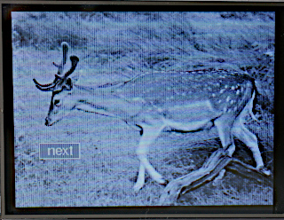
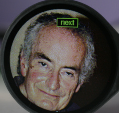
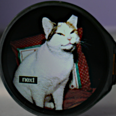

# 1. Displaying photo images

The display drivers in this repo were originally developed for displaying fonts
and geometric shapes. With a minor update they may also be used for image
display. The method used is ideal for full screen images however with suitable
user code smaller images may be rendered. It is also possible to overlay an
image with GUI controls, although transparency is not supported.

GUI references:  
[nanogui](https://github.com/peterhinch/micropython-nano-gui)  
[micro-gui](https://github.com/peterhinch/micropython-micro-gui)  
[micropython-touch](https://github.com/peterhinch/micropython-touch)

Images for display should be converted to a [netpbm format](https://en.wikipedia.org/wiki/Netpbm),
namely a `.pgm` file for a monochrome image or `.ppm` for color. This may be
done using a utility such as Gimp. Netpbm files use 8-bit values for greyscale
images. Color images are encoded as RGB888 (i.e. 8 bits for each primary color).
A CPython utility `img_cvt.py` converts PPM files to RGB565 for 16-bit drivers,
RRRGGGBB for 8-bit color. PGM files are converted to 4-bit greyscale to enable a
monochrome image to display on a 4-bit driver. The `img_cvt.py` utility is
provided in this repo and is documented below.

## 1.2 Supported drivers

Currently gc9a01, ili948x, ili9341 and st7789 drivers are supported.

An updated driver has a `greyscale` method enabling the frame buffer contents to
be interpreted at show time as either color or greyscale. It also has a public
`mvb` bound variable enabling the frame buffer to be loaded from an image.

## 1.3 Monochrome images

These may be displayed using 8-bit or 16-bit drivers by treating it as if it
were color. If the source image is color, a photo editor is used to convert it
to monochrome. It is then exported as a `.ppm` color image and prepared for
display as if it were color (see section 2).

On 4-bit drivers the greyscale image should be exported as a `.pgm` file;
`img_cvt.py` will convert it to 4-bit format. The following is an example of a
monochrome image rendered on a 240x320 display with a 4-bit driver.
  
The image is overlaid by a touchable `Button` widget.

## 1.4 Color images

These cannot be displayed on 4-bit drivers. On 8 or 16 bit drivers these should
be exported from the graphics program as a `.ppm` color image. Then `img_cvt.py`
is used to convert the file to the correct color mode.

The following images were rendered on a 240x240 circular display using an 8-bit
driver. Note the absence of banding, particularly on the cat which has a very
gradual change of luminance (see dithering, below).

    
Images are overlaid by a touchable `Button` widget.

## 1.5 Code samples

Files produced by `img_cvt.py` are binary files. The first four bytes comprise
two 16-bit integers defining the numbers of rows and columns in the image. The
following is an example of a full-screen image display in microgui or
micropython-touch:
```py
class MoonScreen(Screen):
    def __init__(self):
        super().__init__()

    def after_open(self):
        fn = "test.bin"  # Image created by`img_cvt.py`
        # The following line is required if a 4-bit driver is in use
        # ssd.greyscale(True)
        with open(fn, "rb") as f:
            _ = f.read(4)  # Read and discard rows and cols
            f.readinto(ssd.mvb)  # Read the image into the frame buffer
```
On nano-gui:
```py
from color_setup import ssd  # Create a display instance
from gui.core.nanogui import refresh

refresh(ssd)  # Initialise display.
fn = "test.bin"  # Image created by`img_cvt.py`
# The following line is required if a 4-bit driver is in use
# ssd.greyscale(True)
with open(fn, "rb") as f:
    _ = f.read(4)  # Read and discard rows and cols
    f.readinto(ssd.mvb)  # Read the image into the frame buffer
refresh(ssd)
```
These examples rely on the images being configured to precisely match the screen
size. This is described in detail in section 2. In other cases the rows and cols
values in the file must be used to populate a subset of the frame buffer pixels
or to display a subset of the image pixels. Note that the built-in flash of some
platforms can be slow. If there is a detectable pause in displaying the image
this is likely to be the cause. Reading rows and columns:
```py
with open("test.bin", "rb") as f:
    rows = int.from_bytes(f.read(2), "big")
    cols = int.from_bytes(f.read(2), "big")
```

# 2. Preparing an image for display

The following instructions assume that the aim is a full screen display using
simple code as illustrated above. For partial display the initial setup is less
critical.

## 2.1 Initial edit

These instructions are based on using Gimp, however other photo editors have
similar functionality.
1. Use the rectangle select tool to select the region for display. The aspect
ratio should approximately match that of the screen. Dimensions are shown on the
bottom status bar. The mode (portrait or landscape) must match the configuration
of the screen.
2. Select Image-Crop to selection.
3. If converting a color image to monochrome, use Image-Mode-Greyscale.
4. Select Image-Scale Image. Break the link between Width and Height and set the
values to exactly match the screen dimensions.
5. The image can be zoomed with + or <shift>+.
6. Select Filters-Enhance-Sharpen (usharp mask) (optional).
7. Export the image: File-Export As. Navigate to a directory. Set the extension
to PPM to export an image for display on an 8- or 16-bit color driver. For an
image for display on a 4-bit driver, set the extension to PGM (this is
necessarily a greyscale image). When asked for Data Formatting, select RAW.

## 2.2 Using img_cvt.py

This takes a PPM or PGM file and outputs a binary file in the correct format for
display. Typical usage:
```bash
$ ./img_cvt.py test.ppm test.bin
```
Mandatory positional args:
1. `infile` Input file path.
2. `outfile` Output file path.
Optional args:
1. `-r` or `--rows` Expected image dimensions. If passed these are checked
against the actual image and a warning printed on a mismatch.
2. `-c` or `--cols`.
3. `-d` or `--dither` See below.
4. `--rgb565` For PPM files enables conversion to 16-bit RGB565 format.
5. `-h` or `--help` Show help text.

## 2.3 Dithering

When reducing the number of bits in an image there are inevitable quantisation
errors. These can produce ugly banding on areas with gradually changing
luminosity. This can be largely eliminated using a process known as dithering
or error diffusion. The script supports the following values for `-d`:
* Atkinson The default.
* Burke
* Sierra
* FS The Floyd-Steinberg algorithm.
* None

In testing the difference between these algorithms on most images was subtle;
except that selecting `None` led to a substantial loss of quality.

# 3. Populating the Frame Buffer

## 3.1 Output file format

The first four bytes comprise a count of rows, then cols, in big-endian format.
The following bytes are pixel data in a horizontally mapped format. Pixels
comprise 4, 8 or 16 bits depending on the selected format. Hence if pixels are
imagined as an array of size `rows * cols` the sequence of pixels coming from the
input stream is:  
p[0, 0],p[0, 1]...p[0, cols-1],p[1, 0],p[1,1]...p[1, cols-1]...p[rows-1, cols-1]

## 3.2 Frame Buffer Access

Updated display drivers have a `mvb` bound variable: this is a `memoryview` into
the bytearray containing the frame buffer. The three GUIs make the display
driver available as the `ssd` object; since display drivers are subclassed from
`FrameBuffer` the `ssd.mvb` object may be used to populate all or part of the
frame buffer with an image.

# Appendix 1 references

[Netbpm](https://en.wikipedia.org/wiki/Netpbm) PGM and PPM formats.  
[Dithering concepts](https://en.wikipedia.org/wiki/Dither).  
[Dithering algrithms](https://tannerhelland.com/2012/12/28/dithering-eleven-algorithms-source-code.html).
