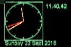
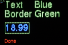
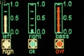
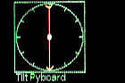
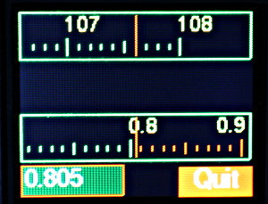
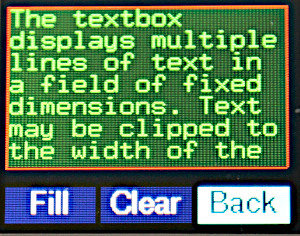
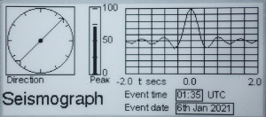
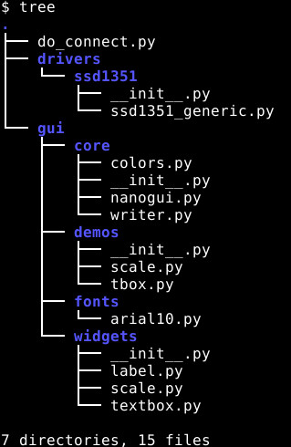

# MicroPython nano-gui

A lightweight and minimal MicroPython GUI library for display drivers based on
the `FrameBuffer` class. It is portable between a range of MicroPython hosts
and display devices. Various display technologies are supported, including
small color and monochrome OLED's, color TFT's, ePaper and Sharp units.

The `nano-gui` library is display-only. A library supporting user input is
[micro-gui](https://github.com/peterhinch/micropython-micro-gui); this comes at
a cost of a substantially greater RAM requirement. It supports all displays
available to nano-gui.

These images, most from OLED displays, fail to reproduce the quality of these
displays. OLEDs are visually impressive displays with bright colors, wide
viewing angle and extreme contrast. For some reason I find them hard to
photograph.  
 The aclock.py demo.  

 Label objects in two fonts.  

 One of the demos running on an Adafruit 1.27 inch
OLED. The colors change dynamically with low values showing green, intermediate
yellow and high red.  

 The alevel.py demo. The Pyboard was mounted
vertically: the length and angle of the vector arrow varies as the
Pyboard is moved.

There is an optional [graph plotting module](./FPLOT.md) for basic
Cartesian and polar plots, also real time plotting including time series.

 A sample image from the plot module.

These images from a TFT display illustrate the new widgets.  
 The Scale widget. Capable of precision display of
floats as the notionally very long scale moves behind its small window.

 The Textbox widget for scrolling text with word
wrap or clipping.

 A mockup of a seismograph screen on an ePaper
display.

# Contents

 1. [Introduction](./README.md#1-introduction)  
  1.1 [Change log](./README.md#11-change-log)  
  1.2 [Description](./README.md#12-description)  
  1.3 [Quick start](./README.md#13-quick-start) Run without actually installing it.  
  &nbsp;&nbsp;&nbsp;&nbsp;&nbsp;1.3.1 [Quick install](./README.md#131-quick-install)  
  1.4 [A performance boost](./README.md#14-a-performance-boost)  
 2. [Files and Dependencies](./README.md#2-files-and-dependencies)  
  2.1 [Files](./README.md#21-files)  
  &nbsp;&nbsp;&nbsp;&nbsp;&nbsp;2.1.1 [Core files](./README.md#211-core-files)  
  &nbsp;&nbsp;&nbsp;&nbsp;&nbsp;2.1.2 [Demo Scripts](./README.md#212-demo-scripts)  
  &nbsp;&nbsp;&nbsp;&nbsp;&nbsp;2.1.3 [Fonts](./README.md#213-fonts)  
  &nbsp;&nbsp;&nbsp;&nbsp;&nbsp;2.1.4 [Hardware setup examples](./README.md#214-hardware-setup-examples)  
  2.2 [Dependencies](./README.md#21-dependencies)  
  2.3 [Verifying hardware configuration](./README.md#23-verifying-hardware-configuration)  
 3. [The nanogui module](./README.md#3-the-nanogui-module)  
  3.1 [Application Initialisation](./README.md#31-application-initialisation) Initial setup and refresh method.  
  &nbsp;&nbsp;&nbsp;&nbsp;&nbsp;3.1.1 [User defined colors](./README.md#311-user-defined-colors)  
  &nbsp;&nbsp;&nbsp;&nbsp;&nbsp;3.1.2 [Monochrome displays](./README.md#312-monochrome-displays) A slight "gotcha" with ePaper.  
  3.2 [Label class](./README.md#32-label-class) Dynamic text at any screen location.  
  3.3 [Meter class](./README.md#33-meter-class) A vertical panel meter.  
  3.4 [LED class](./README.md#34-led-class) Virtual LED of any color.  
  3.5 [Dial and Pointer classes](./README.md#35-dial-and-pointer-classes) Clock
  or compass style display of one or more pointers.  
  3.6 [Scale class](./README.md#36-scale-class) Linear display with wide dynamic range.  
  3.7 [Class Textbox](./README.md#37-class-textbox) Scrolling text display.  
 4. [ESP8266](./README.md#4-esp8266) This can work. Contains information on
 minimising the RAM and flash footprints of the GUI.  
 5. [Old firmware](./README.md#5-old-firmware) For users of color displays who can't run current firmware.

#### [Supported displays](./DISPLAYS.md)

#### [Device driver document.](./DRIVERS.md)

#### [Graph plotting module.](./FPLOT.md)

# 1. Introduction

This library provides a limited set of GUI objects (widgets) for displays whose
display driver is subclassed from the `FrameBuffer` class. The drivers can have
minimal code as graphics primitives are supplied by the `FrameBuffer` class.

Compatible and tested displays are detailed [here](./DISPLAYS.md). The
[device driver doc](./DRIVERS.md) provides guidance on selecting the right
driver for your display, platform and application.

The GUI is cross-platform. The device driver doc explains how to configure it
for a given display and MicroPython host by adapting a single small file. The
GUI supports multiple displays attached to a single target, but bear in mind
the RAM requirements for multiple frame buffers. The GUI has been tested on
Pyboard 1.1, Pyboard D, Raspberry Pi Pico and on the ESP32 reference board
without SPIRAM. Running on ESP8266 is possible but frozen bytecode must be used
owing to its restricted RAM.

It uses synchronous code but is compatible with `uasyncio`. Some demo programs
illustrate this. Code is standard MicroPython, but some device drivers use the
`native` and `viper` decorators.

The GUI is display-only and lacks provision for user input. Authors of
applications requiring touch should consider the touch GUI's for the following
displays:
 * [Official lcd160cr](https://github.com/peterhinch/micropython-lcd160cr-gui)
 * [RA8875 large displays](https://github.com/peterhinch/micropython_ra8875)
 * [SSD1963 large displays](https://github.com/peterhinch/micropython-tft-gui)

For historical reasons and to ensure consistency, code and documentation for
my GUI's employ the American spelling of `color`.

## 1.1 Change log

5 Sep 2022 Add support for additional Pico displays.  
8 Aug 2022 Typo and grammar fixes from @bfiics.  
10 May 2022 Support Waveshare Pi Pico displays.  
7 Sep 2021 Code reduction and faster color text display. Color use now requires
firmware V1.17 or later.  
26 Aug 2021 Support [PR7682](https://github.com/micropython/micropython/pull/7682)
for fast text rendering.  
25 Apr 2021 Support TTGO T-Display.  
26 Mar 2021 Add ST7789. Alter uasyncio support on ili9341.  

## 1.2 Description

Widgets are intended for the display of data from physical devices such as
sensors. They are drawn using graphics primitives rather than icons to minimise
RAM usage. It also enables them to be efficiently rendered at arbitrary scale by
hosts with restricted processing power. The approach also enables widgets to
maximise information in ways that are difficult with icons, in particular using
dynamic color changes in conjunction with moving elements.

Copying the contents of the frame buffer to the display is relatively slow. The
time depends on the size of the frame buffer and the interface speed, but the
latency may be too high for applications such as games. For example the time to
update a 128x128x8 color ssd1351 display on a Pyboard 1.0 is 41ms.

Drivers based on `FrameBuffer` must allocate contiguous RAM for the buffer. To
avoid 'out of memory' errors it is best to instantiate the display before
importing other modules. The example `color_setup` files illustrate this.

## 1.3 Quick start

An easy way to start is to use `mpremote` which allows a directory on your PC
to be mounted on the host. In this way the filesystem on the host is left
unchanged. This is at some cost in loading speed, especially on ESP32. If
adopting this approach, you will need to edit the `color_setup.py` file on
your PC to match your hardware. Install `mpremote` with:
```bash
$ pip3 install mpremote
```
Clone the repo to your PC with:
```bash
$ git clone https://github.com/peterhinch/micropython-nano-gui
$ cd micropython-nano-gui
```
As supplied, `color_setup.py` assumes a Pyboard (1.x or D) connected to an
Adafruit 1.27" OLED as specified in that file. If that doesn't correspond to
your hardware, it should be edited to suit.
```bash
$ mpremote mount .
```
This should provide a REPL. Run a demo:
```python
>>> import gui.demos.aclock
```
Note that the `gui.demos.aclock.py` demo comprises 38 lines of actual code.
This stuff is easier than you might think.

### 1.3.1 Quick install

The easy approach is to copy everything to your hardware using
[rshell](https://github.com/dhylands/rshell). This consumes about 508KiB of
space on your filesystem. Substantial pruning can be done to eliminate unused
drivers, fonts, widgets and demos.

Edit `color_setup.py` as discussed above. Move to the root directory of the
repo, run `rshell` and issue the following commands (note the `/sd` destination
may need to be adapted for non-pyboard targets):
```bash
> cp -r drivers /sd
> cp -r gui /sd
> cp color_setup.py /sd
> repl ~ import gui.demos.aclock
```
This demo reports to the REPL whether the performance boost described below is
active.

## 1.4 A performance boost

A firmware change in V1.17 has enabled the code size to be reduced. It has also
accelerated text rendering on color displays. Use of color displays now
requires firmware V1.17 or later. Existing users should update the display
driver and GUI core files and should ensure that the new file
`drivers/boolpalette.py` exists.

###### [Contents](./README.md#contents)

# 2. Files and Dependencies

On monochrome displays firmware should be V1.13 or later. On the Pi Pico
firmware should be V1.15 or later. For color displays it should be V1.17 or
later.

Installation comprises copying the `gui` and `drivers` directories, with their
contents, plus a hardware configuration file, to the target. The directory
structure on the target must match that in the repo. This consumes about 300KiB
of flash.

Filesystem space may be conserved by copying only the required driver from
`drivers`, but the directory path to that file must be retained. For example,
for SSD1351 displays only the following are actually required:  
`drivers/ssd1351/ssd1351.py`, `drivers/ssd1351/__init__.py`.

The small `color_setup.py` file contains all hardware definitions (for color or
monochrome displays). This is the only file which will require editing to match
the display and its wiring. For information on how to do this, see
[the drivers document](./DRIVERS.md#1-introduction).

## 2.1 Files

### 2.1.1 Core files

The root directory contains an example setup file `color_setup.py` for a color
OLED display. Other examples may be found in the `setup_examples` directory.
These are templates for adaptation: only one file is copied to the target. On
the target the file should be named `color_setup.py` and put in the root of the
filesystem.

The chosen template will need to be edited to match the display in use, the
MicroPython target and the electrical connections between display and target.
Electrical connections are detailed in the template source.
 * `color_setup.py` Hardware setup for the display. As written supports an
 SSD1351 display connected to a Pyboard.

The `gui/core` directory contains the GUI core and its principal dependencies:

 * `nanogui.py` The library.
 * `writer.py` Module for rendering Python fonts.
 * `fplot.py` The graph plotting module.
 * `colors.py` Color constants.

###### [Contents](./README.md#contents)

### 2.1.2 Demo scripts

The `gui/demos` directory contains test/demo scripts.

Demos for small displays:  
 * `mono_test.py` Tests/demos using the official SSD1306 driver for a
 monochrome 128*64 OLED display.
 * `color96.py` Tests/demos for the Adafruit 0.96 inch color OLED.

Demos for larger displays.  
 * `color15.py` Demonstrates a variety of widgets. Cross platform.
 * `aclock.py` Analog clock demo. Cross platform.
 * `alevel.py` Spirit level using Pyboard accelerometer.
 * `fpt.py` Plot demo. Cross platform.
 * `scale.py` A demo of the `Scale` widget. Cross platform. Uses `uasyncio`.
 * `asnano_sync.py` Two Pyboard specific demos using the GUI with `uasyncio`.
 * `asnano.py` Could readily be adapted for other targets.
 * `tbox.py` Demo `Textbox` class. Cross-platform.

Demos for ePaper displays:  
 * `epd_async.py` Demo of asynchronous code on an eInk display. Needs a large display.
 * `epd29_sync.py` Demo for Adafruit 2.9" eInk display: emulates a seismograph.
 * `epd29_async.py` Asynchronous demo for Adafruit 2.9" eInk display.
 * `epd29_lowpower.py` Micropower demo for Adafruit 2.9" eInk display. This doc
 [Micropower use](./DRIVERS.md#715-micropower-use) should be read before
 attempting to run this.

Demos for Sharp displays:  
 * `sharptest.py` Basic functionality check.
 * `clocktest.py` Digital and analog clock demo.
 * `clock_batt.py` Low power demo of battery operated clock.

Usage with `uasyncio` is discussed [here](./ASYNC.md). In summary the GUI works
well with `uasyncio` but the blocking which occurs during transfer of the
framebuffer to the display may affect more demanding applications. Some display
drivers have an additional asynchronous refresh method. This may optionally be
used to mitigate the resultant latency.

###### [Contents](./README.md#contents)

### 2.1.3 Fonts

Python font files are in the `gui/fonts` directory. The easiest way to conserve
RAM is to freeze them which is highly recommended. In doing so the directory
structure must be maintained: the [ESP8266](./README.md#4-esp8266) provides an
illustration.

To create alternatives, Python fonts may be generated from industry standard
font files with
[font_to_py.py](https://github.com/peterhinch/micropython-font-to-py.git). The
`-x` option for horizontal mapping must be specified. If fixed pitch rendering
is required `-f` is also required. Supplied examples are:

 * `arial10.py` Variable pitch Arial. 10 pixels high.
 * `arial35.py` Arial 35 high.
 * `arial_50.py` Arial 50 high.
 * `courier20.py` Fixed pitch Courier, 20 high.
 * `font6.py` FreeSans 14 high.
 * `font10.py` FreeSans 17 high.
 * `freesans20.py` FreeSans 20 high.

### 2.1.4 Hardware setup examples

The `setup_examples` directory contains example setup files for various hardware.
These are templates which may be adapted to suit the hardware in use, then
copied to the hardware root as `color_setup.py`. Example files:

 * `ssd1306_pyb.py` Setup file for monochrome displays using the official
 driver. Supports hard or soft SPI or I2C connections.
 * `ssd1351_esp32.py` As written supports an ESP32 connected to a 128x128 SSD1351
 display. After editing to match the display and wiring, it should be copied to
 the target as `/pyboard/color_setup.py`.
 * `ssd1351_esp8266.py` Similar for [ESP8266](./README.md#4-esp8266). Usage is
 somewhat experimental.
 * `st7735r_pyb.py` Assumes a Pyboard with an
 [Adafruit 1.8 inch TFT display](https://www.adafruit.com/product/358).
 * `st7735r144_pyb.py` For a Pyboard with an
 [Adafruit 1.44 inch TFT display](https://www.adafruit.com/product/2088).
 * `ili9341_esp32.py` A 240*320 ILI9341 display on ESP32.
 * `st7789_pico.py` Example with SSD7789 driver and Pi Pico host.
 * `st7789_ttgo.py` Setup for the TTGO T-Display device.
 * `waveshare_pyb.py` 176*274 ePaper display on Pyboard.
 * `epd29_pyb_sync.py` Adafruit 2.9 inch ePaper display for synchronous code.
 * `epd29_pyb_async.py` Adafruit 2.9 inch ePaper display: `uasyncio` applications.

## 2.2 Dependencies

The source tree now includes all dependencies. These are listed to enable users
to check for newer versions:

 * [writer.py](https://github.com/peterhinch/micropython-font-to-py/blob/master/writer/writer.py)
 Provides text rendering of Python font files.

A copy of the official driver for OLED displays using the SSD1306 chip is
provided. The official file is here:  
 * [SSD1306 driver](https://github.com/micropython/micropython/blob/master/drivers/display/ssd1306.py).

Displays based on the Nokia 5110 (PCD8544 chip) require this driver. It is not
in this repo but may be found here:  
 * [PCD8544/Nokia 5110](https://github.com/mcauser/micropython-pcd8544.git)

###### [Contents](./README.md#contents)

## 2.3 Verifying hardware configuration

This script performs a basic check that the `color_setup.py` file matches the
hardware, that (on color units) all three primary colors can be displayed and
that pixels up to the edges of the display can be accessed.
```python
from color_setup import ssd  # Create a display instance
from gui.core.colors import RED, BLUE, GREEN
from gui.core.nanogui import refresh
refresh(ssd, True)  # Initialise and clear display.
# Uncomment for ePaper displays
# ssd.wait_until_ready()
ssd.fill(0)
ssd.line(0, 0, ssd.width - 1, ssd.height - 1, GREEN)  # Green diagonal corner-to-corner
ssd.rect(0, 0, 15, 15, RED)  # Red square at top left
ssd.rect(ssd.width -15, ssd.height -15, 15, 15, BLUE)  # Blue square at bottom right
ssd.show()
```

###### [Contents](./README.md#contents)

# 3. The nanogui module

The GUI supports a variety of widgets, some of which include text elements. The
coordinates of a widget are those of its top left corner. If a border is
specified, this is drawn outside of the limits of the widgets with a margin of
2 pixels. If the widget is placed at `[row, col]` the top left hand corner of
the border is at `[row-2, col-2]`.

When a widget is drawn or updated (typically with its `value` method) it is not
immediately displayed. To update the display `nanogui.refresh` is called: this
enables multiple updates to the `FrameBuffer` contents before once copying the
buffer to the display. Postponement enhances performance providing a visually
instant update.

Text components of widgets are rendered using the `Writer` (monochrome) or
`CWriter` (colour) classes.

## 3.1 Application Initialisation

The GUI is initialised by issuing:
```python
from color_setup import ssd
```
This defines the hardware as described in [the drivers document](./DRIVERS.md#1-introduction).

A typical application then imports `nanogui` modules and clears the display:
```python
from gui.core.nanogui import refresh
from gui.widgets.label import Label  # Import any widgets you plan to use
from gui.widgets.dial import Dial, Pointer
refresh(ssd, True)  # Initialise and clear display.
```
Initialisation of text display follows. For each font a `CWriter` instance
is created (for monochrome displays a `Writer` is used):
```python
from gui.core.writer import CWriter  # Renders color text
import gui.fonts.arial10  # A Python Font
from gui.core.colors import *  # Standard color constants

CWriter.set_textpos(ssd, 0, 0)  # In case previous tests have altered it
 # Instantiate any CWriters to be used (one for each font)
wri = CWriter(ssd, arial10, GREEN, BLACK, verbose=False)  # Colors are defaults
# wri = Writer(ssd, arial10, verbose=False)  # Monochrome display uses Writer
wri.set_clip(True, True, False)
```
Calling `nanogui.refresh` on startup sets up and clears the display. The method
will subsequently be called whenever a refresh is required. It takes two args:
 1. `device` The display instance (the GUI supports multiple displays).
 2. `clear=False` If set `True` the display will be blanked; it is also
 blanked when a device is refreshed for the first time.

### 3.1.1 User defined colors

The file `gui/core/colors.py` defines standard color constants which may be
used with any display driver. This section describes how to change these or
to create additional colors.

Most of the color display drivers define colors as 8-bit or larger values.
In such cases colors may be created and assigned to variables as follows:
```python
from color_setup import SSD
PALE_YELLOW = SSD.rgb(150, 150, 0)
```
The GUI also provides drivers with 4-bit color to minimise RAM use. Colors are
assigned to a lookup table having 16 entries. The frame buffer stores 4-bit
color values, which are converted to the correct color depth for the hardware
when the display is refreshed.

Of the possible 16 colors 13 are assigned in `gui/core/colors.py`, leaving
color numbers 12, 13 and 14 free. Any color can be assigned as follows:
```python
from gui.core.colors import *  # Imports the create_color function
PALE_YELLOW = create_color(12, 150, 150, 0)
```
This creates a color `rgb(150, 150, 0)` assigns it to "spare" color number 12
then sets `PALE_YELLOW` to 12. Any color number in range `0 <= n <= 15` may be
used (implying that predefined colors may be reassigned). It is recommended
that `BLACK` (0) and `WHITE` (15) are not changed. If code is to be ported
between 4-bit and other drivers, use `create_color()` for all custom colors:
it will produce appropriate behaviour. See the `vari_fields` function in the
demo `color15.py` for an example.

### 3.1.2 Monochrome displays

Most widgets work on monochrome displays if color settings are left at default
values. If a color is specified, drivers in this repo will convert it to black
or white depending on its level of saturation. A low level will produce the
background color, a high level the foreground. This can produce a surprise on
ePaper units where the foreground is white.

At the bit level `1` represents the foreground. This is white on an emitting
display such as an OLED. On a Sharp display it indicates reflection. On an
ePaper display it represents black. Given that `1` is the foreground color,
explicitly specifying `BLACK` on an ePaper will produce `0` as black has (very)
low saturation. In this context the resultant physically white background
color may come as a surprise.

In general the solution is to leave color settings at default.

###### [Contents](./README.md#contents)

## 3.2 Label class

The purpose of a `Label` instance is to display text at a specific screen
location.

Text can be static or dynamic. In the case of dynamic text the background is
cleared to ensure that short strings cleanly replace longer ones.

Labels can be displayed with an optional single pixel border.

Colors are handled flexibly. By default the colors used are those of the
`Writer` instance, however they can be changed dynamically; this might be used
to warn of overrange or underrange values. The `color15.py` demo illustrates
this.

Constructor args:  
 1. `writer` The `Writer` instance (font and screen) to use.
 2. `row` Location on screen.
 3. `col`
 4. `text` If a string is passed it is displayed: typically used for static
 text. If an integer is passed it is interpreted as the maximum text length
 in pixels; typically obtained from `writer.stringlen('-99.99')`. Nothing is
 displayed until `.value()` is called. Intended for dynamic text fields.
 5. `invert=False` Display in inverted or normal style.
 6. `fgcolor=None` Optionally overrides the `Writer` colors.
 7. `bgcolor=None`
 8. `bdcolor=False` If `False` no border is displayed. If `None` a border is
 shown in the `Writer` foreground color. If a color is passed, it is used.

The constructor displays the string at the required location.

Methods:  
 1. `value` Redraws the label. This takes the following args:
    * `text=None` The text to display. If `None` displays the last value.
    * ` invert=False` If true, show inverse text.
    * `fgcolor=None` Foreground color: if `None` the `Writer` default is used.
    * `bgcolor=None` Background color, as per foreground.
    * `bdcolor=None` Border color. As per above except that if `False` is
    passed, no border is displayed. This clears a previously drawn border.  
 Returns the current text string.  
 2. `show` No args. (Re)draws the label. Primarily for internal use by GUI.

If populating a label would cause it to extend beyond the screen boundary a
warning is printed at the console. The label may appear at an unexpected place.
The following is a complete "Hello world" script.
```python
from color_setup import ssd  # Create a display instance
from gui.core.nanogui import refresh
from gui.core.writer import CWriter
from gui.core.colors import *

from gui.widgets.label import Label
import gui.fonts.freesans20 as freesans20

refresh(ssd)  # Initialise and clear display.
CWriter.set_textpos(ssd, 0, 0)  # In case previous tests have altered it
wri = CWriter(ssd, freesans20, GREEN, BLACK, verbose=False)
wri.set_clip(True, True, False)

# End of boilerplate code. This is our application:
Label(wri, 2, 2, 'Hello world!')
refresh(ssd)
```

###### [Contents](./README.md#contents)

## 3.3 Meter class

This provides a vertical linear meter display of values scaled between 0.0 and
1.0.

Constructor positional args:

 1. `writer` The `Writer` instance (font and screen) to use.
 2. `row` Location on screen.
 3. `col`

Keyword only args:

 4. `height=50` Height of meter.
 5. `width=10` Width.
 6. `fgcolor=None` Foreground color: if `None` the `Writer` default is used.
 7. `bgcolor=None` Background color, as per foreground.
 8. `ptcolor=None` Color of meter pointer or bar. Default is foreground color.
 9. `bdcolor=False` If `False` no border is displayed. If `None` a border is
 shown in the `Writer` foreground color. If a color is passed, it is used.
 10. `divisions=5` No. of graduations to show.
 11. `label=None` A text string will cause a `Label` to be drawn below the
 meter. An integer will create a `Label` of that width for later use.
 12. `style=Meter.LINE` The pointer is a horizontal line. `Meter.BAR` causes a
 vertical bar to be displayed. Much easier to read on monochrome displays.
 13. `legends=None` If a tuple of strings is passed, `Label` instances will be
 displayed to  the right hand side of the meter, starting at the bottom. E.G.
 `('0.0', '0.5', '1.0')`
 14. `value=None` Initial value. If `None` the meter will not be drawn until
 its `value()` method is called.
 
Methods:
 1. `value` Args: `n=None, color=None`.
    * `n` should be a float in range 0 to 1.0. Causes the meter to be updated.
    Out of range values are constrained. If `None` is passed the meter is not
    updated.
    * `color` Updates the color of the bar or line if a value is also passed.
    `None` causes no change.  
 Returns the current value.  
 2. `text` Updates the label if present (otherwise throws a `ValueError`). Args:
    * `text=None` The text to display. If `None` displays the last value.
    * ` invert=False` If true, show inverse text.
    * `fgcolor=None` Foreground color: if `None` the `Writer` default is used.
    * `bgcolor=None` Background color, as per foreground.
    * `bdcolor=None` Border color. As per above except that if `False` is
    passed, no border is displayed. This clears a previously drawn border.  
 3. `show` No args. (Re)draws the meter. Primarily for internal use by GUI.

###### [Contents](./README.md#contents)

## 3.4 LED class

This is a virtual LED whose color may be altered dynamically.

Constructor positional args:  
 1. `writer` The `Writer` instance (font and screen) to use.
 2. `row` Location on screen.
 3. `col`

Keyword only args:

 4. `height=12` Height of LED.
 5. `fgcolor=None` Foreground color: if `None` the `Writer` default is used.
 6. `bgcolor=None` Background color, as per foreground.
 7. `bdcolor=False` If `False` no border is displayed. If `None` a border is
 shown in the `Writer` foreground color. If a color is passed, it is used.
 8. `label=None`  A text string will cause a `Label` to be drawn below the
 LED. An integer will create a `Label` of that width for later use.

Methods:
 1. `color` arg `c=None` Change the LED color to `c`. If `c` is `None` the LED
 is turned off (rendered in the background color).
 2. `text` Updates the label if present (otherwise throws a `ValueError`). Args:
    * `text=None` The text to display. If `None` displays the last value.
    * ` invert=False` If true, show inverse text.
    * `fgcolor=None` Foreground color: if `None` the `Writer` default is used.
    * `bgcolor=None` Background color, as per foreground.
    * `bdcolor=None` Border color. As per above except that if `False` is
    passed, no border is displayed. This clears a previously drawn border.  
 3. `show` No args. (Re)draws the LED. Primarily for internal use by GUI.

###### [Contents](./README.md#contents)

## 3.5 Dial and Pointer classes

A `Dial` is a circular display capable of displaying a number of vectors; each
vector is represented by a `Pointer` instance. The format of the display may be
chosen to resemble an analog clock or a compass. In the `CLOCK` case a pointer
resembles a clock's hand extending from the centre towards the periphery. In
the `COMPASS` case pointers are chevrons extending equally either side of the
circle centre.

In both cases the length, angle and color of each `Pointer` may be changed
dynamically. A `Dial` can include an optional `Label` at the bottom which may
be used to display any required text.

In use, a `Dial` is instantiated then one or more `Pointer` objects are
instantiated and assigned to it. The `Pointer.value` method enables the `Dial`
to be updated affecting the length, angle and color of the `Pointer`.
Pointer values are complex numbers.

### Dial class

Constructor positional args:  
 1. `writer` The `Writer` instance (font and screen) to use.
 2. `row` Location on screen.
 3. `col`

Keyword only args:

 4. `height=50` Height and width of dial.
 5. `fgcolor=None` Foreground color: if `None` the `Writer` default is used.
 6. `bgcolor=None` Background color, as per foreground.
 7. `bdcolor=False` If `False` no border is displayed. If `None` a border is
 shown in the `Writer` foreground color. If a color is passed, it is used.
 8. `ticks=4` No. of gradutions to show.
 9. `label=None` A text string will cause a `Label` to be drawn below the
 meter. An integer will create a `Label` of that width for later use.
 10. `style=Dial.CLOCK` Pointers are drawn from the centre of the circle as per
 the hands of a clock. `Dial.COMPASS` causes pointers to be drawn as arrows
 centred on the control's centre. Arrow tail chevrons are suppressed for very
 short pointers.
 11. `pip=None` Draws a central dot. A color may be passed, otherwise the
 foreground color will be used. If `False` is passed, no pip will be drawn. The
 pip is suppressed if the shortest pointer would be hard to see.

When a `Pointer` is instantiated it is assigned to the `Dial` by the `Pointer`
constructor.

### Pointer class

Constructor arg:
 1. `dial` The `Dial` instance on which it is to be displayed.

Methods:
 1. `value` Args:  
    * `v=None` The value is a complex number. A magnitude exceeding unity is
    reduced (preserving phase) to constrain the `Pointer` within the unit
    circle.
    * `color=None` By default the pointer is rendered in the foreground color
    of the parent `Dial`. Otherwise the passed color is used.  
    Returns the current value.
 2. `show` No args. (Re)draws the control. Primarily for internal use by GUI.

Typical usage (`ssd` is the device and `wri` is the current `Writer`):
```python
def clock(ssd, wri):
    # Border in Writer foreground color:
    dial = Dial(wri, 5, 5, ticks = 12, bdcolor=None)
    hrs = Pointer(dial)
    mins = Pointer(dial)
    hrs.value(0 + 0.7j, RED)
    mins.value(0 + 0.9j, YELLOW)
    dm = cmath.exp(-1j * cmath.pi / 30)  # Rotate by 1 minute
    dh = cmath.exp(-1j * cmath.pi / 1800)  # Rotate hours by 1 minute
    # Twiddle the hands: see aclock.py for an actual clock
    for _ in range(80):
        utime.sleep_ms(200)
        mins.value(mins.value() * dm, RED)
        hrs.value(hrs.value() * dh, YELLOW)
        refresh(ssd)
```

###### [Contents](./README.md#contents)

## 3.6 Scale class

This displays floating point data having a wide dynamic range. It is modelled
on old radios where a large scale scrolls past a small window having a fixed
pointer. This enables a scale with (say) 200 graduations (ticks) to readily be
visible on a small display, with sufficient resolution to enable the user to
interpolate between ticks. Default settings enable estimation of a value to
within about +-0.1%.

Legends for the scale are created dynamically as it scrolls past the window.
The user may control this by means of a callback. The example `lscale.py`
illustrates a variable with range 88.0 to 108.0, the callback ensuring that the
display legends match the user variable. A further callback enables the scale's
color to change over its length or in response to other circumstances.

The scale displays floats in range -1.0 <= V <= 1.0.

Constructor positional args:  
 1. `writer` The `Writer` instance (font and screen) to use.
 2. `row` Location on screen.
 3. `col`  

Keyword only arguments (all optional):
 * `ticks=200` Number of "tick" divisions on scale. Must be divisible by 2.
 * `legendcb=None` Callback for populating scale legends (see below).
 * `tickcb=None` Callback for setting tick colors (see below).
 * `height=0` Pass 0 for a minimum height based on the font height.
 * `width=200`
 * `bdcolor=None` Border color. If `None`, `fgcolor` will be used.
 * `fgcolor=None` Foreground color. Defaults to system color.
 * `bgcolor=None` Background color defaults to system background.
 * `pointercolor=None` Color of pointer. Defaults to `.fgcolor`.
 * `fontcolor=None` Color of legends. Default `fgcolor`.

Method:
 * `value=None` Set or get the current value. Always returns the current value.
 A passed `float` is constrained to the range -1.0 <= V <= 1.0 and becomes the
 `Scale`'s current value. The `Scale` is updated. Passing `None` enables
 reading the current value, but see note below on precision.

### Callback legendcb

The display window contains 20 ticks comprising two divisions; by default a
division covers a range of 0.1. A division has a legend at the start and end
whose text is defined by the `legendcb` callback. If no user callback is
supplied, legends will be of the form `0.3`, `0.4` etc. User code may override
these to cope with cases where a user variable is mapped onto the control's
range. The callback takes a single `float` arg which is the value of the tick
(in range -1.0 <= v <= 1.0). It must return a text string. An example from the
`lscale.py` demo shows FM radio frequencies:
```python
def legendcb(f):
    return '{:2.0f}'.format(88 + ((f + 1) / 2) * (108 - 88))
```
The above arithmetic aims to show the logic. It can (obviously) be simplified.

### Callback tickcb

This callback enables the tick color to be changed dynamically. For example a
scale might change from green to orange, then to red as it nears the extremes.
The callback takes two args, being the value of the tick (in range
-1.0 <= v <= 1.0) and the default color. It must return a color. This example
is taken from the `scale.py` demo:
```python
def tickcb(f, c):
    if f > 0.8:
        return RED
    if f < -0.8:
        return BLUE
    return c
```

### Increasing the ticks value

This increases the precision of the display.

It does this by lengthening the scale while keeping the window the same size,
with 20 ticks displayed. If the scale becomes 10x longer, the value diference
between consecutive large ticks and legends is divided by 10. This means that
the `tickcb` callback must return a string having an additional significant
digit. If this is not done, consecutive legends will have the same value.

### Precision

For performance reasons the control stores values as integers. This means that
if you set `value` and subsequently retrieve it, there may be some loss of
precision. Each visible division on the control represents 10 integer units.

###### [Contents](./README.md#contents)

## 3.7 Class Textbox

Displays multiple lines of text in a field of fixed dimensions. Text may be
clipped to the width of the control or may be word-wrapped. If the number of
lines of text exceeds the height available, scrolling will occur. Access to
text that has scrolled out of view may be achieved by calling a method. The
widget supports fixed and variable pitch fonts.
```python
from gui.widgets.textbox import Textbox
```

Constructor mandatory positional arguments:
 1. `writer` The `Writer` instance (font and screen) to use.
 2. `row` Location on screen.
 3. `col`  
 4. `width` Width of the object in pixels.
 5. `nlines` Number of lines of text to display. The object's height is
 determined from the height of the font:  
 `height in pixels = nlines*font_height`  
 As per most widgets the border is drawn two pixels beyond the control's
 boundary.

Keyword only arguments:
 * `bdcolor=None` Border color. If `None`, `fgcolor` will be used.
 * `fgcolor=None` Color of border. Defaults to system color.
 * `bgcolor=None` Background color of object. Defaults to system background.
 * `clip=True` By default lines too long to display are right clipped. If
 `False` is passed, word-wrap is attempted. If the line contains no spaces
 it will be wrapped at the right edge of the window.

Methods:
 * `append` Args `s, ntrim=None, line=None` Append the string `s` to the
 display and scroll up as required to show it. By default only the number of
 lines which will fit on screen are retained. If an integer `ntrim=N` is
 passed, only the last N lines are retained; `ntrim` may be greater than can be
 shown in the control, hidden lines being accessed by scrolling.  
 If an integer (typically 0) is passed in `line` the display will scroll to
 show that line.
 * `scroll` Arg `n` Number of lines to scroll. A negative number scrolls up. If
 scrolling would achieve nothing because there are no extra lines to display,
 nothing will happen. Returns `True` if scrolling occurred, otherwise `False`.
 * `value` No args. Returns the number of lines of text stored in the widget.
 * `clear` No args. Clears all lines from the widget and refreshes the display.
 * `goto` Arg `line=None` Fast scroll to a line. By default shows the end of
 the text. 0 shows the start.

Fast updates:  
Rendering text to the screen is relatively slow. To send a large amount of text
the fastest way is to perform a single `append`. Text may contain newline
(`'\n'`) characters as required. In that way rendering occurs once only.

`ntrim`__
If text is regularly appended to a `Textbox` its buffer grows, using RAM. The
value of `ntrim` sets a limit to the number of lines which are retained, with
the oldest (topmost) being discarded as required.

###### [Contents](./README.md#contents)

# 4. ESP8266

Some personal observations on successful use with an ESP8266.

I chose an [Adafruit 128x128 OLED display](https://www.adafruit.com/product/1431)
to represent the biggest display I thought the ESP8266 might support. I
reasoned that, if this can be made to work, smaller or monochrome displays
would present no problem.

The ESP8266 is a minimal platform with typically 36.6KiB of free RAM. The
framebuffer for a 128*128 OLED requires 16KiB of contiguous RAM (the display
hardware uses 16 bit color but my driver uses an 8 bit buffer to conserve RAM).
The 4-bit driver halves this size.

A further issue is that, by default, ESP8266 firmware does not support complex
numbers. This rules out the plot module and the `Dial` widget. It is possible
to turn on complex support in the build, but I haven't tried this.

I set out to run the `scale.py` and `textbox.py` demos as these use `uasyncio`
to create dynamic content, and the widgets themselves are relatively complex.

I froze a subset of the `drivers` and the `gui` directories. A subset minimises
the size of the firmware build and eliminates modules which won't compile due
to the complex number issue. The directory structure in my frozen modules
directory matched that of the source. This was the structure of my frozen
directory before I added the 4 bit driver:  


I erased the flash, built and installed the new firmware. Finally I copied
`setup_examples/esp8266_setup.py` to `/pyboard/color_setup.py`. This could have
been frozen but I wanted to be able to change pins if required.

Both demos worked perfectly.

I modified the demos to regularly report free RAM. `scale.py` reported 10480
bytes, `tbox.py` reported 10512 bytes, sometimes more, as the demo progressed.
With the 4 bit driver `scale.py` reported 18112 bytes. In conclusion I think
that applications of moderate complexity should be feasible.

# 5. Old firmware

Current firmware is highly recommended. For users of color displays who cannot
meet the requirements of
[Files and Dependencies](./README.md#2-files-and-dependencies) it is possible
to run under V1.15+. This involves copying
[this file](https://github.com/peterhinch/micropython-font-to-py/blob/master/writer/old_versions/writer_fw_compatible.py)
to `gui/core/writer.py`. This uses Python code to render text if the firmware
or driver are unable to support fast rendering.

###### [Contents](./README.md#contents)
