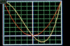
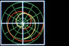
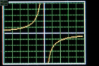
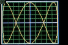
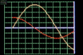
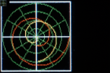
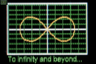

# fplot module

This provides a rudimentary means of displaying two dimensional Cartesian (xy)
and polar graphs on `framebuf` based displays. It is an optional extension to
the MicroPython [nano-gui](https://github.com/peterhinch/micropython-nano-gui)
library: this should be installed, configured and tested before use.

This was ported from the
[lcd160cr-gui library](https://github.com/peterhinch/micropython-lcd160cr-gui).
Like `nanogui.py` it uses synchronous code.

Please excuse the photography: they look much better than in the pictures. In
particular the effect at the top left corner is an artifact of my efforts at
post processing.

 Classic Cartesian plot.  

 Classic Cartesian plot.  

 Plot of discontinuous data.  

 A Lissajous figure.  

 Still from realtime simulation of reading and plotting data. 

 Still from realtime simulation of acquisition of polar data.  

 The lemniscate of Bernoulli.  

# Contents

 1. [Python files](./FPLOT.md#1-python-files)  
 2. [Concepts](./FPLOT.md#2-concepts)  
  2.1 [Graph classes](./FPLOT.md#21-graph-classes)  
  2.2 [Curve clsses](./FPLOT.md#22-curve-classes)  
  2.3 [Coordinates](./FPLOT.md#23-coordinates) 
 3. [Graph classes](./FPLOT.md#3-graph-classes)  
  3.1 [Class CartesianGraph](./FPLOT.md#31-class-cartesiangraph)  
  3.2 [Class PolarGraph](./FPLOT.md#32-class-polargraph)  
 4. [Curve classes](./FPLOT.md#4-curve-classes)  
  4.1 [class Curve](./FPLOT.md#41-class-curve)  
   4.1.1 [Scaling](./FPLOT.md#411-scaling) Optional scaling of data values.  
  4.2 [class PolarCurve](./FPLOT.md#42-class-polarcurve)  
   4.2.1 [Scaling](./FPLOT.md#421-scaling) Required scaling of complex points.  
  4.3 [class TSequence](./FPLOT.md#43-class-tsequence) Plot Y values on time axis.  

###### [Main README](../README.md)

# 1. Python files

These are located in the `plot` directory.

 1. `fplot.py` The plot library
 2. `fpt.py` Test program. Usage examples.

# 2. Concepts

Data for Cartesian graphs constitutes a set of x, y pairs, for polar graphs
it is a set of complex `z` values. The module supports three common cases:  
 1. The dataset is complete at the outset.
 2. Arbitrary data arrives gradually and needs to be plotted as it arrives.
 3. One or more `y` values arrive gradually. The `X` axis represents time. This
 is a simplifying case of 2.

## 2.1 Graph classes

A user program first instantiates a graph object (`PolarGraph` or
`CartesianGraph`). This creates an empty graph image upon which one or more
curves may be plotted.

## 2.2 Curve classes

The user program then instantiates one or more curves (`Curve` or
`PolarCurve`) as appropriate to the graph. Curves may be assigned colors to
distinguish them.

A curve is plotted by means of a user defined `populate` generator. This
assigns points to the curve in the order in which they are to be plotted. The
curve will be displayed on the graph as a sequence of straight line segments
between successive points.

Where it is required to plot realtime data as it arrives, this is achieved
via calls to the curve's `point` method.

## 2.3 Coordinates

Graph objects are sized and positioned in terms of TFT screen pixel
coordinates, with (0, 0) being the top left corner of the display, with x
increasing to the right and y increasing downwards. The coordinate system
within a graph conforms to normal mathematical conventions.

Scaling is provided on Cartesian curves enabling user defined ranges for x and
y values. Points lying outside of the defined range will produce lines which
are clipped at the graph boundary.

Points on polar curves are defined as Python `complex` types and should lie
within the unit circle. Points which are out of range may be plotted beyond the
unit circle but will be clipped to the rectangular graph boundary.

###### [Contents](./FPLOT.md#contents)

# 3. Graph classes

## 3.1 Class CartesianGraph

Constructor.  
Mandatory positional arguments:  
 1. `writer` A `CWriter` instance.
 2. `row` Position of the graph in screen coordinates.
 3. `col`

Keyword only arguments (all optional):  
 * `height=90` Dimension of the bounding box.
 * `width=110` Dimension of the bounding box.
 * `fgcolor=None` Color of the axis lines. Defaults to Writer forgeround color.
 * `bgcolor=None` Background color of graph. Defaults to Writer background.
 * `bdcolor=None` Border color. If `False` no border is displayed. If `None` a
 border is shown in the `Writer` forgeround color. If a color is passed, it is
 used.
 * `gridcolor=None` Color of grid. Default: Writer forgeround color.
 * `xdivs=10` Number of divisions (grid lines) on x axis.
 * `ydivs=10` Number of divisions on y axis.
 * `xorigin=5` Location of origin in terms of grid divisions.
 * `yorigin=5` As `xorigin`. The default of 5, 5 with 10 grid lines on each
 axis puts the origin at the centre of the graph. Settings of 0, 0 would be
 used to plot positive values only.

Methods:  
 1. `clear` No args. Clears all curves from the graph.
 2. `show` No args. Redraws the graph. For future/subclass use.

## 3.2 Class PolarGraph

Constructor.  
Mandatory positional arguments:  
 1. `writer` A `CWriter` instance.
 2. `row` Position of the graph in screen coordinates.
 3. `col`

Keyword only arguments (all optional):  
 * `height=90` Dimension of the square bounding box.
 * `fgcolor=None` Color of the axis lines. Defaults to Writer forgeround color.
 * `bgcolor=None` Background color of graph. Defaults to Writer background.
 * `bdcolor=None` Border color. If `False` no border is displayed. If `None` a
 border is shown in the `Writer` forgeround color. If a color is passed, it is
 used.
 * `gridcolor=None` Color of grid. Default: Writer forgeround color.
 * `adivs=3` Number of angle divisions per quadrant.
 * `rdivs=4` Number radius divisions.

Methods:  
 1. `clear` No args. Clears all curves from the graph.
 2. `show` No args. Redraws the graph. For future/subclass use.

###### [Contents](./FPLOT.md#contents)

# 4. Curve classes

## 4.1 class Curve

The Cartesian curve constructor takes the following positional arguments:

Mandatory arguments:
 1. `graph` The `CartesianGraph` instance.
 2. `color`

Optional arguments:  
 3. `populate=None` A generator to populate the curve. See below.   
 4. `origin=(0,0)` 2-tuple containing x and y values for the origin. Provides
 for an optional shift of the data's origin.
 5. `excursion=(1,1)` 2-tuple containing scaling values for x and y.  

Methods:
 * `point` Arguments x, y. Defaults `None`. Adds a point to the curve. If a
 prior point exists a line will be drawn between it and the current point. If a
 point is out of range or if either arg is `None` no line will be drawn.
 Passing no args enables discontinuous curves to be plotted. This method is
 normally used for real time plotting.

The `populate` generator may take zero or more positional arguments. It should
repeatedly yield `x, y` values before returning. Where a curve is discontinuous
`None, None` may be yielded: this causes the line to stop. It is resumed when
the next valid `x, y` pair is yielded.

If `populate` is not provided the curve may be plotted by successive calls to
the `point` method. This may be of use where data points are acquired in real
time, and realtime plotting is required. See function `rt_rect` in `fpt.py`.

### 4.1.1 Scaling

By default, with symmetrical axes, x and y values are assumed to lie between -1
and +1.

To plot x values from 1000 to 4000 we would set the `origin` x value to 1000
and the `excursion` x value to 3000. The `excursion` values scale the plotted
values to fit the corresponding axis.

## 4.2 class PolarCurve

The constructor takes the following positional arguments:

Mandatory arguments:
 1. `graph` The `PolarGraph` instance.
 2. `color`

Optional arguments:  
 3. `populate=None` A generator to populate the curve. See below.   

Methods:
 * `point` Argument `z=None`. Normally a `complex`. Adds a point
 to the curve. If a prior point exists a line will be drawn between it and the
 current point. If the arg is `None` no line  will be drawn. Passing no args
 enables discontinuous curves to be plotted. Lines are clipped at the square
 region bounded by (-1, -1) to (+1, +1).

The `populate` generator may take zero or more positional arguments. It should
yield a complex `z` value for each point before returning. Where a curve is
discontinuous a value of `None` may be yielded: this causes plotting to stop.
It is resumed when the next valid `z` point is yielded.

If `populate` is not provided the curve may be plotted by successive calls to
the `point` method. This may be of use where data points are acquired in real
time, and realtime plotting is required.

### 4.2.1 Scaling

Complex points should lie within the unit circle to be drawn within the grid.

###### [Contents](./FPLOT.md#contents)

## 4.3 class TSequence

A common task is the acquisition and plotting of real time data against time,
such as hourly temperature and air pressure readings. This class facilitates
this. Time is on the x-axis with the most recent data on the right. Older
points are plotted to the left until they reach the left hand edge when they
are discarded. This is akin to old fashioned pen plotters where the pen was at
the rightmost edge (corresponding to time now) with old values scrolling to the
left with the time axis in the conventional direction.

The user instantiates a graph with the X origin at the right hand side and then
instantiates one or more `TSequence` objects. As each set of data arrives it is
appended to its `TSequence` using the `add` method. See the example below.

The constructor takes the following args:

Mandatory arguments:
 1. `graph` The `PolarGraph` instance.
 2. `color`
 3. `size` Integer. The number of time samples to be plotted. See below.

Optional arguments:  
 4. `yorigin=0` These args provide scaling of Y axis values as per the `Curve`
 class.
 5 `yexc=1`

Method:
 1. `add` Arg `v` the value to be plotted. This should lie between -1 and +1
 unless scaling is applied.

Note that there is little point in setting the `size` argument to a value
greater than the number of X-axis pixels on the graph. It will work but RAM
and execution time will be wasted: the constructor instantiates an array of
floats of this size.

Each time a data set arrives the graph should be cleared, a data value should
be added to each `TSequence` instance, and the display instance should be
refreshed. The following example assumes that `ssd` is the display device and
`wri` is a `Writer` or `CWriter` instance.

```python
def foo():
    refresh(ssd, True)  # Clear any prior image
    g = CartesianGraph(wri, 2, 2, xorigin = 10, fgcolor=WHITE, gridcolor=LIGHTGREEN)
    tsy = TSequence(g, YELLOW, 50)
    tsr = TSequence(g, RED, 50)
    for t in range(100):
        g.clear()
        tsy.add(0.9*math.sin(t/10))
        tsr.add(0.4*math.cos(t/10))
        refresh(ssd)
        utime.sleep_ms(100)
```

###### [Contents](./FPLOT.md#contents)
